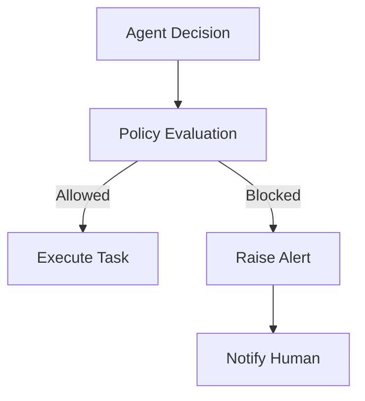
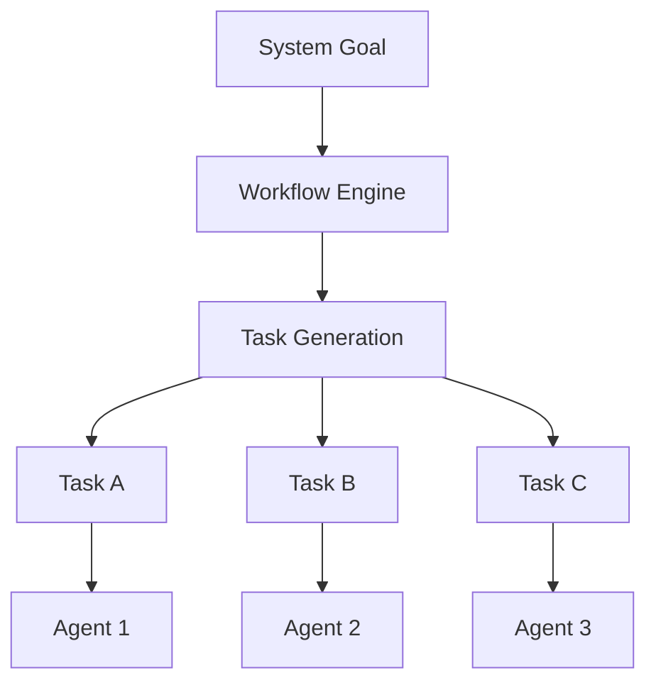
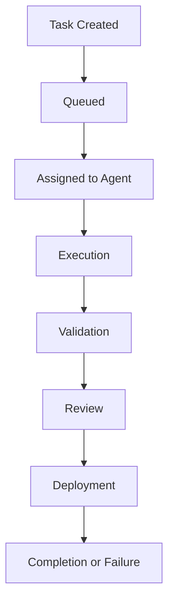
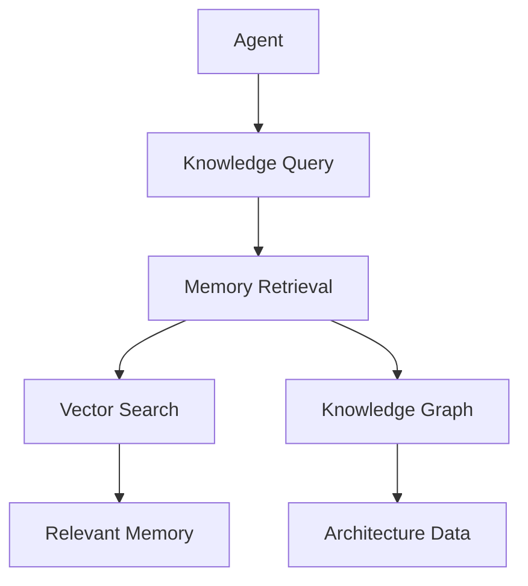
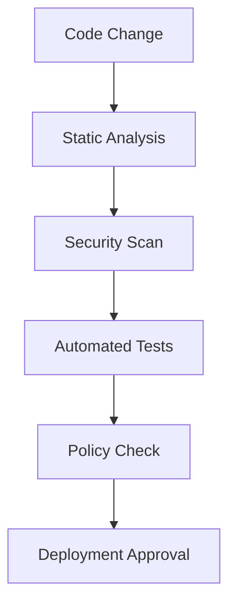
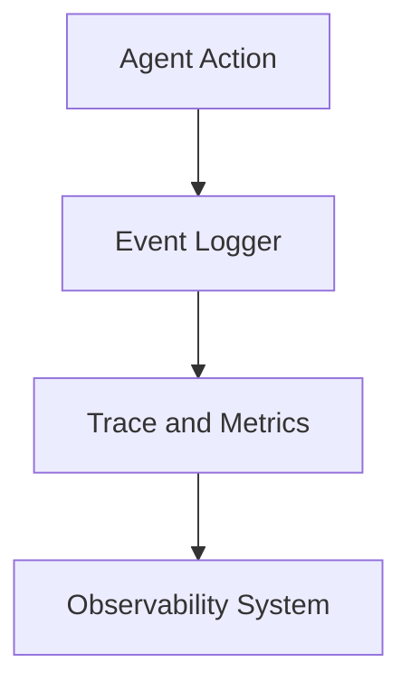
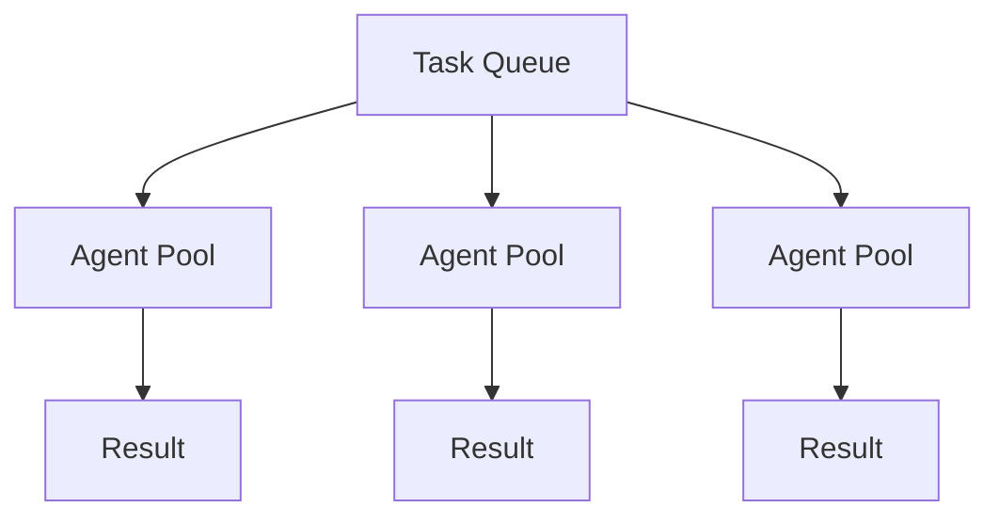
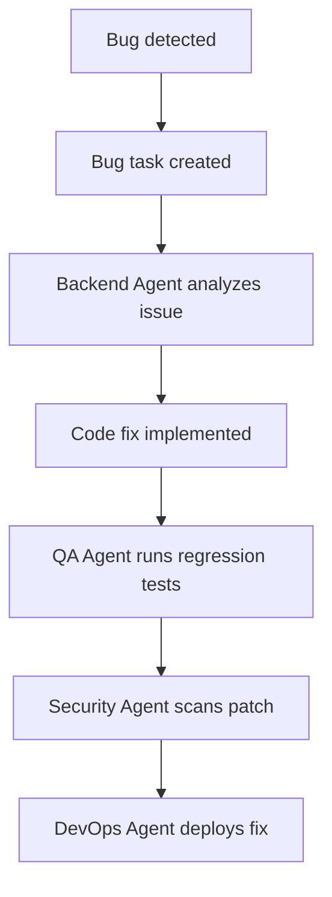

# Chapter 3 — Core Architectural Principles

This section defines the core architectural principles that govern the platform. These principles appear before the High-Level Architecture so that all subsequent design follows from them.

---

Principle 1 — Deterministic Governance of Autonomous Agents
Purpose
Even though agents perform autonomous reasoning and decision-making, the system must ensure that all actions occur within deterministic operational boundaries.
Autonomous systems that lack deterministic governance can:
- introduce unsafe changes
- perform unexpected actions
- create runaway task loops
- generate excessive compute costs
- modify infrastructure without authorization
Therefore, every agent action must pass through deterministic policy enforcement mechanisms.

---

Responsibilities
The governance layer must enforce:
- deployment restrictions
- infrastructure access limits
- security policies
- regulatory compliance
- cost budgets
- task execution permissions

---

**Figure 3.1 — Agent Decision Pipeline**

---

Subsystem Components
Policy Engine
Responsible for evaluating whether an agent's requested action is permitted.
Functions include:
- rule evaluation
- policy enforcement
- compliance validation

---

Approval System
Certain operations require human approval, including:
- production deployments
- infrastructure changes
- security configuration updates
- sensitive data access

---

Risk Evaluation Engine
Evaluates the risk level of proposed actions based on:
- code impact
- affected services
- historical incident patterns

---

Data Models
Policy Evaluation Request
PolicyEvaluation
{
    action_id: UUID
    agent_id: string
    action_type: deployment | code_change | infra_change
    project_id: UUID
    risk_score: float
}

---

Failure Handling
If a policy violation occurs:
1.	the action is blocked
2.	the orchestrator logs the event
3.	the system generates an alert
4.	the task is flagged for human review

---

Scaling Strategy
Policy evaluation must operate at high throughput because every agent action must pass through it.
The policy engine should be implemented as:
- stateless microservices
- horizontally scalable
- low latency (<10ms per evaluation)

---

Principle 2 — Task-Oriented System Architecture
Purpose
All operations in the platform must be represented as tasks.
This ensures that:
- actions are traceable
- workflows are reproducible
- failures can be retried
- system state remains observable

---

**Figure 3.2 — Task-Oriented Architecture**

---

Subsystem Components
Task Scheduler
Responsible for:
- queueing tasks
- assigning tasks to agents
- managing task dependencies

---

Workflow Manager
Responsible for orchestrating multi-task workflows.
Functions include:
- workflow creation
- dependency management
- state transitions

---

Task Execution Monitor
Tracks the progress of tasks and detects failures.

---

Data Models
Task State Model (Canonical — see Executive Overview Data Models)
TaskState enum: CREATED | QUEUED | ASSIGNED | RUNNING | VALIDATION | REVIEW | DEPLOYMENT | COMPLETED | FAILED | BLOCKED | RETRYING

---

**Figure 3.3 — Task Lifecycle**

---

Failure Handling
When a task fails:
- the orchestrator records the failure
- the system retries the task (configurable retries)
- if retries fail, escalation occurs

---

Scaling Strategy
The task system must support tens of thousands of tasks per day.
Recommended technologies:
- distributed message queues
- partitioned task storage
- asynchronous worker pools

---

Principle 3 — Knowledge Persistence and Institutional Memory
Purpose
The platform must accumulate knowledge over time, enabling agents to operate with historical context.
Without persistent knowledge, agents would:
- repeat previous mistakes
- lose architectural decisions
- duplicate research work

---

**Figure 3.4 — Knowledge Retrieval**

---

Subsystem Components
Vector Memory System
Stores semantic knowledge for retrieval.
Examples:
- documentation
- design decisions
- research findings

---

Knowledge Graph
Stores structured information such as:
- system architecture
- service dependencies
- API relationships

---

Memory Compression Engine
Because memory grows indefinitely, older knowledge must be summarized and compressed.

---

Data Models
Knowledge Record (high-level abstraction; for detailed schema see MemoryEntry in Executive Overview — Canonical Data Models. Categories here map to MemoryEntry type: architecture→decision, decision→decision, research→research.)
KnowledgeRecord
{
    id: UUID
    category: architecture | decision | research
    content: text
    embedding: vector
    created_at: timestamp
}

---

Failure Handling
Memory corruption or data loss could severely degrade system reasoning.
Mitigation strategies:
- database replication
- periodic backups
- integrity verification

---

Scaling Strategy
Knowledge systems must support:
- millions of documents
- low-latency retrieval
- high write throughput

---

Principle 4 — Safety-First Autonomous Development
Purpose
Autonomous development introduces the risk of agents making unsafe changes.
The system must therefore prioritize safety over speed.
No change may reach production unless it passes through:
- automated testing
- security validation
- policy checks
- deployment safeguards

---

**Figure 3.5 — Safety Validation Pipeline**

---

Subsystem Components
Security Agent
Analyzes code for vulnerabilities.

---

QA Agent
Runs testing frameworks.

---

Deployment Guardrail System
Prevents unsafe production deployments.

---

Runtime Behavior
All changes must pass through the validation pipeline before deployment.

---

Failure Handling
If any validation step fails:
- the deployment is blocked
- a new task is generated to fix the issue

---

Scaling Strategy
Testing infrastructure must scale horizontally to support parallel test execution.

---

Principle 5 — Observability and Explainability
Purpose
Autonomous systems must be fully observable and explainable.
Every decision made by an agent must be traceable.

---

**Figure 3.6 — Observability Pipeline**

---

Subsystem Components
Distributed Logging
Captures detailed logs of agent activity.

---

Trace System
Tracks workflows and agent decisions.

---

Metrics System
Monitors system performance.

---

Data Models
Agent Action Log
AgentActionLog
{
    id: UUID,
    agent_id: string,
    task_id: UUID,
    action: string,
    created_at: timestamp
}

---

Scaling Strategy
Observability systems must handle high event volumes.
Recommended systems include:
- distributed log aggregation
- scalable metrics systems
- trace sampling

---

Principle 6 — Horizontal Scalability
Purpose
The platform must scale to support:
- multiple projects
- thousands of tasks
- hundreds of agents

---

**Figure 3.7 — Horizontal Scaling**

---

Subsystem Components
Agent Worker Pools
Agents run as distributed workers.

---

Distributed Queues
Task queues distribute workloads.

---

Auto-Scaling Infrastructure
Infrastructure automatically scales based on load.

---

Failure Handling
If an agent fails:
- tasks are requeued
- another agent processes them

---

**Figure 3.8 — Autonomous Bug Fix Workflow**

---

Relationship to Next Sections
The Core Principles defined in this section guide the design of every subsystem.
The next section will define the High-Level Architecture, which translates these principles into a complete system structure.
 