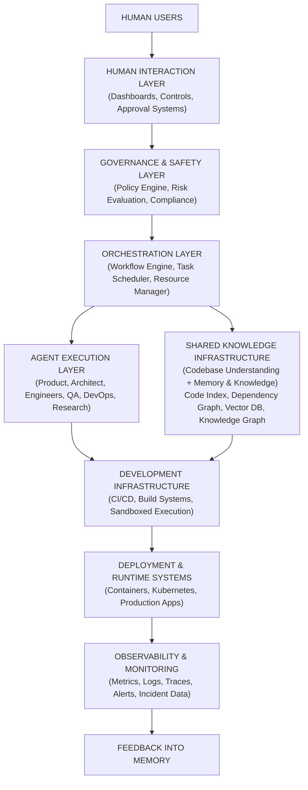

# 4. High Level Architecture

Detailed Explanation
The High Level Architecture defines the structural composition of the AI Autonomous Development Platform (AADP) and explains how the system’s primary subsystems interact to support large-scale autonomous software engineering.
The architecture is designed to support:
- continuous autonomous development
- distributed multi-agent collaboration
- persistent institutional knowledge
- safe deployment pipelines
- multi-project execution
- scalable infrastructure
The system is built using a layered distributed architecture where responsibilities are separated into specialized subsystems.
Each subsystem operates independently but communicates through well-defined APIs, message queues, and shared knowledge stores.
This architecture ensures that:
- failures in one subsystem do not cascade across the system
- components can scale independently
- the platform remains maintainable over time
The system is composed of the following major layers:
1.	Human Interaction Layer
2.	Governance and Safety Layer
3.	Orchestration Layer
4.	Agent Execution Layer
5.	Codebase Understanding System
6.	Memory and Knowledge Layer
7.	Development Infrastructure Layer
8.	Observability and Monitoring Layer
9.	Deployment and Runtime Layer
Each layer is responsible for a distinct set of capabilities.

---

Multi-Tenant Architecture
The platform supports multi-project execution and multiple teams or clients. Multi-tenant architecture is required for:
- Tenant isolation: memory, code access, and task queues are partitioned by tenant_id and project_id; no cross-tenant data access.
- Namespace design: per-tenant namespaces for memory (vector and graph), codebase indices, and workflow state.
- Resource quotas: per-tenant and per-project quotas for compute, token budgets, and storage; enforcement at Orchestrator and Model Router.

---

System Architecture Overview
The following diagram illustrates the full architecture.

*Diagram source: `diagrams/high-level-architecture.mmd` in the repository.*

Note: Observability is cross-cutting; it collects metrics, logs, and traces from all layers (agents, orchestrator, infrastructure, deployment), not only post-deployment.

---

Layer 1 — Human Interaction Layer
Purpose
The Human Interaction Layer provides the interfaces through which humans interact with the platform.
Although the system operates autonomously, human oversight remains necessary for:
- defining product goals
- approving critical decisions
- monitoring system behavior
- intervening during incidents

---

Responsibilities
The layer supports:
- project creation
- requirement input
- system dashboards
- approval workflows
- manual task injection
- system configuration

---

Internal Components
Web Dashboard
Provides a centralized interface for monitoring system activity.
Capabilities include:
- viewing active projects
- monitoring agent activity
- inspecting tasks and workflows
- reviewing deployments

---

Approval Interface
Allows humans to approve or reject high-risk operations such as:
- production deployments
- infrastructure changes
- security policy modifications

---

Incident Control Panel
Allows operators to:
- pause workflows
- cancel tasks
- rollback deployments
- restart agents

---

Data Model
HumanAction
{
    id: UUID,
    user_id: UUID,
    action_type: enum(approval, reject, override, pause),
    target_id: UUID,
    created_at: timestamp
}

---

Layer 2 — Governance and Safety Layer
Purpose
The Governance Layer ensures that autonomous agents operate within strict operational boundaries.
It prevents unsafe operations and enforces organizational policies.

---

Responsibilities
The layer enforces:
- security policies
- compliance rules
- deployment restrictions
- infrastructure access control
- data privacy requirements

---

Internal Components
Policy Engine
Evaluates whether agent actions comply with system policies.

---

Compliance Validator
Ensures system actions comply with:
- security requirements
- regulatory constraints
- organizational standards

---

Risk Assessment Engine
Evaluates the potential impact of actions.
Examples include:
- large-scale refactoring
- database schema changes
- infrastructure modifications

---

Runtime Behavior
All critical actions are routed through the governance layer before execution.

---

Layer 3 — Orchestration Layer
Purpose
The Orchestration Layer coordinates the activities of all agents in the system.
It acts as the central nervous system of the platform.

---

Responsibilities
The orchestrator manages:
- task scheduling
- workflow execution
- dependency tracking
- resource allocation
- failure recovery
- cost control

---

Architecture Diagram
                    ORCHESTRATOR
                         │
       ┌─────────────────┼─────────────────┐
       ▼                 ▼                 ▼
   Workflow Engine   Task Scheduler   Resource Manager
       │                 │                 │
       ▼                 ▼                 ▼
   Task Creation    Task Assignment    Compute Allocation

---

Subsystem Components
Workflow Engine
Manages complex multi-step processes.

---

Task Scheduler
Distributes tasks across available agents.

---

Resource Manager
Allocates compute resources for tasks.

---

Failure Handling
If the orchestrator fails:
- standby instances take over
- state is restored from persistent storage

---

Layer 4 — Agent Execution Layer
Purpose
The Agent Execution Layer contains all autonomous agents responsible for performing development tasks.

---

Agent Categories
Product Agents
Responsible for product planning.

---

Engineering Agents
Responsible for writing code.
Examples:
- Backend Engineer Agent
- Frontend Engineer Agent

---

Quality Agents
Responsible for testing and validation.

---

Operations Agents
Responsible for infrastructure and deployment.

---

Research Agents
Responsible for identifying new technologies.

---

Self-Improvement Agents
Responsible for improving system processes.

---

Agent Architecture Diagram
                AGENT WORKER
                     │
                     ▼
               Task Retrieval
                     │
                     ▼
               Context Retrieval
                     │
                     ▼
               Reasoning Engine
                     │
                     ▼
               Result Generation
                     │
                     ▼
               Task Completion

---

Layer 5 — Codebase Understanding System
Purpose
The Codebase Understanding System maintains a continuously updated understanding of all managed software repositories.

---

Responsibilities
The system must track:
- code structure
- dependencies
- APIs
- documentation
- commit history

---

Components
Code Indexer
Scans repositories and builds searchable indexes.

---

Dependency Graph Builder
Constructs graphs representing system architecture.

---

API Catalog
Maintains documentation for internal APIs.

---

Layer 6 — Memory and Knowledge Layer
Purpose
Stores long-term knowledge used by agents.

---

Components
Vector Database
Stores semantic knowledge.

---

Knowledge Graph
Stores structured relationships.

---

Research Repository
Stores external knowledge sources.

---

Layer 7 — Development Infrastructure
Purpose
Provides the infrastructure required for software development.

---

Components
CI/CD Systems
Automates build and deployment processes.

---

Sandboxed Execution Environment
Allows generated code to run safely during testing.

---

Artifact Storage
Stores build artifacts and container images.

---

Layer 8 — Observability and Monitoring
Purpose
Ensures that the system remains observable and debuggable.

---

Components
Metrics System
Tracks system performance.

---

Logging Infrastructure
Stores system logs.

---

Alerting System
Notifies operators of failures.

---

Layer 9 — Deployment and Runtime Systems
Purpose
Runs the software built by the platform.

---

Components
Container Orchestration
Manages application containers.

---

Production Services
The deployed applications themselves.

---

Example System Workflow
Feature Development Workflow
Feature Request
      │
      ▼
Product Manager Agent
      │
      ▼
Architect Agent
      │
      ▼
Task Breakdown
      │
      ▼
Engineering Agents
      │
      ▼
Testing Pipeline
      │
      ▼
Security Validation
      │
      ▼
Deployment
      │
      ▼
Monitoring

---

Scaling Strategy
The architecture supports scalability through:
Distributed Agent Pools
Agents run across distributed infrastructure.

---

Partitioned Task Queues
Task queues are partitioned to handle high workloads.

---

Replicated Databases
Critical data stores use replication for availability.

---

Multi-Region Infrastructure
System components run across multiple cloud regions.

---

Transition to Next Section
The next section will describe the Agent Architecture, which defines the internal design of individual AI agents and how they perform tasks within the platform.
 