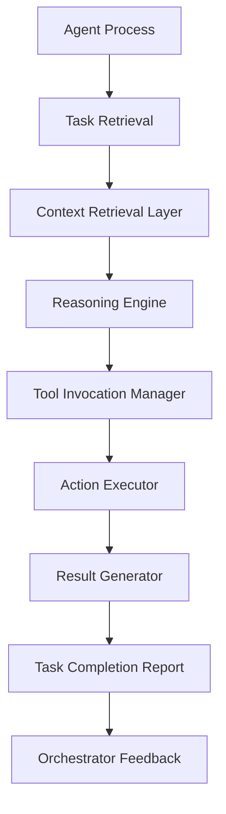
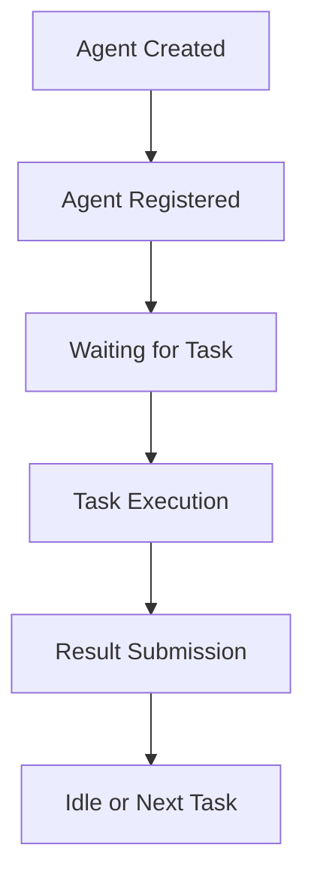
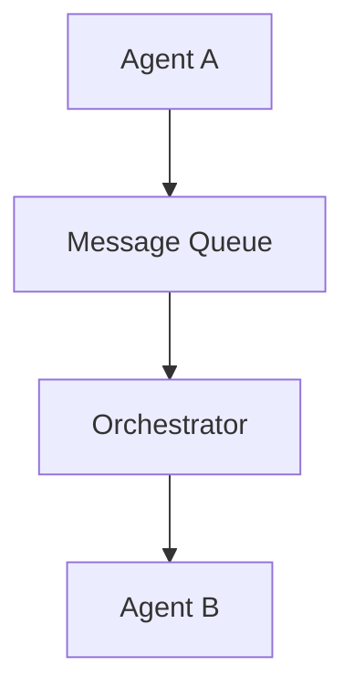
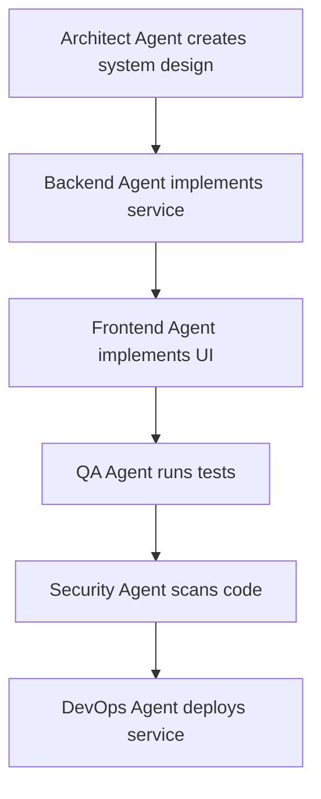

# Chapter 5 — Agent Architecture

Detailed Explanation
The Agent Architecture defines the internal design, lifecycle, communication model, and runtime behavior of autonomous agents operating within the AI Autonomous Development Platform (AADP).
Agents are the primary execution entities responsible for performing software development tasks such as:
- product planning
- architectural design
- code implementation
- testing and validation
- security analysis
- deployment operations
- research and experimentation
Each agent represents a specialized role within a virtual engineering organization and operates as a distributed worker within the platform.
Agents do not operate independently. Instead, they are coordinated by the Orchestration Layer, which assigns tasks and manages workflows.
The Agent Architecture must support:
- high concurrency
- stateless horizontal scaling
- deterministic task execution
- controlled resource consumption
- structured communication
- auditability
The system must support hundreds or thousands of simultaneously active agents, distributed across multiple projects and repositories.

---

Agent Design Model
Agents operate using a task-driven reasoning model.
Each agent executes the following operational cycle:
1.	Receive task from orchestrator
2.	Retrieve relevant knowledge and context
3.	Perform reasoning and planning
4.	Execute required actions
5.	Generate outputs
6.	Report results
7.	Create follow-up tasks if necessary
This cycle ensures that agent behavior remains structured and observable.

---

**Figure 5.1 — Agent Process Architecture**

---

Agent Types
The system contains several categories of agents, each designed to perform specific tasks.

---

Product Management Agents
Purpose
Define product direction and requirements.
Responsibilities
- analyzing feature requests
- defining product specifications
- prioritizing development tasks
- coordinating with architect agents

---

Architect Agents
Purpose
Design system architecture and high-level technical solutions.
Responsibilities
- system design
- API design
- component definition
- technology selection

---

Engineering Agents
Backend Engineer Agents
Responsible for:
- implementing backend services
- writing business logic
- database integration
- API development
Frontend Engineer Agents
Responsible for:
- UI development
- user experience implementation
- frontend state management

---

Quality Assurance Agents
Responsible for validating system correctness.
Responsibilities include:
- unit testing
- integration testing
- regression testing
- performance testing

---

Security Agents
Responsible for identifying vulnerabilities and security risks.
Responsibilities include:
- static code analysis
- dependency scanning
- vulnerability detection

---

DevOps Agents
Responsible for deployment and infrastructure management.
Responsibilities include:
- CI/CD pipeline management
- container orchestration
- monitoring configuration

---

Research Agents
Responsible for evaluating new technologies and optimization strategies.
Responsibilities include:
- analyzing emerging tools
- recommending system improvements

---

Self-Improvement Agents
Responsible for improving the platform itself.
Responsibilities include:
- optimizing workflows
- improving agent coordination
- updating system processes

---

Agent Lifecycle
Agents follow a structured lifecycle managed by the orchestrator.

---

**Figure 5.2 — Agent Lifecycle Stages**

---

Agent Registration
Agents must register with the orchestrator when they start.
Registration includes:
- agent role
- capabilities
- resource requirements
- supported tools

---

Subsystem Components

---

Agent Runtime Container
Agents run inside isolated container environments.
Each container includes:
- reasoning engine
- tool interface
- task interface
- logging systems
This isolation prevents interference between agents.

---

Reasoning Engine
The reasoning engine is responsible for:
- interpreting tasks
- generating solutions
- planning actions
Agents never call LLM providers directly. All inference is requested via the Orchestrator inference API: Agent → Orchestrator (policy, quota check) → Model Router → Model Providers. The reasoning engine issues inference requests to the Orchestrator; the Orchestrator enforces policy and forwards to the Model Router. This ensures centralized budget enforcement, audit, and model selection.

---

Tool Interface
Agents must be able to interact with external systems.
Examples include:
- code repositories
- testing frameworks
- deployment systems
- knowledge databases
The tool interface standardizes these interactions.

---

Context Retrieval System
Before performing tasks, agents retrieve context from:
- vector memory
- knowledge graphs
- codebase indexes
This ensures informed decision-making.

---

Agent Communication Protocol
Agents communicate with the orchestrator and other agents through structured messages.

---

**Figure 5.3 — Message Flow**

---

Message Types
- task request
- task result
- clarification request
- dependency notification
- system alert

---

Data Models
Agent Definition
Agent
{
    id: string
    role: string
    capabilities: [string]
    status: idle | busy | offline
    registered_at: timestamp
}

---

Agent Task Assignment
AgentTaskAssignment
{
    task_id: UUID
    agent_id: string
    assigned_at: timestamp
}

---

Agent Message
AgentMessage
{
    id: UUID
    sender_agent: string
    receiver_agent: string
    message_type: request | result | clarification
    payload: json
    timestamp: timestamp
}

---

Runtime Behavior
The runtime behavior of agents follows a consistent execution loop.
while agent_is_active:

    task = request_task_from_orchestrator()

    context = retrieve_context(task)

    plan = generate_solution(task, context)

    result = execute_plan(plan)

    submit_result(result)

---

Failure Handling
Agents must be resilient to failure.
Possible failures include:
- reasoning failures
- tool invocation failures
- runtime errors
- infrastructure interruptions
Mitigation strategies include:
- retry mechanisms
- fallback strategies
- task reassignment

---

Scaling Strategy
The agent architecture supports horizontal scalability.

---

Agent Worker Pools
Agents run in worker pools based on their role.
Examples:
- backend agent pool
- QA agent pool
- research agent pool

---

Auto Scaling
Agent pools automatically scale based on:
- task queue size
- system load
- resource utilization

---

Tool Invocation Manager
Agents interact with external systems (repositories, CI/CD, APIs, file systems) through a central Tool Invocation Manager. The Tool Invocation Manager:
- validates and sandboxes tool calls
- logs invocations for observability and audit
- enforces policy (e.g., no direct production writes without approval)
- provides idempotency and correlation with task_id/trace_id
All tool calls are mediated by the Orchestrator (or an Orchestrator-authorized Tool Service); agents do not call external systems directly.

---

Stateless Execution and State Persistence
Agents are stateless workers between tasks: they do not retain in-process state across task boundaries. All persistent state required for long-term reasoning, workflow context, task chain memory, and multi-agent coordination is stored in:
- Orchestrator state store (task state, workflow progress, assignment)
- Memory and Knowledge Layer (retrieved context, decisions, research)
- Workflow engine (DAG state, dependencies)
This ensures that workflow DAG execution, multi-step tasks, and collaboration remain consistent while agents scale horizontally.

---

**Figure 5.4 — Feature Implementation Workflow**

---

Transition to Next Section
The next section will describe the Model Management System, which provides centralized model access, routing, and prompt governance.
 