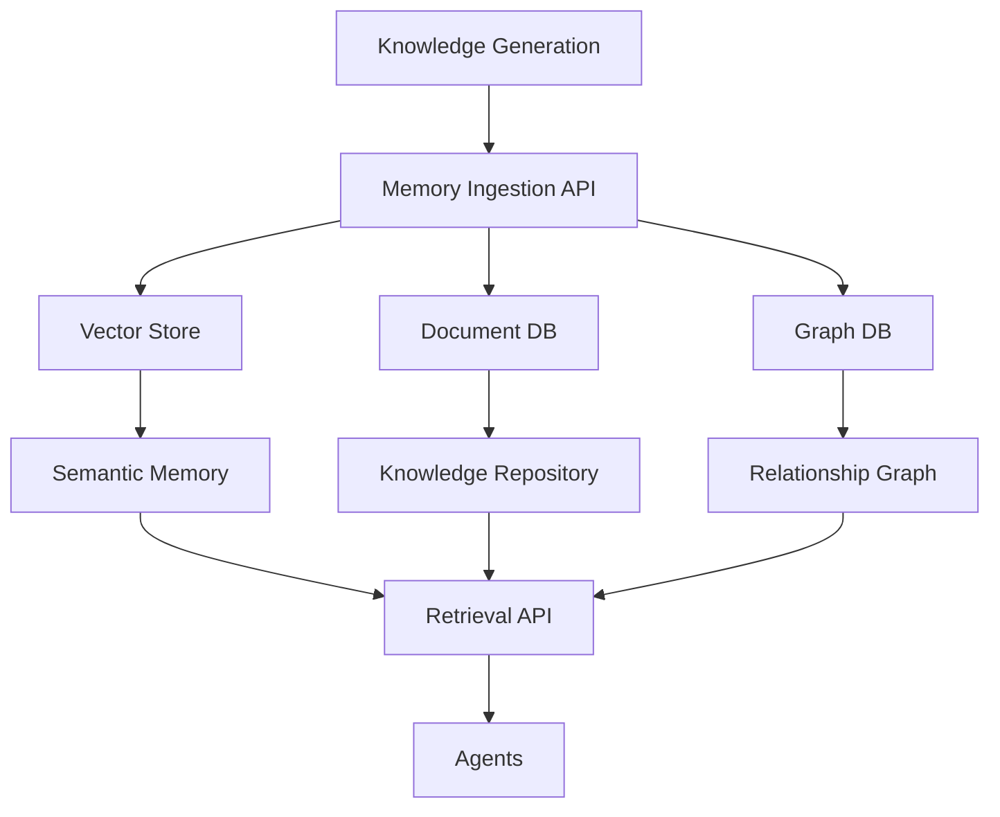
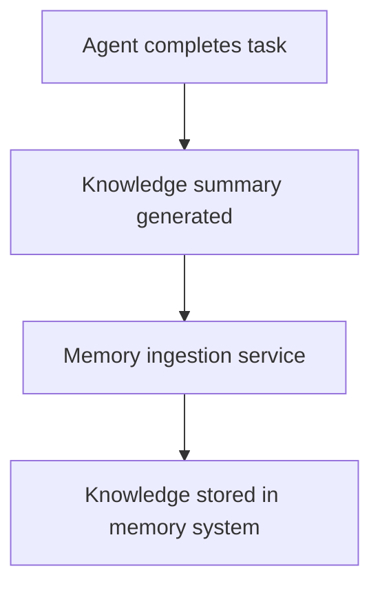
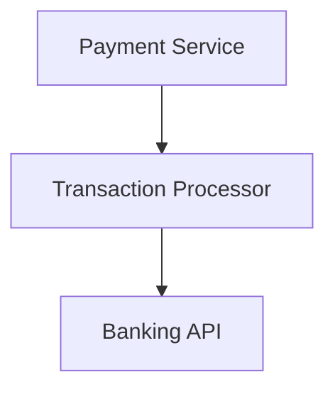
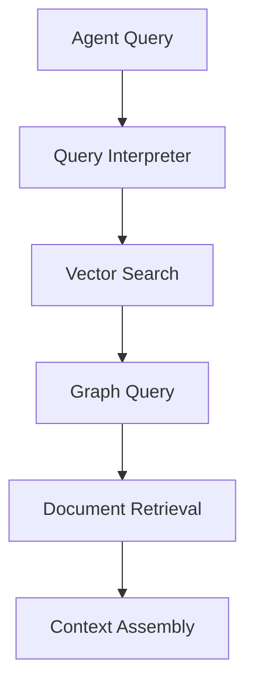
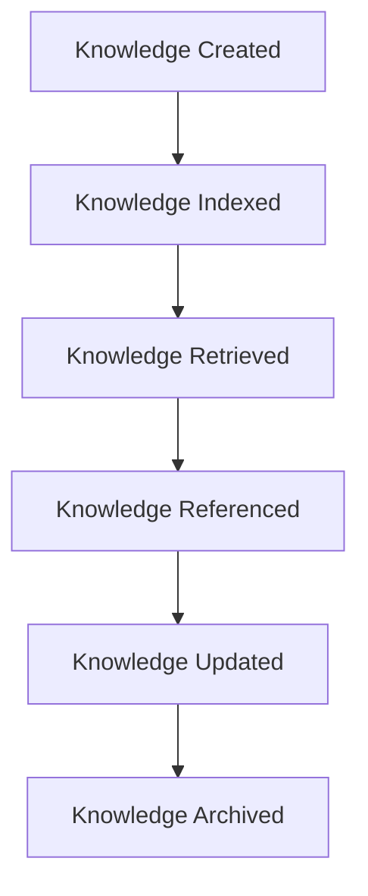
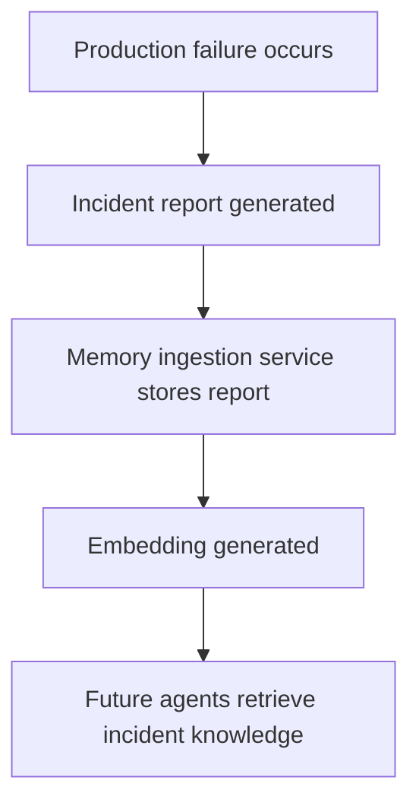

# Chapter 9 — Memory and Knowledge Layer

Detailed Explanation
The Memory and Knowledge Layer (MKL) provides the persistent institutional memory of the AI Autonomous Development Platform (AADP). It stores, organizes, retrieves, and evolves knowledge that agents rely on for reasoning, planning, and decision making.
Unlike traditional software systems that treat logs or documentation as static artifacts, the AADP Memory Layer functions as an active knowledge substrate that continuously accumulates information about:
- architectural decisions
- development history
- bugs and incidents
- performance characteristics
- research insights
- deployment outcomes
- system behavior
This knowledge enables agents to:
- avoid repeating previous mistakes
- understand historical design decisions
- recall prior implementations
- reuse architectural patterns
- learn from production incidents
Over time, the platform develops a growing institutional knowledge base, similar to the long-term experience accumulated by human engineering organizations.
The Memory Layer is therefore essential for:
- long-term reasoning
- cross-project learning
- system explainability
- autonomous improvement

---

System Objectives
The Memory and Knowledge Layer must satisfy several critical requirements.
Persistent Knowledge Storage
The system must store knowledge generated across:
- agents
- workflows
- deployments
- incidents
- research tasks
This knowledge must remain accessible over long time horizons.

---

Semantic Retrieval
Agents must be able to retrieve relevant knowledge using natural language queries.
Example:
"How was authentication implemented in previous projects?"

---

Structured Knowledge Representation
Certain knowledge must be represented in structured form.
Examples include:
- architectural diagrams
- service relationships
- configuration standards

---

Knowledge Evolution
As the system grows, memory must evolve through:
- summarization
- compression
- deduplication
- archival

---

Memory Lifecycle Management
Memory lifecycle must be explicitly managed to control growth, quality, and compliance:
- TTL (time-to-live): optional expiration per memory entry or category; expired entries are archived or purged per retention policy.
- Summarization: older or low-usage entries may be summarized to reduce storage while preserving key information.
- Deduplication: detect and merge or suppress duplicate or near-duplicate memories (e.g., by embedding similarity).
- Poisoning detection: monitor for malicious or low-quality memories (e.g., anomaly detection on retrieval patterns, human review sampling); quarantine or purge detected poison entries.

---

Knowledge Provenance
Every memory entry must contain metadata describing:
- which agent generated it
- which workflow produced it
- what evidence supports it
This ensures traceability and reliability.

---

**Figure 9.1 — Memory System Architecture**

---

Subsystem Components
Memory Ingestion Service
Purpose
Captures new knowledge generated by agents and workflows.

---

Responsibilities
- receiving memory entries
- validating metadata
- assigning embeddings
- storing knowledge

---

Inputs
Examples of knowledge inputs include:
- architecture documents
- bug analyses
- deployment reports
- research summaries

---

**Figure 9.2 — Ingestion Workflow**

---

Knowledge Provenance
Every memory entry carries provenance (see canonical MemoryEntry schema in Executive Overview). The Memory Ingestion Service populates commit_id, prompt_id, agent_id, and raw_references when ingesting; this supports auditing and traceability of how knowledge was generated.

---

Vector Memory Store
Purpose
Stores semantic representations of knowledge to enable similarity search.

---

Responsibilities
- storing embeddings
- performing vector similarity search
- retrieving relevant context

---

Example Query
Agent query:
"Previous incidents involving payment failures"
Vector search retrieves similar incident reports.

---

Data Model
MemoryEmbedding
MemoryEmbedding
{
    id: UUID
    memory_id: UUID
    embedding_vector: vector
    created_at: timestamp
}

---

Document Knowledge Repository
Purpose
Stores full-text knowledge documents.

---

Examples
- architectural documents
- design proposals
- postmortems
- research reports

---

Data Model
KnowledgeDocument
KnowledgeDocument
{
    id: UUID
    title: string
    content: text
    category: architecture | research | incident | decision
    created_by_agent: string
    created_at: timestamp
}

---

Knowledge Graph
Purpose
Stores relationships between knowledge entities.

---

Relationships
Examples include:
- service dependencies
- decision rationales
- incident causes

---

**Figure 9.3 — Service Relationship Graph**

---

Graph Data Model
KnowledgeRelationship
KnowledgeRelationship
{
    source_entity: string
    target_entity: string
    relationship_type: depends_on | caused_by | improves
}

---

Knowledge Compression Engine
Purpose
Prevents memory systems from growing indefinitely.

---

Responsibilities
- summarizing historical knowledge
- merging duplicate records
- archiving outdated knowledge

---

Example
Multiple bug reports related to the same issue may be summarized into a single consolidated record.

---

Retrieval System
Agents retrieve knowledge through a unified retrieval interface.

---

**Figure 9.4 — Retrieval Pipeline**

---

Retrieval API
Example query request:
POST /memory/query

{
  "query": "authentication architecture",
  "project_id": "123"
}

---

Example response:
{
  "documents": [
    "auth_architecture_doc",
    "session_management_design"
  ]
}

---

Knowledge Lifecycle
Knowledge entries pass through several lifecycle stages.

---

**Figure 9.5 — Knowledge Lifecycle**

---

Runtime Behavior
The memory system operates continuously alongside agent workflows.
while system_running:

    ingest_new_knowledge()

    update_embeddings()

    maintain_graph_relationships()

    compress_old_knowledge()

---

Failure Handling
Potential failures include:
- corrupted embeddings
- incomplete knowledge records
- inconsistent graph relationships
Mitigation strategies:
- replication
- periodic integrity checks
- backup snapshots

---

Scaling Strategy
The memory system must support long-term accumulation of knowledge across many projects.

---

Distributed Vector Databases
Embeddings are partitioned across multiple nodes.

---

Graph Database Clustering
Knowledge graphs run on distributed clusters.

---

Tiered Storage
Older knowledge is moved to lower-cost storage.

---

**Figure 9.6 — Incident Learning Workflow**

---

Transition to Next Section
The next section will define the Safety and Guardrail System, which ensures that autonomous agents operate within strict safety boundaries.
 