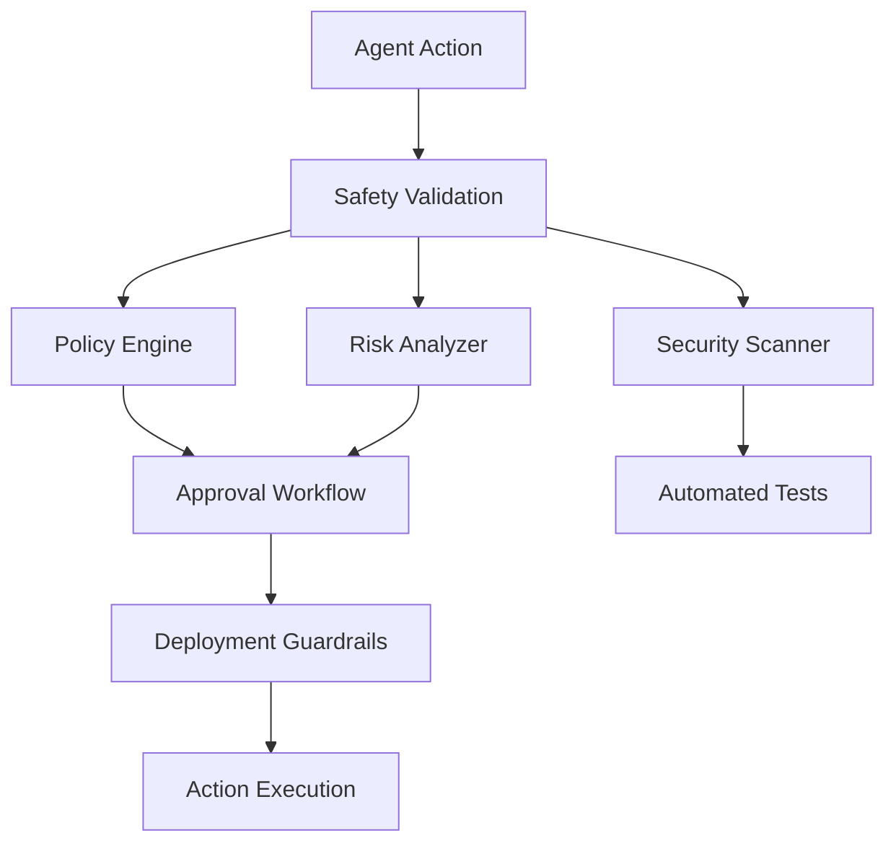
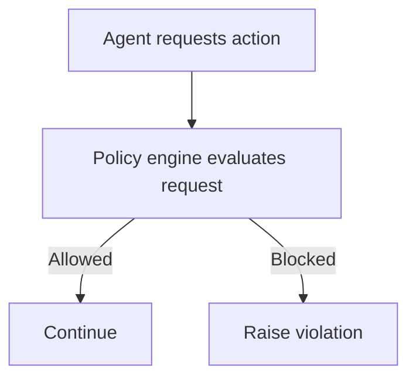
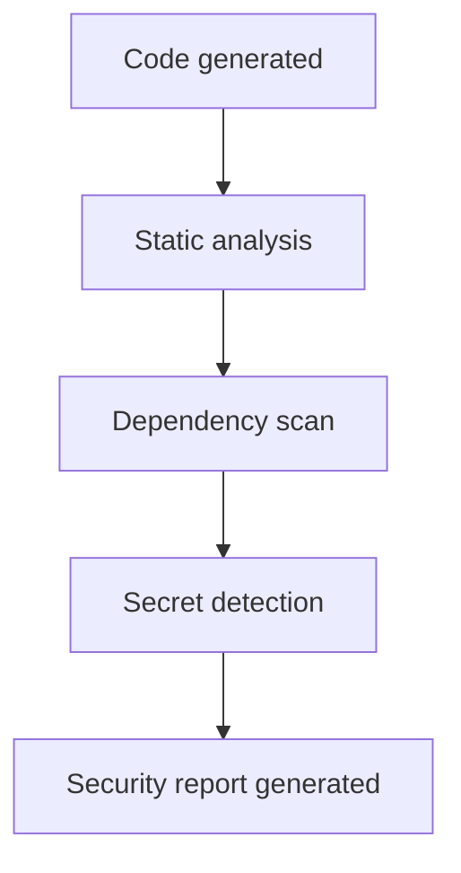
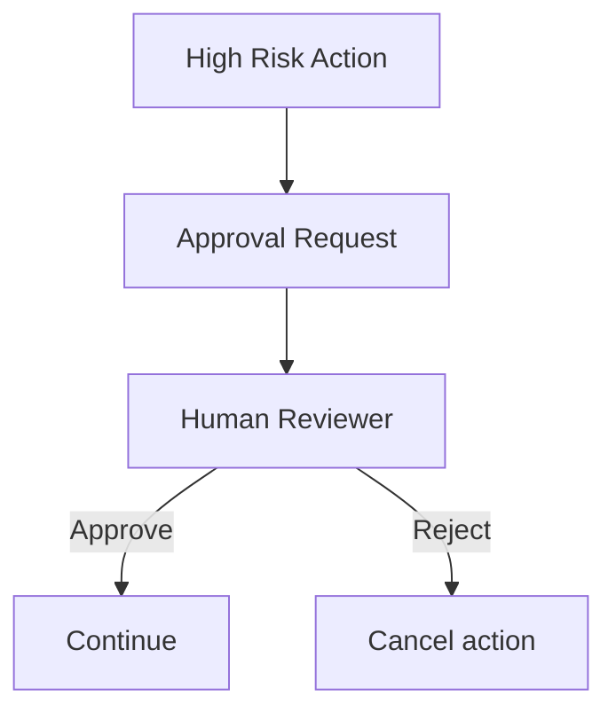
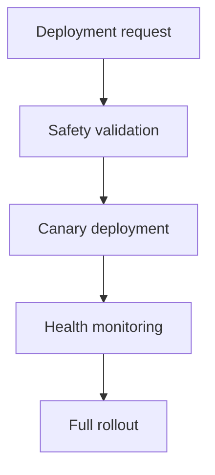
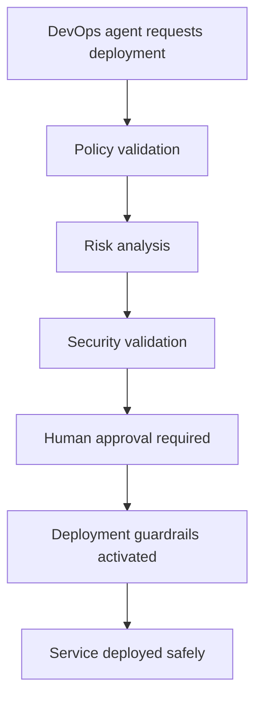

# Chapter 10 — Safety and Guardrail System

Detailed Explanation
The Safety and Guardrail System (SGS) is the governance and protection framework of the AI Autonomous Development Platform (AADP). It ensures that autonomous agents operate within strictly defined operational, security, and regulatory boundaries.
Because the platform is capable of:
- modifying production software
- deploying infrastructure changes
- interacting with sensitive systems
- executing code autonomously
it must enforce strong safety controls that prevent dangerous actions from occurring without proper validation.
The Safety and Guardrail System ensures that:
- autonomous behavior remains predictable
- unsafe changes cannot reach production
- security vulnerabilities are detected early
- regulatory policies are enforced
- human oversight is applied to high-risk actions
This system acts as the central governance layer that sits between agents and any action that could impact the outside world.
All potentially dangerous actions must pass through this system before execution.
Examples of guarded actions include:
- code merges to production branches
- database migrations
- infrastructure configuration changes
- deployment of new services
- access to sensitive data
- external API integrations
The Safety and Guardrail System integrates tightly with:
- the Orchestration System
- the Deployment Infrastructure
- the Codebase Understanding System
- the Observability System
to provide comprehensive protection across the entire platform.

---

Safety Architecture Overview
The Safety and Guardrail System consists of several independent safety mechanisms working together. Policy evaluation is integrated with the CI/CD pipeline so that deployment safety is enforced before any deployment or infrastructure modification.

---

CI/CD and Policy Integration
Explicit architecture: CI Pipeline → Policy Engine → Deployment Approval
- Before deployment: every deployment request is evaluated by the Policy Engine; only approved requests proceed.
- Before infrastructure modification: infra change tasks are gated by the Policy Engine and optional human approval.
- Before artifact publishing: artifact promotion (e.g., to production) triggers policy evaluation and approval workflow.

---

**Figure 10.1 — Safety Validation Pipeline**

---

System Objectives
The Safety and Guardrail System must enforce the following objectives.
Prevent Unsafe Autonomous Actions
Agents must never execute dangerous operations without passing validation.

---

Enforce Organizational Policies
All actions must comply with defined policies.
Examples:
- coding standards
- deployment procedures
- security requirements

---

Detect Security Vulnerabilities
The system must automatically detect vulnerabilities in generated code.

---

Manage Risky Operations
High-risk actions require additional validation steps.

---

Maintain System Integrity
The system must prevent:
- destructive operations
- privilege escalation
- unauthorized data access

---

Core Subsystems
The Safety and Guardrail System contains several subsystems.

---

Policy Engine
Purpose
Evaluates whether an agent action complies with system policies.

---

Responsibilities
- validating actions
- enforcing constraints
- blocking unauthorized operations

---

**Figure 10.2 — Policy Evaluation Workflow**

---

Data Model
PolicyRule
PolicyRule
{
    id: UUID
    name: string
    description: text
    action_type: deployment | code_change | infra_change
    enforcement: allow | deny | approval_required
}

---

Risk Analysis Engine
Purpose
Evaluates the potential impact of proposed actions.

---

Risk Factors
Risk scoring considers:
- number of affected files
- affected services
- infrastructure impact
- historical incident patterns

---

Risk Scoring Example
RiskScore
{
    change_size: 0.4
    service_impact: 0.3
    infrastructure_impact: 0.2
    historical_risk: 0.1
}
Total risk score determines whether additional validation is required.

---

Security Scanning System
Purpose
Detects security vulnerabilities in generated code.

---

Security Checks
The system performs:
- static code analysis
- dependency vulnerability scanning
- secret detection
- insecure API usage detection

---

**Figure 10.3 — Vulnerability Detection Workflow**

---

Data Model
SecurityReport
SecurityReport
{
    id: UUID
    task_id: UUID
    vulnerabilities: [string]
    severity: low | medium | high | critical
}

---

Approval Workflow System
Purpose
Allows humans to review high-risk actions before execution.

---

Examples of Approval-Requiring Actions
- production deployments
- infrastructure changes
- database schema migrations
- external integrations

---

**Figure 10.4 — Approval Workflow**

---

Data Model
ApprovalRequest
ApprovalRequest
{
    id: UUID
    action_type: deployment | infra_change
    requested_by_agent: string
    status: pending | approved | rejected
}

---

Deployment Guardrails
Purpose
Prevent unsafe deployments.

---

Guardrail Mechanisms
Examples include:
- canary deployments
- automatic rollback
- health monitoring
- deployment rate limits

---

**Figure 10.5 — Deployment Flow**

---

Runtime Behavior
All actions executed by agents must pass through the Safety System.
function execute_agent_action(action):

    policy_result = evaluate_policy(action)

    if policy_result == BLOCK:
        raise_violation()

    risk = evaluate_risk(action)

    if risk > threshold:
        request_human_approval()

    security_scan(action)

    execute_action()

---

Failure Handling
Potential failures include:
- policy misconfiguration
- false-positive security alerts
- approval delays
Mitigation strategies include:
- audit logs
- override mechanisms
- fallback workflows

---

Scaling Strategy
The Safety System must handle high volumes of agent actions.

---

Distributed Policy Evaluation
Policy checks run across scalable stateless services.

---

Parallel Security Scanning
Code scans run across distributed scanning workers.

---

Approval Queue Scaling
Approval requests are managed through queue-based systems.

---

**Figure 10.6 — Production Deployment Workflow**

---

Transition to Next Section
The next section will define the Planning and Execution Cycles, which describe how autonomous development workflows are executed continuously.
 