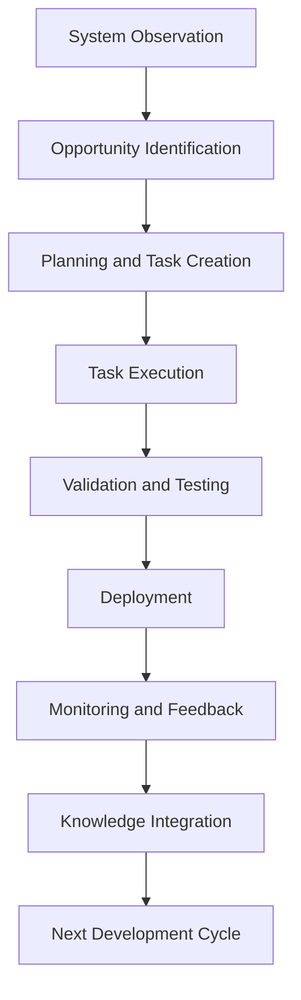
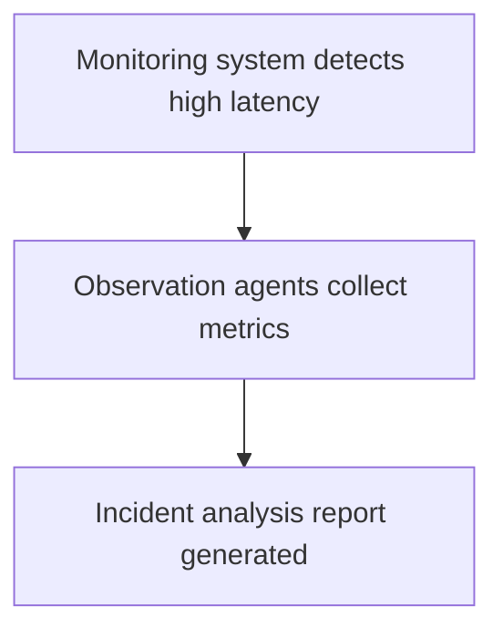
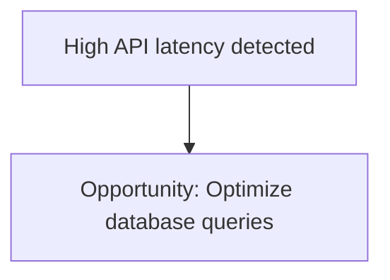
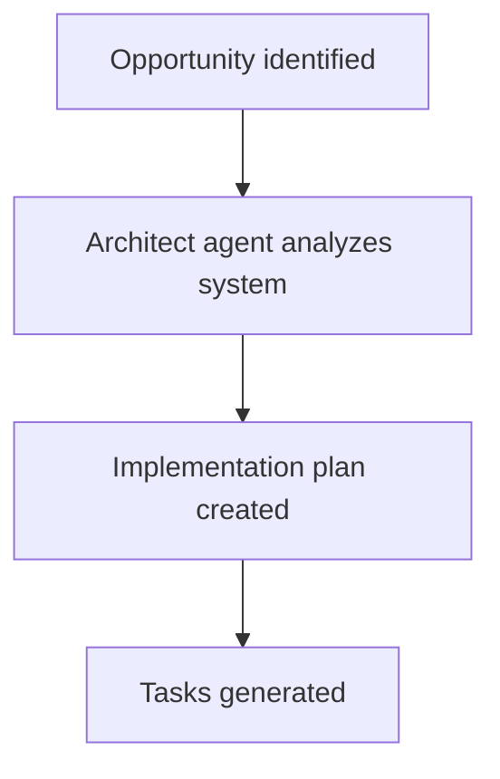
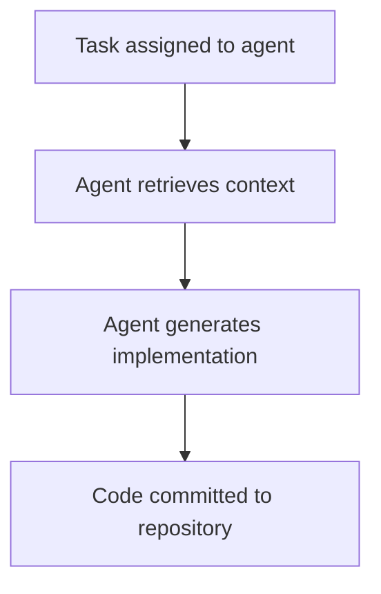
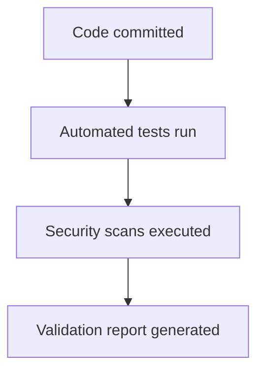
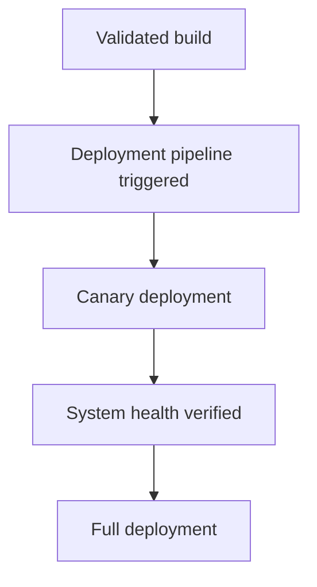
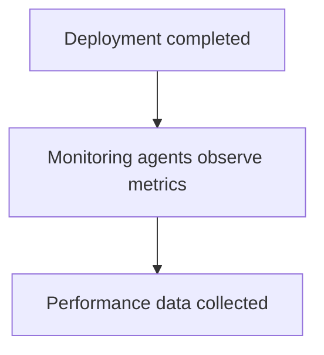
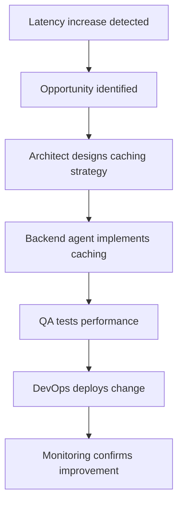

# Chapter 11 — Planning and Execution Cycles

Detailed Explanation
The Planning and Execution Cycles (PEC) define the operational loop through which the AI Autonomous Development Platform (AADP) performs continuous software development.
Autonomous software development requires more than simply executing tasks. The system must continuously:
- observe system state
- identify opportunities or problems
- plan improvements
- execute tasks
- validate outcomes
- learn from results
This iterative loop is referred to as the Autonomous Development Cycle.
The Planning and Execution Cycles ensure that:
- development remains structured and deterministic
- agents collaborate in coordinated workflows
- system changes are validated before deployment
- learning occurs after each execution cycle
The cycle operates continuously across all projects managed by the platform.
Each cycle consists of multiple stages:
1.	System Observation
2.	Opportunity Identification
3.	Planning and Task Decomposition
4.	Task Execution
5.	Validation and Testing
6.	Deployment
7.	Monitoring and Feedback
8.	Knowledge Integration
These stages together form a closed-loop autonomous development system.

---

**Figure 11.1 — Autonomous Development Cycle**

---

Cycle Stage 1 — System Observation
Purpose
The platform continuously monitors all managed systems to understand their current state.

---

Inputs
Observation data may include:
- application logs
- performance metrics
- error reports
- user feedback
- monitoring alerts
- system usage patterns

---

Responsible Agents
Observation is performed by:
- monitoring agents
- incident analysis agents
- performance analysis agents

---

**Figure 11.2 — Observation Workflow**

---

Cycle Stage 2 — Opportunity Identification
Purpose
Identify potential improvements or issues requiring action.

---

Examples of Opportunities
- performance optimizations
- bug fixes
- feature enhancements
- infrastructure improvements
- security updates

---

Opportunity Detection Sources
Sources include:
- production incidents
- research insights
- product roadmap updates
- system monitoring signals

---

**Figure 11.3 — Opportunity Identification**

---

Cycle Stage 3 — Planning and Task Decomposition
Purpose
Convert high-level opportunities into actionable development plans.

---

Responsibilities
Planning agents must:
- analyze system architecture
- determine required changes
- generate task lists
- define dependencies

---

Responsible Agents
- Product Manager Agent
- Architect Agent

---

**Figure 11.4 — Planning Workflow**

---

Task Decomposition Example
Opportunity:
Implement caching for API responses.
Generated tasks:
1.	Design caching strategy
2.	Modify backend service
3.	Update API gateway configuration
4.	Add performance tests
5.	Deploy caching infrastructure

---

Cycle Stage 4 — Task Execution
Purpose
Agents perform the tasks generated during planning.

---

Responsible Agents
Execution tasks are handled by:
- backend engineering agents
- frontend engineering agents
- DevOps agents

---

**Figure 11.5 — Execution Workflow**

---

Cycle Stage 5 — Validation and Testing
Purpose
Ensure that implemented changes meet quality and safety requirements.

---

Validation Steps
- unit testing
- integration testing
- performance testing
- security scanning

---

Responsible Agents
- QA agents
- Security agents

---

**Figure 11.6 — Validation Workflow**

---

Cycle Stage 6 — Deployment
Purpose
Deploy validated changes into production environments.

---

Deployment Strategies
The system supports:
- rolling deployments
- canary releases
- blue-green deployments

---

Responsible Agents
Deployment tasks are handled by:
- DevOps agents

---

**Figure 11.7 — Deployment Workflow**

---

Cycle Stage 7 — Monitoring and Feedback
Purpose
Observe system behavior after deployment.

---

Monitoring Metrics
Examples include:
- error rates
- latency
- throughput
- resource utilization

---

Responsible Systems
- monitoring infrastructure
- observability agents

---

**Figure 11.8 — Feedback Workflow**

---

Cycle Stage 8 — Knowledge Integration
Purpose
Integrate lessons learned into the knowledge system.

---

Responsibilities
- storing incident reports
- recording architectural decisions
- summarizing deployment results

---

Example Knowledge Entry
Deployment of caching system reduced latency by 40%
This knowledge becomes available for future decision-making.

---

Planning Cycle Scheduling
The system runs planning cycles continuously.

---

Cycle Scheduling Strategies
The orchestrator may trigger cycles based on:
- time intervals
- system events
- user requests

---

Scheduling Example
Every 6 hours:

    analyze_system_state()

    identify_opportunities()

    create_planning_tasks()

---

Data Models
Opportunity Record
Opportunity
{
    id: UUID
    project_id: UUID
    description: text
    priority: integer
    source: monitoring | research | user_request
}

---

Planning Session
PlanningSession
{
    id: UUID
    opportunity_id: UUID
    generated_tasks: [task_id]
}

---

Failure Handling
Failures may occur during planning or execution cycles.
Examples include:
- incorrect task decomposition
- implementation errors
- deployment failures
Mitigation strategies include:
- task retries
- workflow rollback
- incident investigation

---

Scaling Strategy
Planning and execution cycles must scale across many projects.

---

Parallel Project Execution
Each project may run independent cycles.

---

Distributed Task Execution
Tasks are distributed across agent pools.

---

Incremental Planning
Planning cycles focus only on new opportunities.

---

**Figure 11.9 — Performance Optimization Cycle**

---

Transition to Next Section
The next section will define the Task Management System, which handles creation, storage, prioritization, and execution of tasks.
 