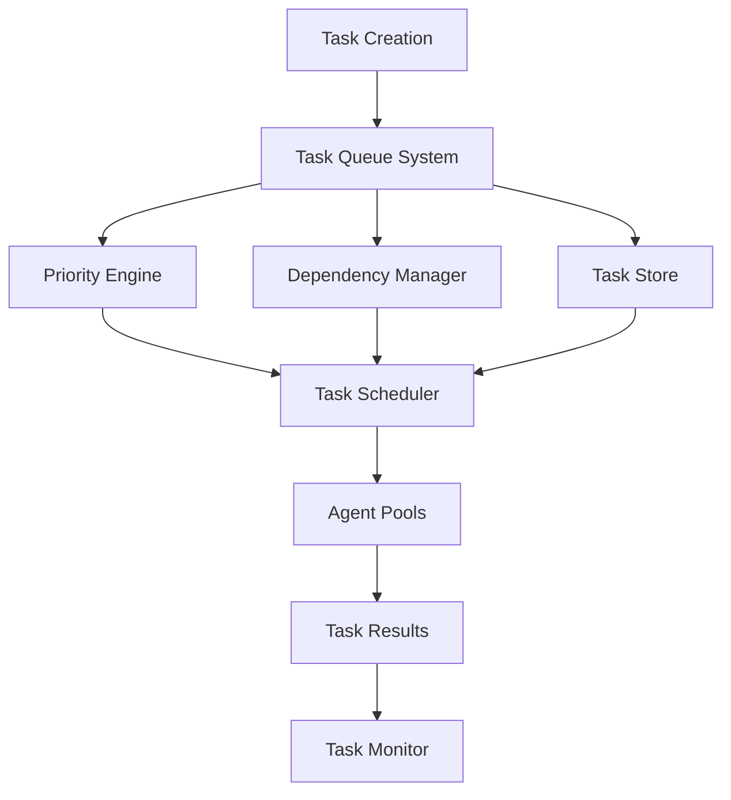
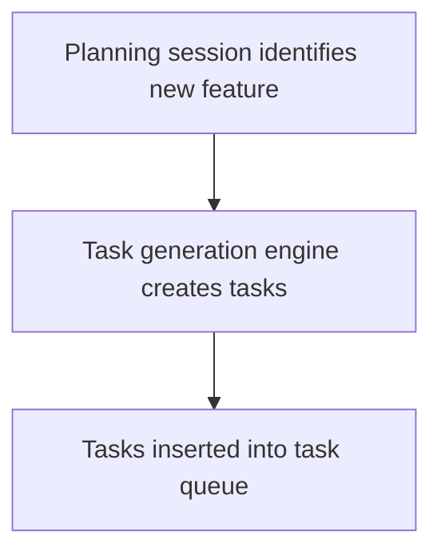
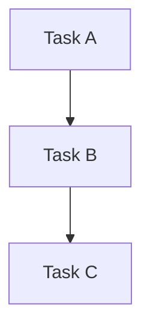
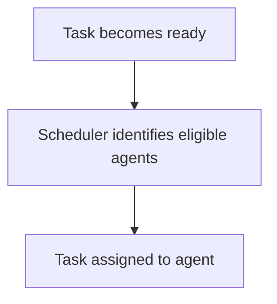
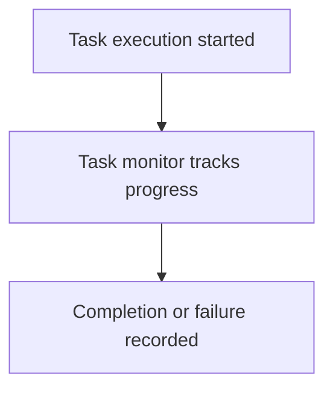
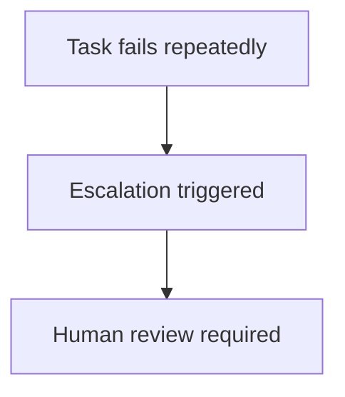
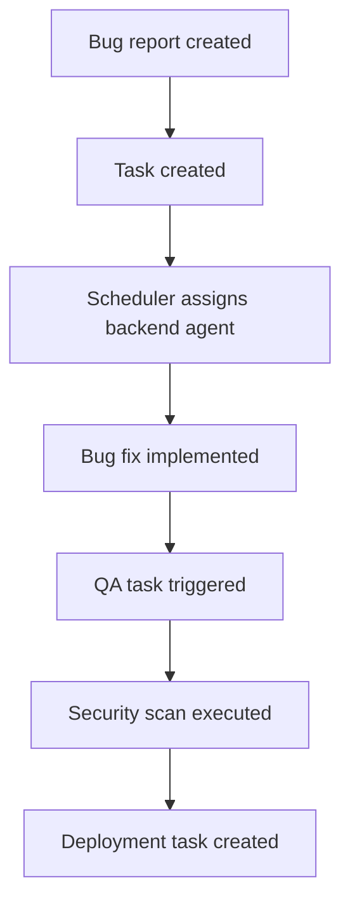

# Chapter 12 — Task Management System

Detailed Explanation
The Task Management System (TMS) is the operational backbone of the AI Autonomous Development Platform (AADP). It defines how work is created, prioritized, scheduled, tracked, executed, retried, and completed across the entire system.
All autonomous work within the platform is represented as tasks. A task is the smallest unit of work that can be assigned to an agent and executed independently.
Examples of tasks include:
- designing an API endpoint
- implementing a backend service
- writing unit tests
- performing a security scan
- executing a deployment pipeline
- analyzing production incidents
Because the platform may manage:
- hundreds of agents
- thousands of concurrent tasks
- multiple projects
- multiple repositories
the Task Management System must provide a highly scalable, fault-tolerant, distributed task orchestration mechanism.
The TMS ensures that work is:
- clearly defined
- properly prioritized
- executed in the correct order
- retried if failures occur
- fully observable and auditable
The system also integrates closely with:
- the Orchestration System
- the Agent Execution Layer
- the Planning and Execution Cycles
- the Safety and Guardrail System
to maintain deterministic execution of autonomous workflows.

---

System Objectives
The Task Management System must support the following capabilities.
Task Creation
Generate tasks from:
- planning sessions
- agent outputs
- monitoring signals
- user requests

---

Task Prioritization
Determine which tasks should execute first based on:
- urgency
- project priorities
- resource availability
- risk levels

---

Task Scheduling
Assign tasks to the most appropriate agent.

---

Dependency Management
Ensure tasks execute only when their dependencies are satisfied.

---

Task Tracking
Maintain a complete history of task execution.

---

Failure Recovery
Automatically retry tasks or escalate failures.

---

**Figure 12.1 — Task Management Architecture**

---

Core Subsystems
Task Creation Engine
Purpose
Creates new tasks based on system inputs.

---

Sources of Task Creation
Tasks may originate from:
- planning sessions
- agent-generated subtasks
- monitoring alerts
- human input

---

**Figure 12.2 — Task Creation Workflow**

---

Task Queue System
Purpose
Stores pending tasks awaiting execution.

---

Responsibilities
- maintaining task queues
- supporting priority-based scheduling
- distributing tasks to agents

---

Queue Partitioning
Queues may be partitioned by:
- project
- task type
- priority level
This improves scalability and reduces queue contention.

---

Data Model
TaskQueueEntry
TaskQueueEntry
{
    task_id: UUID
    priority: integer
    created_at: timestamp
}

---

Priority Engine
Purpose
Determines the order in which tasks should be executed.

---

Priority Factors
Priority may be influenced by:
- production incidents
- security vulnerabilities
- customer-impacting bugs
- scheduled feature releases

---

Example Priority Calculation
priority_score =
    urgency_weight * urgency +
    impact_weight * user_impact +
    risk_weight * risk_score
Higher scores indicate higher priority.

---

Dependency Manager
Purpose
Ensures tasks execute only when prerequisite tasks are complete.

---

Dependency Example
Task A: Design API
Task B: Implement Backend
Task C: Write Tests

Dependencies:

B depends on A
C depends on B

---

**Figure 12.3 — Task Dependency DAG**

---

Task Scheduler
Purpose
Assigns tasks to agents.

---

Responsibilities
- selecting appropriate agent pools
- balancing workload
- ensuring fairness across projects

---

**Figure 12.4 — Scheduling Workflow**

---

Task Store
Purpose
Maintains the persistent record of all tasks.

---

Stored Data
The system stores:
- task definitions
- task states
- execution logs
- task dependencies

---

Data Model
Task (schema aligned to Canonical Task — see Executive Overview Data Models)
Task
{
    id: UUID,
    project_id: UUID,
    title: string,
    description: text,
    type: enum(feature, bug, infra, research, security, improvement, deployment),
    assigned_agent: string,
    status: enum(CREATED, QUEUED, ASSIGNED, RUNNING, VALIDATION, REVIEW, DEPLOYMENT, COMPLETED, FAILED, BLOCKED, RETRYING),
    priority: integer,
    dependencies: [task_id]
}

---

Task Monitor
Purpose
Tracks the execution of tasks and detects anomalies.

---

Responsibilities
- monitoring execution times
- detecting stalled tasks
- identifying failed tasks

---

**Figure 12.5 — Monitoring Workflow**

---

Task Lifecycle (Canonical — see Executive Overview)
CREATED → QUEUED → ASSIGNED → RUNNING → VALIDATION → REVIEW → DEPLOYMENT → COMPLETED
Failure/auxiliary states: FAILED, BLOCKED, RETRYING

---

Retry and Escalation Mechanism
When tasks fail, the system must attempt recovery.

---

Retry Strategy
Tasks may be retried a configurable number of times.
max_retries = 3

---

**Figure 12.6 — Escalation Workflow**

---

Runtime Behavior
The Task Management System runs continuously.
while system_running:

    new_tasks = fetch_created_tasks()

    enqueue_tasks(new_tasks)

    ready_tasks = resolve_dependencies()

    schedule_ready_tasks()

    monitor_task_execution()

---

Failure Handling
The Task Management System must handle multiple failure scenarios.
Examples include:
- agent crashes
- dependency deadlocks
- task timeouts
Mitigation strategies include:
- task retries
- deadlock detection
- automatic task reassignment

---

Scaling Strategy
The system must scale to support extremely high task volumes.

---

Distributed Queue Systems
Task queues run across distributed message brokers.

---

Horizontal Scheduler Scaling
Multiple scheduler nodes operate simultaneously.

---

Task Partitioning
Tasks are partitioned by project and type.

---

Database Sharding
Task storage databases are sharded across multiple nodes.

---

**Figure 12.7 — Bug Fix Workflow**

---

Transition to Next Section
The next section will define the Autonomous Development Workflow, which integrates tasks, agents, and orchestration into a full development lifecycle.
 