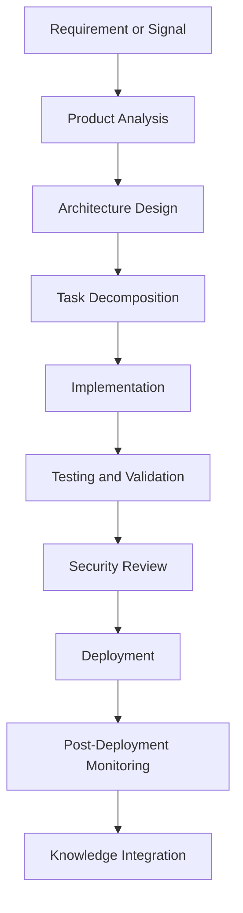
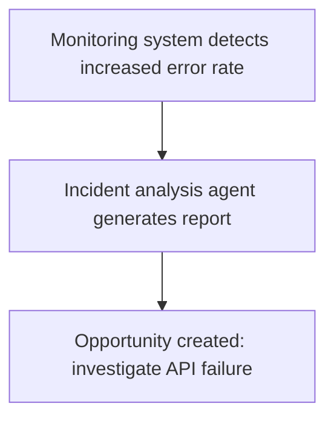
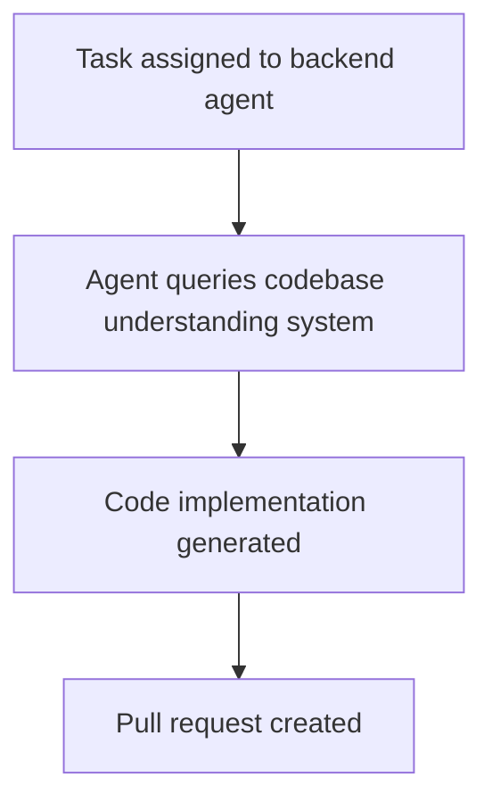
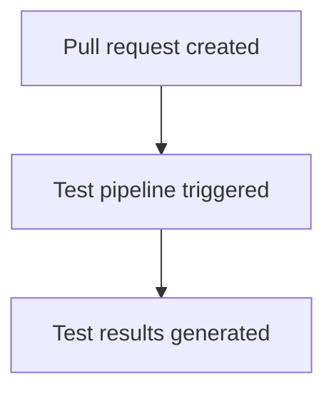
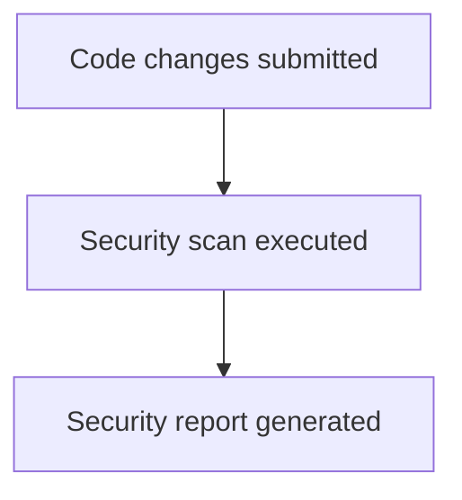
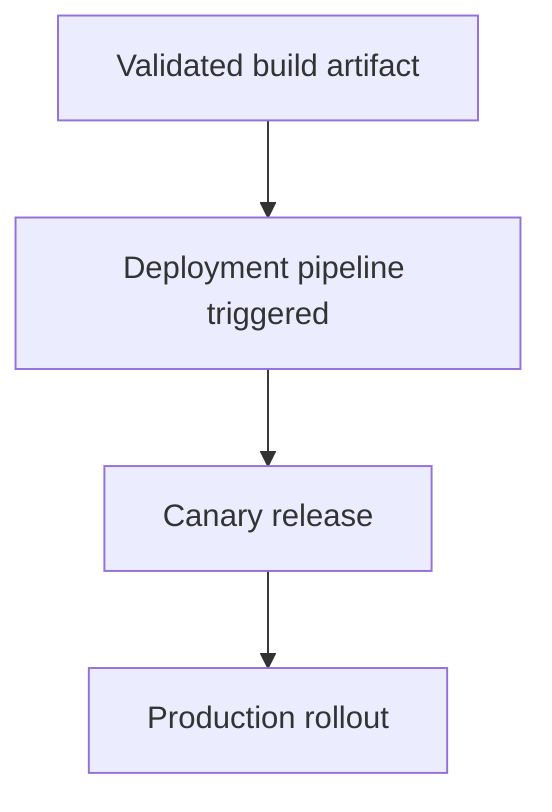
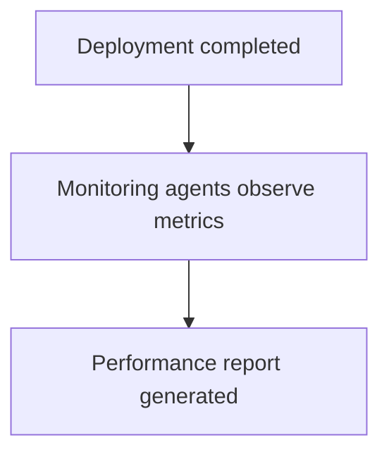
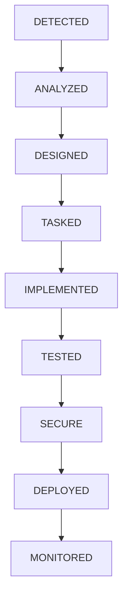
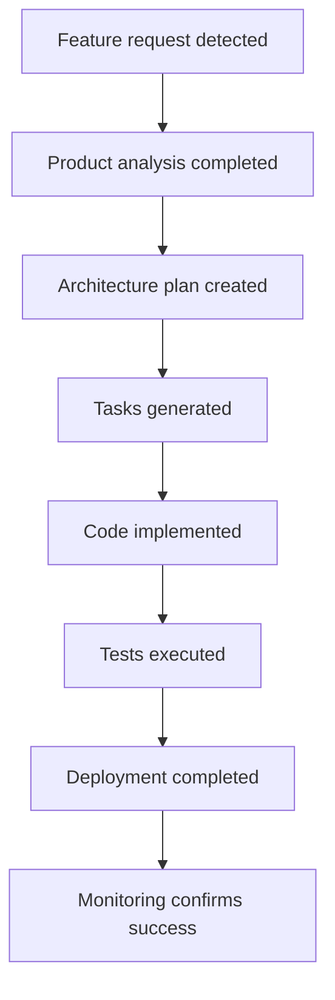

# Chapter 13 — Autonomous Development Workflow

Detailed Explanation
The Autonomous Development Workflow (ADW) defines the end-to-end lifecycle through which the AI Autonomous Development Platform (AADP) converts ideas, system signals, or human requests into production-ready software changes.
While previous sections defined individual subsystems such as:
- Agent Architecture
- Task Management System
- Planning and Execution Cycles
- Safety and Guardrail System
- Codebase Understanding System
the Autonomous Development Workflow defines how these components interact to form a complete development pipeline.
The workflow replicates the operational behavior of a real-world software engineering organization, but executed by autonomous agents coordinated by the orchestrator.
The system must support multiple types of workflows, including:
- feature development
- bug resolution
- security patching
- infrastructure changes
- performance optimization
- research-driven improvements
Each workflow follows a structured lifecycle with clearly defined stages.

---

Workflow Lifecycle Overview
The Autonomous Development Workflow consists of the following major stages:
1.	Requirement or Opportunity Detection
2.	Product Analysis
3.	Architecture Design
4.	Task Decomposition
5.	Implementation
6.	Testing and Validation
7.	Security Review
8.	Deployment
9.	Post-Deployment Monitoring
10.	Knowledge Integration
These stages ensure that development remains safe, traceable, and repeatable.

---

**Figure 13.1 — Workflow Architecture**

---

Stage 1 — Requirement or Opportunity Detection
Purpose
The workflow begins when the system identifies a new development opportunity.

---

Sources of Opportunities
Opportunities may originate from:
- human feature requests
- monitoring alerts
- production incidents
- performance metrics
- research recommendations

---

Responsible Components
- Monitoring agents
- Product management agents
- Research agents

---

**Figure 13.2 — Detection Workflow**

---

Stage 2 — Product Analysis
Purpose
Define the product requirements and scope of the proposed change.

---

Responsible Agent
Product Manager Agent

---

Responsibilities
- understanding the problem
- defining expected outcomes
- determining priority
- estimating business impact

---

Output
A Product Specification Document containing:
- problem description
- success criteria
- user impact analysis

---

Product Specification Data Model
ProductSpecification
{
    id: UUID
    opportunity_id: UUID
    description: text
    success_metrics: [string]
    priority: integer
}

---

Stage 3 — Architecture Design
Purpose
Define the technical solution required to implement the change.

---

Responsible Agent
Architect Agent

---

Responsibilities
- analyzing current system architecture
- identifying affected components
- designing implementation strategy

---

Output
Architecture Plan

---

Architecture Plan Example
ArchitecturePlan
{
    affected_services: ["api_gateway", "auth_service"],
    design_summary: "Introduce token caching layer",
    risk_level: medium
}

---

Stage 4 — Task Decomposition
Purpose
Convert the architecture plan into executable tasks.

---

Responsible Components
- Architect Agent
- Orchestrator

---

Task Types
Typical tasks include:
- backend implementation
- frontend updates
- database migration
- infrastructure configuration
- testing

---

Task Decomposition Example
Architecture Plan: Introduce caching layer

Generated Tasks:

# 1. Implement caching module

# 2. Modify API gateway

# 3. Add cache invalidation logic

# 4. Write performance tests

# 5. Deploy cache infrastructure

---

Stage 5 — Implementation
Purpose
Engineering agents implement the required changes.

---

Responsible Agents
- Backend Engineer Agents
- Frontend Engineer Agents
- DevOps Agents

---

**Figure 13.3 — Implementation Workflow**

---

Stage 6 — Testing and Validation
Purpose
Ensure correctness and quality of implemented changes.

---

Validation Types
- unit tests
- integration tests
- regression tests
- performance tests

---

Responsible Agent
QA Agent

---

**Figure 13.4 — Validation Workflow**

---

Stage 7 — Security Review
Purpose
Identify vulnerabilities before deployment.

---

Responsible Agent
Security Agent

---

Security Checks
- static code analysis
- dependency vulnerability scanning
- secret detection

---

**Figure 13.5 — Security Review Workflow**

---

Stage 8 — Deployment
Purpose
Deploy validated software into production environments.

---

Responsible Agent
DevOps Agent

---

Deployment Strategies
Supported strategies include:
- rolling deployments
- canary deployments
- blue-green deployments

---

**Figure 13.6 — Deployment Workflow**

---

Stage 9 — Post-Deployment Monitoring
Purpose
Ensure deployed changes behave correctly.

---

Monitoring Data
The system observes:
- error rates
- response times
- system load

---

Responsible Systems
- observability infrastructure
- monitoring agents

---

**Figure 13.7 — Monitoring Workflow**

---

Stage 10 — Knowledge Integration
Purpose
Store lessons learned into the knowledge system.

---

Responsibilities
- recording architectural decisions
- documenting deployment outcomes
- storing incident analyses

---

Knowledge Entry Example
Cache layer reduced API latency by 35%

---

**Figure 13.8 — Workflow State Machine**

---

Data Models
Workflow (Section 2, 7) defines the workflow schema (id, project_id, name, tasks, status). WorkflowInstance below represents a single running instance of an autonomous development workflow—the same logical entity with current_stage and type; it references the same task set and aligns with the Workflow schema.
Workflow Instance
WorkflowInstance
{
    id: UUID
    project_id: UUID
    type: feature | bug | optimization
    current_stage: string
    tasks: [task_id]
}

---

Workflow Event
WorkflowEvent
{
    workflow_id: UUID
    event_type: stage_transition
    timestamp: timestamp
}

---

Failure Handling
Workflow failures may occur at multiple stages.
Examples include:
- implementation errors
- test failures
- deployment failures
Mitigation strategies include:
- workflow rollback
- retry mechanisms
- human intervention

---

Scaling Strategy
The Autonomous Development Workflow must scale across many concurrent projects.

---

Parallel Workflow Execution
Each project may run multiple workflows simultaneously.

---

Distributed Agent Pools
Agents execute workflow tasks in parallel.

---

Incremental Workflow Execution
Only relevant stages are executed when necessary.

---

**Figure 13.9 — Feature Development Example**

---

Transition to Next Section
The next section will define the Deployment Infrastructure, which enables safe and scalable software deployment.
 