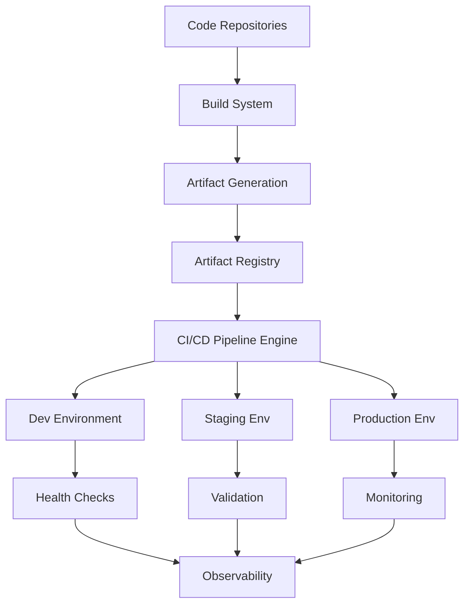
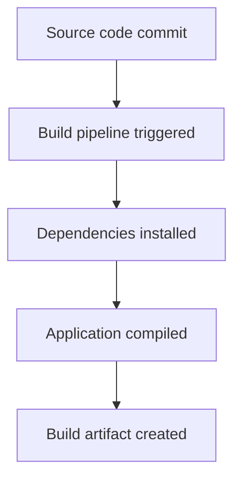
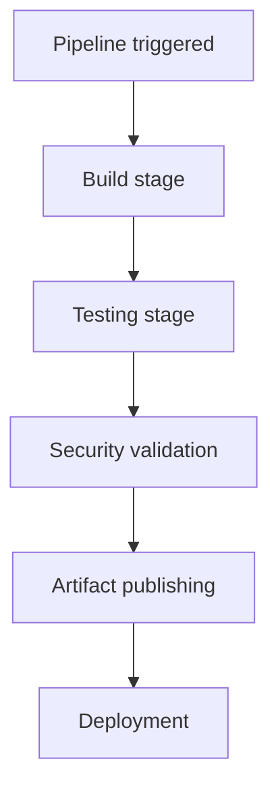
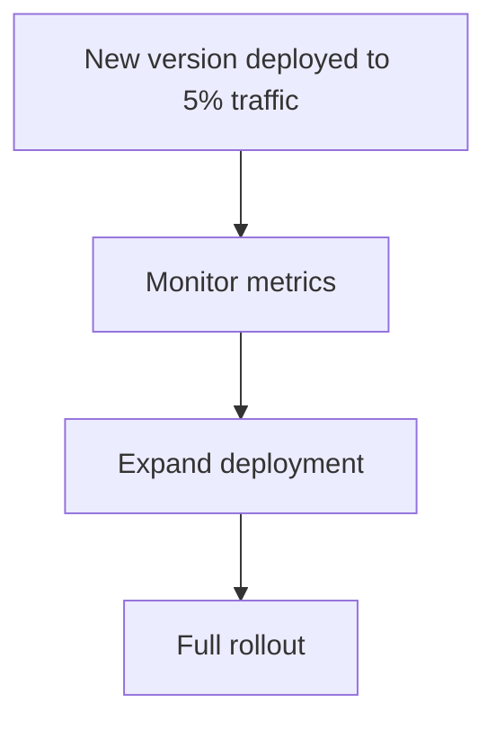
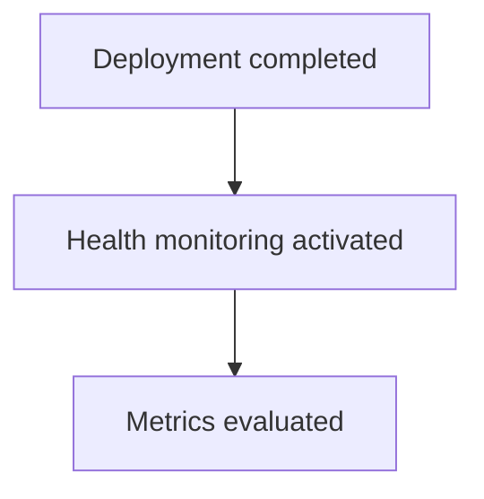
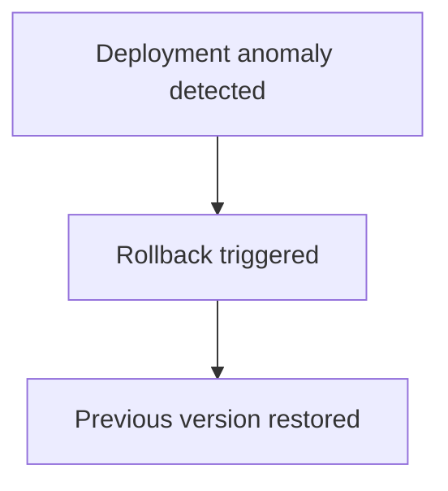
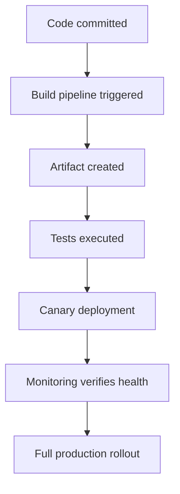

# Chapter 14 — Deployment Infrastructure

Detailed Explanation
The Deployment Infrastructure (DI) provides the execution environment where software artifacts generated by the AI Autonomous Development Platform (AADP) are built, tested, packaged, and deployed into production environments.
Autonomous development systems require extremely robust deployment infrastructure because code is generated and deployed by agents rather than humans. Therefore the deployment layer must enforce strict guarantees for:
- artifact integrity
- deterministic builds
- safe rollout strategies
- automated rollback mechanisms
- reproducible environments
- environment isolation
The Deployment Infrastructure integrates closely with:
- the Task Management System
- the Orchestration System
- the Safety and Guardrail System
- the Observability and Monitoring Layer
to ensure that autonomous deployments remain safe and verifiable.
The deployment system must support modern cloud-native infrastructure patterns, including:
- containerized applications
- microservice architectures
- infrastructure as code
- distributed services
The platform must also support multi-environment deployment pipelines, including:
- development environments
- staging environments
- production environments
Each environment provides increasing levels of safety validation before changes reach production.

---

**Figure 14.1 — Deployment Architecture**

---

Core Objectives
The Deployment Infrastructure must provide the following capabilities.
Deterministic Builds
All builds must be reproducible using the same source code and dependencies.

---

Artifact Versioning
Every build artifact must be versioned and traceable to a specific commit.

---

Deployment Strategy
The system must support explicit deployment strategies to reduce risk and enable safe rollback:
- Canary deployment: route a small percentage of traffic to the new version; monitor metrics; promote or roll back based on SLOs.
- Blue-green deployment: run new version alongside current (blue/green); switch traffic in one cutover; instant rollback by switching back.
- Rollback policy: automated rollback triggers (e.g., error rate threshold, latency degradation); manual rollback via approval interface; immutable artifact registry so previous versions are always available.

---

Safe Deployment Strategies
The system must support gradual deployment strategies that reduce risk (see Deployment Strategy above).

---

Automated Rollback
The platform must automatically revert changes when deployments cause failures (see Rollback policy above).

---

Environment Isolation
Different environments must remain isolated to prevent accidental production changes.

---

Subsystem Components
Build System
Purpose
Transforms source code into executable artifacts.

---

Responsibilities
- compiling source code
- installing dependencies
- running build scripts
- packaging applications

---

Supported Artifact Types
The system must support building:
- container images
- compiled binaries
- serverless packages
- frontend bundles

---

**Figure 14.2 — Build Workflow**

---

Artifact Registry
Purpose
Stores build artifacts for deployment.

---

Responsibilities
- artifact versioning
- artifact storage
- artifact retrieval

---

Artifact Metadata
Each artifact contains metadata describing:
- source commit
- build timestamp
- build environment

---

Data Model
Artifact
Artifact
{
    id: UUID
    repository: string
    version: string
    commit_hash: string
    build_timestamp: timestamp
}

---

CI/CD Pipeline Engine
Purpose
Automates build, test, and deployment processes.

---

Responsibilities
- executing build pipelines
- running automated tests
- deploying artifacts

---

Pipeline Stages
Typical pipeline stages include:
1.	build
2.	test
3.	security scan
4.	artifact packaging
5.	deployment

---

**Figure 14.3 — Pipeline Workflow**

---

Environment Management System
Purpose
Manages deployment environments.

---

Supported Environments
The system must support:
- development
- staging
- production

---

Environment Configuration
Each environment may have different:
- configuration variables
- scaling rules
- monitoring settings

---

Environment Data Model
Environment
Environment
{
    id: UUID
    name: development | staging | production
    cluster_endpoint: string
    configuration: json
}

---

Deployment Controller
Purpose
Manages deployment execution.

---

Responsibilities
- executing deployment strategies
- monitoring deployment health
- coordinating rollout phases

---

Supported Deployment Strategies

---

Rolling Deployment
Gradually replaces running instances.

---

Canary Deployment
Deploys to a small subset of users first.

---

Blue-Green Deployment
Runs two environments simultaneously.

---

**Figure 14.4 — Canary Deployment Workflow**

---

Health Monitoring System
Purpose
Verify system health after deployments.

---

Health Indicators
The system checks:
- response latency
- error rates
- resource utilization

---

**Figure 14.5 — Health Check Workflow**

---

Rollback System
Purpose
Automatically revert faulty deployments.

---

Rollback Triggers
Rollback occurs when:
- error rates increase
- latency exceeds thresholds
- service crashes occur

---

**Figure 14.6 — Rollback Workflow**

---

Runtime Behavior
The deployment system operates continuously alongside development workflows.
while pipeline_active:

    build_artifact()

    run_tests()

    publish_artifact()

    deploy_to_environment()

    monitor_health()

    if anomaly_detected:
        rollback()

---

Failure Handling
Deployment infrastructure must handle various failures.
Examples include:
- build failures
- artifact corruption
- deployment failures
Mitigation strategies include:
- artifact verification
- pipeline retries
- rollback mechanisms

---

Scaling Strategy
The Deployment Infrastructure must support large-scale distributed applications.

---

Distributed Build Workers
Build jobs run on distributed worker nodes.

---

Container Orchestration
Applications are deployed on container orchestration platforms.

---

Multi-Cluster Deployment
Production deployments may span multiple clusters.

---

Artifact Replication
Artifact registries replicate data across regions.

---

**Figure 14.7 — Feature Deployment Workflow**

---

Transition to Next Section
The next section will define the Observability and Monitoring System, which ensures the platform remains observable and debuggable.
 