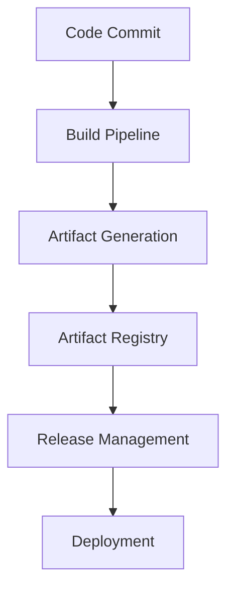
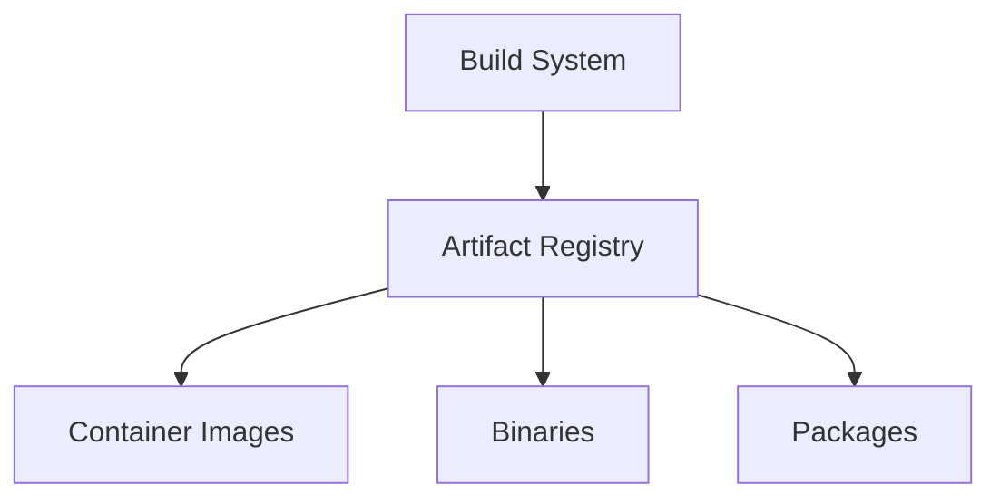
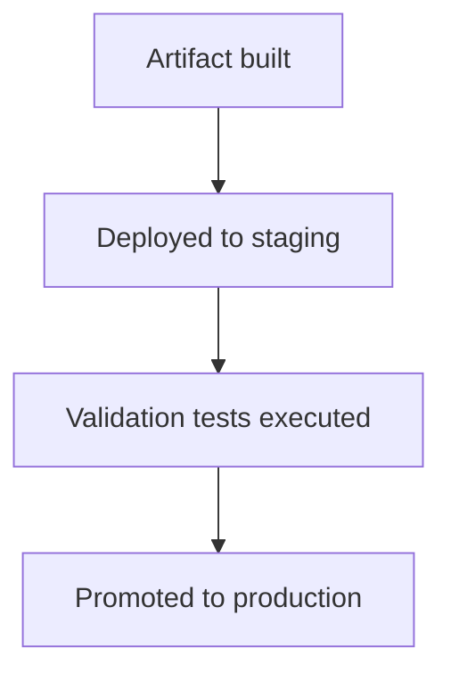
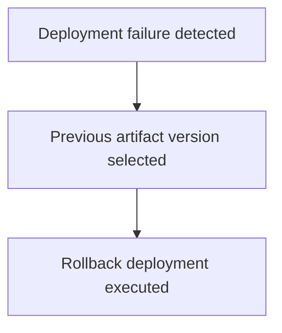
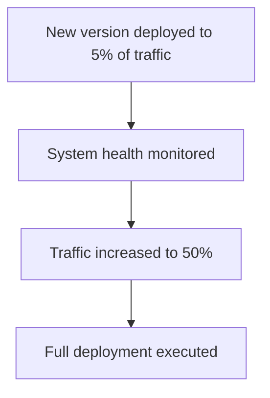
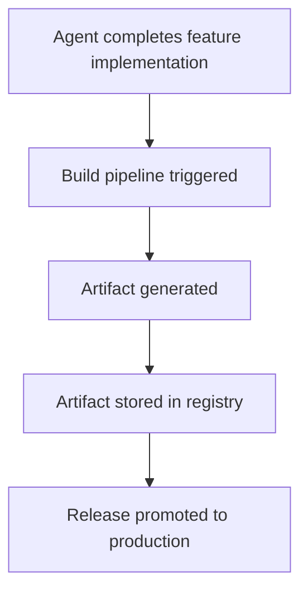

# Chapter 15 — Artifact and Release Management

Detailed Explanation
The Artifact and Release Management System (ARMS) manages the lifecycle of software artifacts generated by the AI Autonomous Development Platform (AADP).
As autonomous agents generate code and execute builds, the system must maintain strict control over:
• build artifacts
• container images
• release versions
• deployment packages
Artifact management ensures that all software releases are:
• reproducible
• verifiable
• traceable
• secure
The system integrates with the CI/CD pipelines to automatically store and manage artifacts produced during the build process.
The Artifact and Release Management System ensures that all deployed software can be traced back to:
• the source code commit
• the build environment
• the build configuration
• the responsible workflow
This capability is essential for debugging, auditing, and secure software delivery.

---

Artifact Management Architecture (Container Registry, Signing, Release Versioning)
- Container registry: all container images are stored in a dedicated registry (e.g., OCI-compliant); access control and namespacing by project/tenant.
- Artifact signing: artifacts (containers, binaries) are signed at build time; deployment pipelines verify signatures before promotion; prevents tampering and ensures provenance.
- Release versioning: semantic versioning (e.g., MAJOR.MINOR.PATCH) or commit-based tags; every release is immutable and traceable to a specific build and commit.

---

**Figure 15.1 — Artifact Lifecycle**

---

Core Objectives
The Artifact and Release Management System must achieve several goals.
Artifact Traceability
Every deployed artifact must be traceable to its source code and build process.
Immutable Artifacts
Artifacts cannot be modified once created.
Secure Software Supply Chain
Artifacts must be verified before deployment.
Reliable Rollbacks
The system must support rapid rollback to previous stable versions.

---

Artifact Registry
Purpose
The Artifact Registry stores all build outputs generated by the platform.
Artifacts include:
• container images
• compiled binaries
• build packages
• deployment bundles

---

**Figure 15.2 — Artifact Storage Architecture**

---

Artifact Metadata Model
Artifact
{
    id: UUID
    repository_id: UUID
    commit_hash: string
    version: string
    build_timestamp: timestamp
    artifact_type: container | binary | package
}
This metadata ensures traceability between code and deployments.

---

Container Versioning
All container images follow a versioning strategy.
The platform uses semantic versioning.
Example:
major.minor.patch
Example versions:
v1.0.0
v1.1.0
v1.1.1
Version numbers are automatically generated by the release pipeline.

---

Immutable Build Strategy
Artifacts must be immutable.
Once an artifact is created:
• it cannot be modified
• it cannot be overwritten
• it can only be replaced by a new version
This guarantees reproducibility of deployments.

---

Signed Artifacts
To prevent supply-chain attacks, artifacts must be cryptographically signed.
Signing ensures that artifacts:
• originate from trusted build pipelines
• have not been tampered with
Artifact verification occurs before deployment.

---

Release Management
Release management coordinates the promotion of artifacts across environments.
Typical environments include:
• development
• staging
• production

---

**Figure 15.3 — Release Promotion Workflow**

---

Rollback Strategy
If a deployment introduces errors, the system must revert to a previously stable version.
**Figure 15.4 — Rollback Procedure**

---

Canary Deployment Strategy
The system supports gradual rollout of new releases.
**Figure 15.5 — Canary Deployment Flow**

---

Supply Chain Security
Artifact security includes:
• dependency vulnerability scanning
• Software Bill of Materials (SBOM) generation
• artifact signature verification
These checks prevent deployment of compromised software.

---

Runtime Behavior
The artifact management system operates as part of the CI/CD pipeline.
while system_running:

    receive_build_output()

    store_artifact()

    verify_artifact_signature()

    update_release_registry()

---

Failure Handling
Potential failures include:
• artifact registry outages
• corrupted build artifacts
• failed release promotions
Mitigation strategies include:
• artifact replication
• release rollback mechanisms
• retry policies

---

Scaling Strategy
The Artifact and Release Management System must support high build volumes.
Scaling mechanisms include:
Distributed Artifact Storage
Artifacts are stored across replicated storage clusters.
Parallel Build Pipelines
Multiple builds may run concurrently.
Registry Caching
Artifact registries use caching to accelerate deployments.

---

**Figure 15.6 — Autonomous Feature Release**

---

Transition to Next Section
The next section will define the Observability and Monitoring System, which provides visibility into system health and operational performance.
 