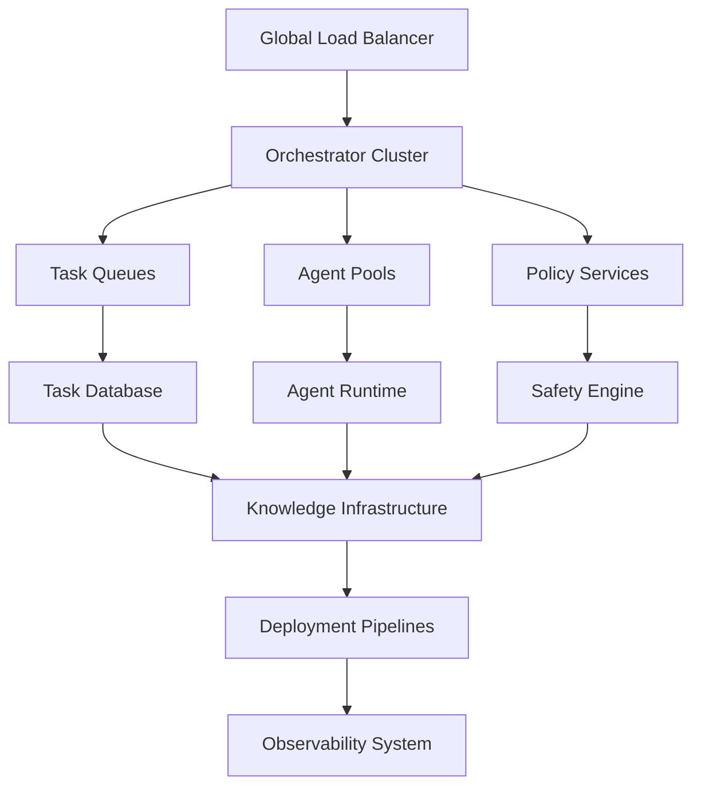
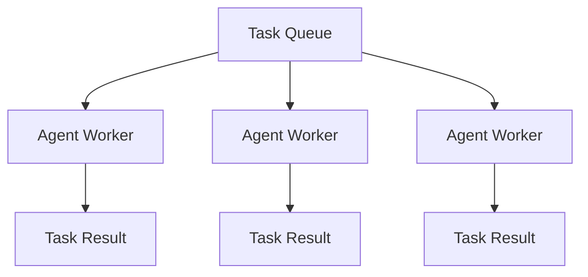
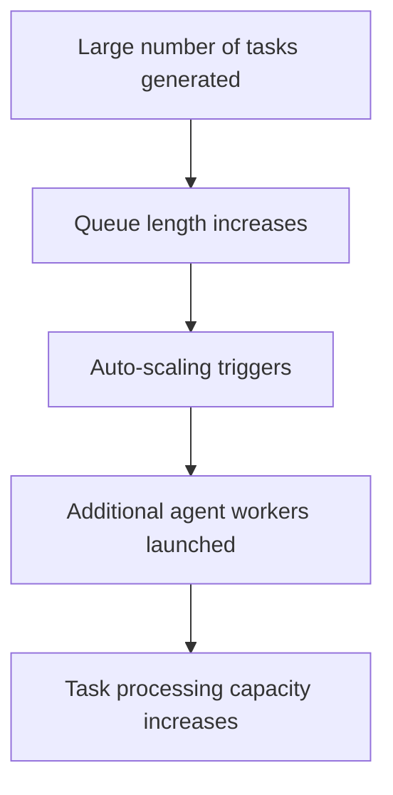

# Chapter 17 — Scalability Architecture

Detailed Explanation
The Scalability Architecture defines how the AI Autonomous Development Platform (AADP) scales to support large-scale autonomous software development across multiple projects, repositories, and agent pools.
The system must be capable of supporting:
- hundreds to thousands of autonomous agents
- tens of thousands of tasks per day
- hundreds of concurrent workflows
- multiple repositories and services
- continuous deployment pipelines
- long-term knowledge accumulation
Unlike traditional applications where scaling primarily focuses on user traffic, the AADP must scale across multiple operational dimensions, including:
- agent execution capacity
- task orchestration throughput
- knowledge retrieval performance
- codebase indexing pipelines
- observability data ingestion
- deployment pipelines
The architecture must ensure that the system can grow horizontally while maintaining:
- deterministic task execution
- low latency coordination
- operational safety
- cost efficiency
The system must avoid bottlenecks at any single subsystem.
Therefore, scalability must be designed into every major component.

---

Scalability Dimensions
The platform must scale across several critical dimensions.

---

Agent Scaling
Support large numbers of concurrently active agents.

---

Task Scaling
Support extremely high volumes of task execution.

---

Knowledge Scaling
Handle large knowledge stores and semantic indexes.

---

Repository Scaling
Support indexing and analysis of very large codebases.

---

Deployment Scaling
Handle frequent deployments across many services.

---

Observability Scaling
Process large volumes of monitoring data.

---

**Figure 17.1 — High-Level Scaling Architecture**

---

Core Scalability Principles
The platform follows several architectural principles to ensure scalability.

---

Horizontal Scaling
Components scale by adding additional nodes rather than increasing the capacity of individual nodes.
Examples include:
- agent workers
- task schedulers
- indexing workers

---

Stateless Service Design
Most services must remain stateless.
State is stored in:
- databases
- distributed caches
- message queues
This allows services to scale horizontally without coordination overhead.

---

Workload Partitioning
Workloads are partitioned by:
- project
- repository
- task type
Partitioning reduces resource contention.

---

Asynchronous Processing
Long-running tasks must execute asynchronously.
Examples include:
- code indexing
- large-scale testing
- deployment pipelines

---

Agent Scaling Architecture
Agents are deployed as worker pools that process tasks from distributed queues.
**Figure 17.2 — Task Queue Distribution**

---

Agent Auto-Scaling
Agent pools scale based on:
- queue length
- task latency
- resource utilization
Example scaling logic:
if task_queue_length > threshold:
    scale_agent_pool(up)

---

Task System Scaling
The Task Management System must support high task throughput.

---

Distributed Task Queues
Tasks are distributed across multiple queue partitions.

---

Partition Strategy
Partition keys may include:
- project_id
- task_type

---

Partition Example
Queue Partition A: backend tasks
Queue Partition B: frontend tasks
Queue Partition C: testing tasks

---

Task Storage Scaling
Task databases are sharded across multiple nodes.

---

Knowledge System Scaling
The memory and knowledge layer must support extremely large data volumes.

---

Vector Database Scaling
Embeddings are distributed across multiple shards.

---

Knowledge Graph Scaling
Graph databases run in clustered mode.

---

Document Storage Scaling
Documents are stored in distributed object storage systems.

---

Codebase Understanding Scaling
Codebase indexing must support large repositories.

---

Incremental Indexing
Only modified files are reprocessed.

---

Parallel Parsing
Code parsing is distributed across worker clusters.

---

Repository Partitioning
Large monorepos may be partitioned by module.

---

Deployment Infrastructure Scaling
Deployment systems must support frequent deployments across many services.

---

Distributed Build Workers
Build jobs run across worker clusters.

---

Multi-Cluster Deployment
Production environments may span multiple Kubernetes clusters.

---

Artifact Replication
Artifact registries replicate data across multiple regions.

---

Observability Scaling
Observability systems must handle massive telemetry volumes.

---

Distributed Logging
Logs are processed using distributed ingestion pipelines.

---

Metrics Aggregation
Metrics are stored in scalable time-series databases.

---

Trace Sampling
Tracing systems may sample traces to reduce storage costs.

---

Data Models
AgentPool
AgentPool
{
    role: string
    active_agents: integer
    max_agents: integer
}

---

QueuePartition
QueuePartition
{
    id: UUID
    task_type: string
    queue_size: integer
}

---

ScalingEvent
ScalingEvent
{
    component: string
    action: scale_up | scale_down
    timestamp: timestamp
}

---

Runtime Behavior
Scaling operations run continuously based on system metrics.
while system_running:

    evaluate_queue_lengths()

    evaluate_agent_utilization()

    scale_agent_pools()

    rebalance_workloads()

---

Failure Handling
Scaling infrastructure must tolerate failures.
Examples include:
- worker node crashes
- queue partition failures
- database node failures
Mitigation strategies include:
- automatic failover
- workload redistribution
- data replication

---

Cost Optimization
Scaling must also consider infrastructure cost.
Strategies include:
- dynamic resource allocation
- idle resource shutdown
- efficient workload scheduling

---

Example Workflow
Example: Handling Task Surge
**Figure 17.3 — Auto-Scaling Workflow**

---

Transition to Next Section
The next section will define the Security Architecture, which ensures that the platform protects sensitive systems, data, and infrastructure.
 