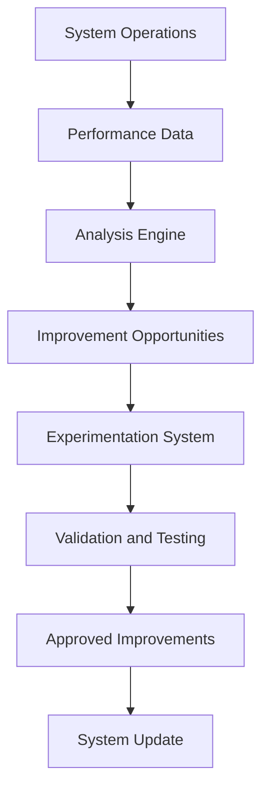
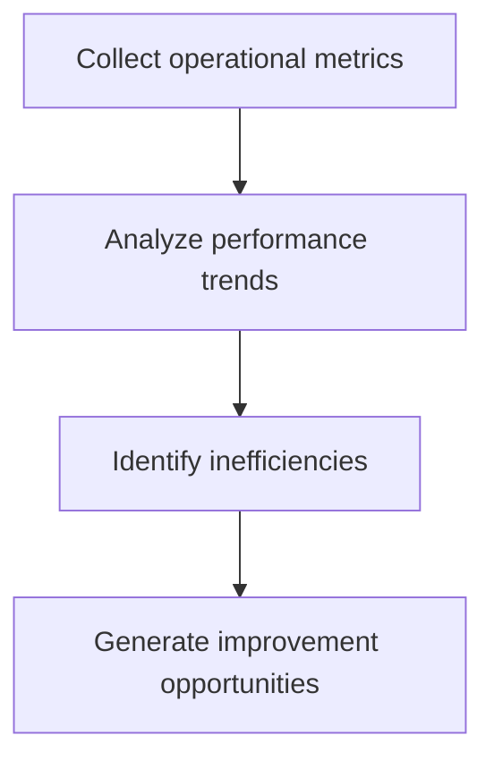
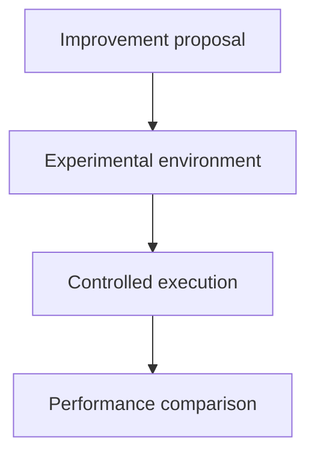
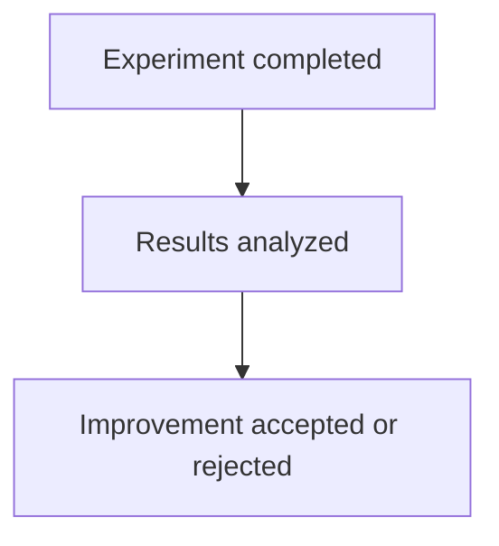
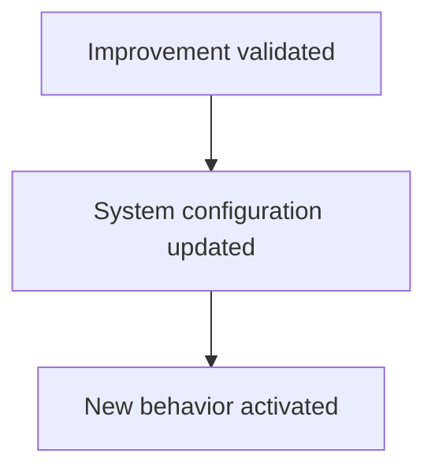
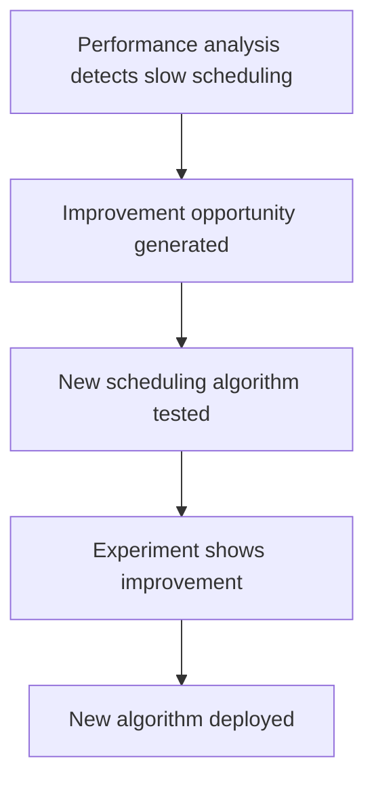

# Chapter 21 — Self-Improvement and Evolution Layer

Detailed Explanation
The Self-Improvement and Evolution Layer (SIEL) enables the AI Autonomous Development Platform (AADP) to improve its own capabilities over time.
Traditional software systems evolve only through external development efforts. In contrast, the AADP is designed to be a self-evolving engineering system capable of analyzing its own performance and implementing improvements to:
- agent workflows
- task execution strategies
- code generation quality
- deployment reliability
- testing strategies
- architectural design
This layer transforms the platform from a static system into an adaptive engineering organization.
The Self-Improvement and Evolution Layer operates continuously by:
1.	collecting operational data
2.	analyzing system performance
3.	identifying improvement opportunities
4.	proposing system modifications
5.	validating improvements through controlled experiments
6.	deploying successful optimizations
Through this cycle, the platform gradually improves its own performance and reliability.
The Self-Improvement Layer integrates closely with:
- the Observability and Monitoring System
- the Memory and Knowledge Layer
- the Task Management System
- the Orchestration System
to analyze system behavior and implement improvements.

---

**Figure 21.1 — Evolution Architecture**

---

Core Objectives
The Self-Improvement Layer must achieve several objectives.
Continuous System Optimization
Improve system performance and efficiency.

---

Workflow Optimization
Enhance the coordination between agents and workflows.

---

Code Quality Improvement
Improve code generation quality over time.

---

Infrastructure Optimization
Improve resource utilization and deployment efficiency.

---

Learning from Failures
Analyze system failures and incorporate lessons learned.

---

Subsystem Components
The Self-Improvement Layer contains several specialized subsystems.

---

Performance Analysis Engine
Purpose
Analyze operational metrics and identify inefficiencies.

---

Data Sources
The analysis engine consumes data from:
- observability metrics
- task execution logs
- deployment results
- incident reports

---

**Figure 21.2 — Analysis Workflow**

---

Performance Analysis Data Model
PerformanceMetric
PerformanceMetric
{
    metric_name: string
    value: float
    timestamp: timestamp
}

---

Improvement Opportunity Generator
Purpose
Convert performance insights into actionable improvement proposals.

---

Example Improvements
Examples include:
- optimizing task scheduling algorithms
- improving test coverage strategies
- modifying deployment pipelines
- enhancing agent reasoning prompts

---

Opportunity Data Model
ImprovementOpportunity
ImprovementOpportunity
{
    id: UUID
    description: text
    affected_component: string
    expected_benefit: string
}

---

Experimentation System
Purpose
Test potential improvements safely before applying them to the platform.

---

Experiment Types
Experiments may include:
- new task scheduling algorithms
- alternative agent prompts
- modified deployment strategies

---

**Figure 21.3 — Experiment Architecture**

---

Experiment Data Model
Experiment
Experiment
{
    id: UUID
    description: text
    control_group: string
    experimental_group: string
}

---

Validation System
Purpose
Evaluate experiment results.

---

Validation Criteria
Evaluation metrics include:
- task success rate
- deployment success rate
- system latency
- agent efficiency

---

**Figure 21.4 — Validation Workflow**

---

System Update Engine
Purpose
Apply validated improvements to the platform.

---

Examples of Updates
Examples include:
- updating agent prompts
- modifying scheduling algorithms
- adjusting infrastructure scaling rules

---

**Figure 21.5 — Update Workflow**

---

Runtime Behavior
The Self-Improvement Layer operates continuously.
while system_running:

    analyze_system_performance()

    generate_improvement_opportunities()

    run_experiments()

    validate_results()

    deploy_successful_improvements()

---

Safety Controls
Because self-improvement involves modifying the platform itself, strict safety mechanisms must be enforced.

---

Safety Measures
The system enforces:
- human approval for critical changes
- controlled experimentation environments
- rollback capability

---

Failure Handling
Potential failures include:
- incorrect performance analysis
- flawed experiments
- unintended side effects
Mitigation strategies include:
- staged rollout of improvements
- continuous monitoring
- rollback mechanisms

---

Scaling Strategy
The Self-Improvement Layer must scale alongside system growth.

---

Distributed Analysis Pipelines
Performance analysis runs across distributed compute nodes.

---

Parallel Experiments
Multiple experiments may run concurrently.

---

Experiment Isolation
Experiments execute in isolated environments.

---

**Figure 21.6 — Optimizing Task Scheduling Example**

---

Transition to Next Section
The next section will define the Economic / Value Optimization System, which evaluates task value and prioritizes work across the platform.
 