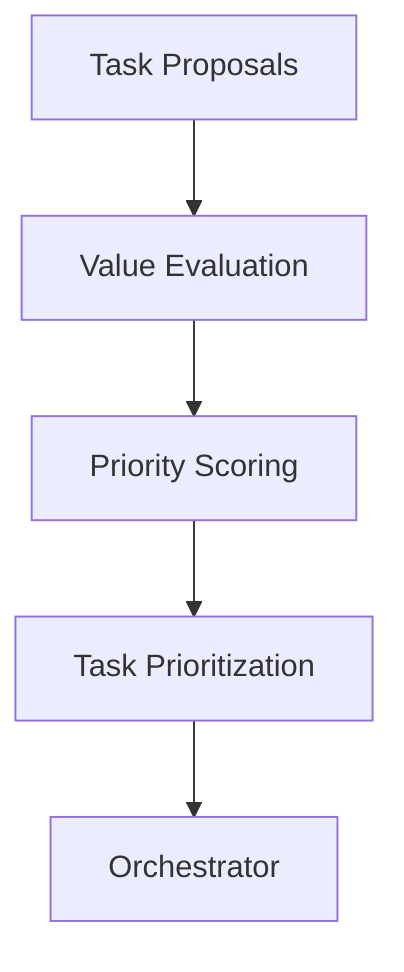
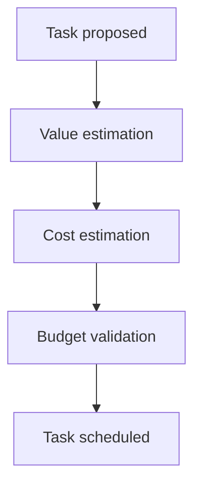

# Chapter 22 — Economic / Value Optimization System

Detailed Explanation
The Economic / Value Optimization System (EVOS) is responsible for evaluating the expected value of development tasks and prioritizing work across the AI Autonomous Development Platform (AADP).
While other subsystems focus on executing tasks and improving system capabilities, the Economic / Value Optimization System determines which tasks should be performed and in what order.
In autonomous software development environments, large numbers of potential tasks may exist simultaneously, including:
• new feature implementation
• bug fixes
• performance optimizations
• security improvements
• architectural refactoring
• technical debt reduction
Without a value evaluation system, agents may expend computational resources on tasks that provide little benefit.
The EVOS ensures that development effort is directed toward tasks that maximize overall system value.

---

**Figure 22.1 — Economic Decision Architecture**

---

Core Objectives
The Economic / Value Optimization System must achieve several goals.
Prioritize Valuable Work
Ensure that development resources focus on tasks with the highest expected benefit.
Prevent Wasteful Computation
Reduce execution of low-value or redundant tasks.
Balance Cost and Benefit
Ensure that expected value exceeds expected compute cost.
Optimize Long-Term Platform Evolution
Encourage tasks that improve system capabilities over time.

---

Subsystem Components
The EVOS contains several internal subsystems.

---

Task Opportunity Analyzer
Purpose
Identify potential development opportunities across the system.
Sources of task proposals include:
• user feature requests
• system incidents
• performance monitoring alerts
• research agent discoveries
• self-improvement suggestions

---

Value Estimation Engine
Purpose
Estimate the expected benefit of performing a task.
Factors used in value estimation include:
• user impact
• system performance improvement
• reliability improvements
• security risk reduction

---

Value Estimation Model
Example value scoring formula:
Task Value Score =
    User Impact +
    Performance Gain +
    Reliability Improvement +
    Strategic Importance

---

Cost Estimation Engine
Purpose
Estimate the computational cost required to complete a task.
Cost estimates include:
• expected LLM token usage
• compute time required
• infrastructure utilization

---

Cost Model Example
Estimated Cost =
    Model Inference Cost +
    Compute Resource Cost +
    Storage Operations Cost

---

Return on Investment (ROI) Evaluation
The system evaluates the expected value of tasks relative to their estimated cost.
ROI = Expected Value / Estimated Cost
Tasks with higher ROI receive higher priority.

---

Priority Scoring System
Tasks are assigned a priority score based on:
• ROI score
• system urgency
• security impact
• dependency relationships

---

Priority Data Model
TaskPriority
{
    task_id: UUID
    value_score: float
    estimated_cost: float
    roi_score: float
    priority_level: integer
}

---

Compute Budget Awareness
The EVOS integrates with the Cost Model and Budget Control Architecture.
Before scheduling a task, the system verifies that sufficient compute budget is available.
**Figure 22.2 — Task Scheduling with Budget Validation**

---

Strategic Value Evaluation
Certain tasks provide long-term benefits even if immediate value is low.
Examples include:
• architecture refactoring
• technical debt reduction
• documentation improvements
The EVOS applies a strategic weight to such tasks.

---

Runtime Behavior
The system continuously evaluates task opportunities.
while system_running:

    gather_task_proposals()

    estimate_task_value()

    estimate_task_cost()

    calculate_roi()

    update_task_priorities()

---

Failure Handling
Potential issues include:
• inaccurate value estimates
• cost prediction errors
• priority conflicts
Mitigation strategies include:
• feedback-driven model improvement
• human override mechanisms
• continuous priority recalibration

---

Scaling Strategy
The Economic / Value Optimization System must support large numbers of tasks across many projects.
Scaling mechanisms include:
Distributed Evaluation Workers
Task value estimation is distributed across worker nodes.
Batch Priority Updates
Priority scores are recalculated in batches to improve efficiency.

---

Example Workflow
Example: Feature vs Optimization Decision
Feature A expected value: 80
Estimated cost: 40

ROI = 2.0

Optimization B expected value: 50
Estimated cost: 10

ROI = 5.0
Optimization B receives higher priority due to greater ROI.

---

Transition to Next Section
The next section will define the Product Intelligence and UX Optimization System, which analyzes user behavior and product usage to drive UX improvements.
 