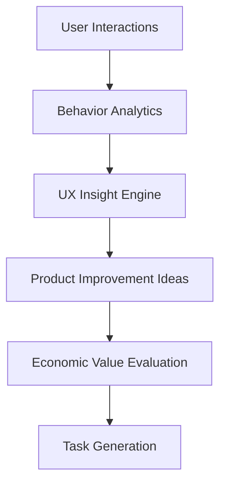
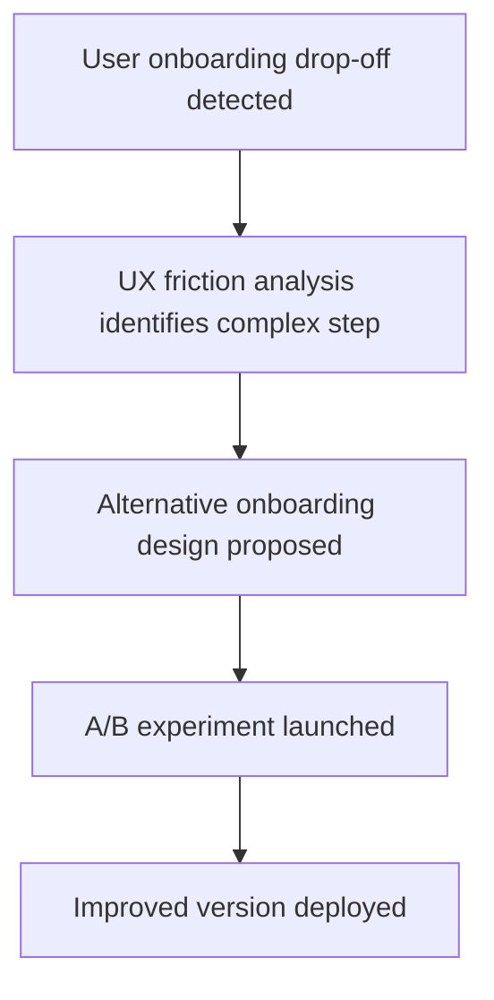

# Chapter 23 — Product Intelligence and UX Optimization System

Detailed Explanation

The Product Intelligence and UX Optimization System (PIUXOS) continuously analyzes user behavior, product usage patterns, and market trends in order to improve the software products built by the AI Autonomous Development Platform (AADP).

While other subsystems focus on engineering execution and task prioritization, this system focuses on product success.

The goal of this subsystem is to ensure that the applications developed by the platform:

• maximize user engagement
• improve retention
• reduce user friction
• increase product adoption

The system uses behavioral analytics and experimentation frameworks to identify opportunities for improving product design and user experience.

This allows the platform to evolve products based on real-world usage data rather than assumptions.

**Figure 23.1 — Product Intelligence Architecture**

Insights generated by this subsystem feed into the Economic / Value Optimization System which prioritizes improvements.

Core Objectives

The Product Intelligence and UX Optimization System must achieve several goals.

Improve User Retention

Identify patterns that increase long-term user engagement.

Reduce User Friction

Detect user interface elements that cause confusion or drop-off.

Optimize Feature Adoption

Determine which features are used frequently and which are ignored.

Enable Data-Driven Product Evolution

Allow the platform to improve products based on behavioral data.

Subsystem Components

The PIUXOS subsystem contains several internal components.

User Behavior Analytics Engine
Purpose

Collect and analyze user interaction data.

The system tracks events such as:

• page navigation
• feature usage
• time spent on screens
• interaction sequences

Example Event Model
UserEvent
{
    user_id: UUID
    event_type: click | view | submit
    feature: string
    timestamp: timestamp
}

This data forms the foundation for product analysis.

Feature Usage Analysis

The system continuously evaluates how often features are used.

Metrics analyzed include:

• daily active usage
• feature adoption rate
• abandonment rate

This allows the system to detect:

• unused features
• highly valuable features
• features that require redesign.

User Journey Analysis

The system reconstructs user journeys to understand how users interact with the product.

Example journey:

Signup
   ↓
Onboarding
   ↓
Dashboard
   ↓
Feature A
   ↓
User Drop-Off

This analysis identifies where users abandon workflows.

UX Friction Detection

The system detects interface problems by analyzing behavioral signals such as:

• repeated failed interactions
• long completion times
• navigation loops

These signals indicate potential usability problems.

Product Experimentation Framework

The platform supports controlled UX experiments.

Example experiment:

UI Version A → Current design
UI Version B → Simplified interface

Users are randomly assigned to different versions.

Metrics compared include:

• retention rate
• engagement
• feature completion time

Experiment Data Model
UXExperiment
{
    experiment_id: UUID
    feature: string
    variant_a: string
    variant_b: string
}
Market Intelligence Module

In addition to internal analytics, the system analyzes external product trends.

Sources include:

• competitor products
• emerging UI patterns
• industry benchmarks

This helps the system propose innovative features.

Product Insight Generation

Insights generated by the system may include:

• onboarding flow improvements
• UI simplification opportunities
• feature redesign proposals
• product navigation improvements

These insights are converted into development tasks.

Integration With Economic Optimization

Before execution, proposed improvements are evaluated by the Economic / Value Optimization System.

This ensures that only improvements with meaningful expected value are prioritized.

Runtime Behavior

The system continuously analyzes product usage data.

while system_running:

    collect_user_events()

    analyze_feature_usage()

    detect_ux_friction()

    generate_product_insights()

    submit_improvement_tasks()
Scaling Strategy

The analytics system must handle large volumes of user interaction data.

Scaling mechanisms include:

Distributed event ingestion pipelines
Stream processing systems
Batch analytics pipelines

**Figure 23.2 — Improving Onboarding Flow Example**

---

Transition to Next Section
The next section will define the Multi-Project Execution System, which enables the platform to manage many development projects simultaneously.
 