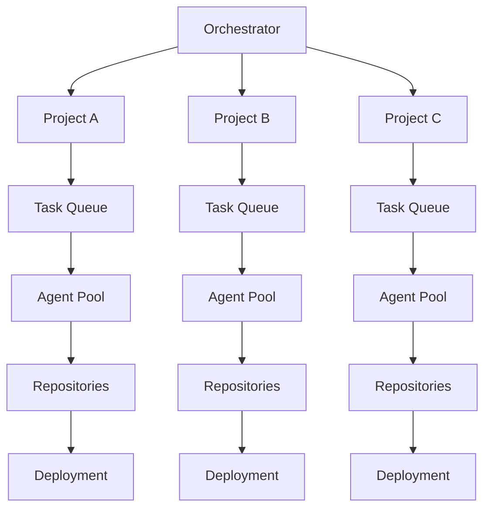
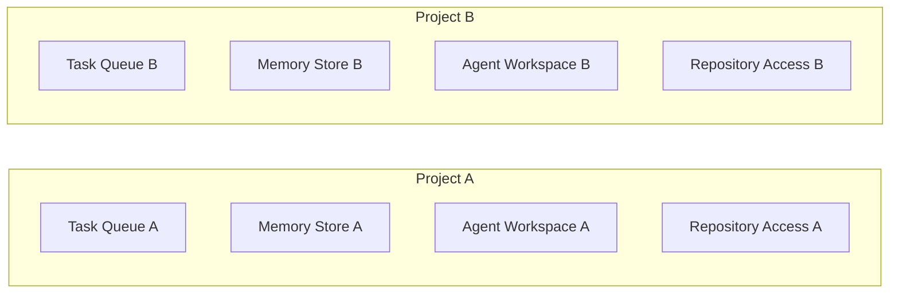
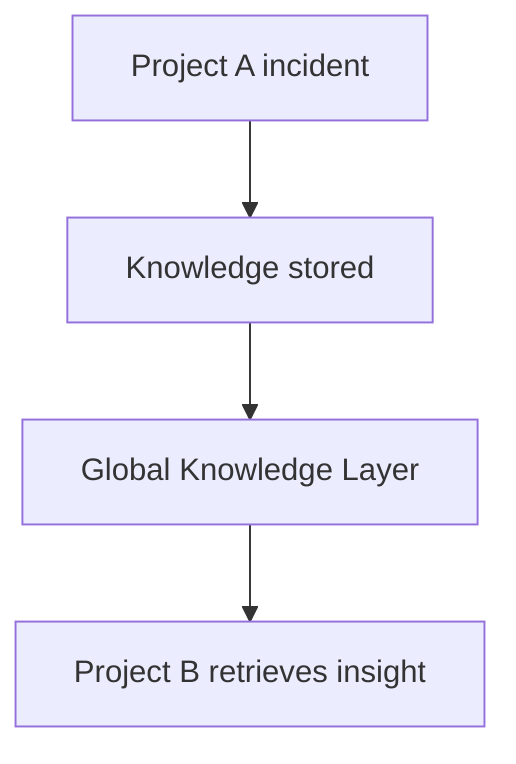

# Chapter 24 — Multi-Project Execution System

Detailed Explanation
The Multi-Project Execution System (MPES) enables the AI Autonomous Development Platform (AADP) to operate on many independent software projects simultaneously while maintaining strict isolation between them.
In real-world production environments the platform must support:
• dozens or hundreds of active projects
• multiple repositories per project
• independent deployment pipelines
• independent workflows
• separate knowledge bases
• independent agent activity
Each project represents a logically independent software system that may belong to different teams, organizations, or tenants.
For this reason the platform must enforce strict project isolation boundaries while still allowing the system to reuse global engineering knowledge.
The Multi-Project Execution System therefore provides two major capabilities:
1.	Project Isolation
Ensures that actions performed within one project cannot affect other projects.
2.	Controlled Cross-Project Knowledge Sharing
Allows reusable insights such as architectural patterns or security fixes to benefit multiple projects.
The MPES integrates with multiple core subsystems including:
• Orchestration System
• Task Management System
• Memory and Knowledge Layer
• Codebase Understanding System
• Deployment Infrastructure
• Security Architecture
Through these integrations the system can coordinate large-scale autonomous development across many projects concurrently.

---

**Figure 24.1 — Multi-Project Architecture**

---

Core Objectives
The Multi-Project Execution System must achieve several objectives.

---

Project Isolation
Ensure that tasks, workflows, and agent actions from different projects cannot interfere with each other.
Isolation boundaries include:
• task queues
• memory stores
• repositories
• deployment pipelines

---

Resource Allocation
Ensure fair distribution of system resources across projects.
Resources include:
• agent compute capacity
• LLM token usage
• infrastructure compute
• storage capacity

---

Knowledge Reuse
Allow useful knowledge to be reused across projects when safe.
Examples include:
• architectural patterns
• security fixes
• performance improvements

---

Scalability
Allow the platform to support large numbers of projects concurrently.

---

Subsystem Components
The Multi-Project Execution System contains several internal components.

---

Project Registry
Purpose
Maintain metadata for all projects managed by the platform.

---

Responsibilities
The registry stores:
• project identifiers
• repository locations
• environment configurations
• workflow states
• resource quotas

---

Project Data Model
Project
{
    id: UUID
    name: string
    description: text
    tenant_id: UUID
    repositories: [string]
    environments: [string]
    created_at: timestamp
}
The tenant_id field enables support for multi-tenant deployments.

---

Project Namespace System
Each project operates inside an isolated namespace.
A namespace defines the boundaries for:
• task queues
• memory entries
• agent workflows
• repository access
• deployment pipelines

---

**Figure 24.2 — Project Namespace Structure**

---

Agent Access Boundaries
Agents must only access resources belonging to the project that created the task.
Agent access restrictions are enforced by:
• project identity tokens
• orchestrator policy validation
• RBAC policies
Example rule:
BackendAgent(ProjectA) cannot access Repository(ProjectB)
The orchestrator validates project scope before task execution.

---

Repository Access Control
Each project defines a list of authorized repositories.
The system enforces repository access through:
• repository authentication tokens
• repository access policies
• project repository allow-lists

---

Repository Data Model
Repository
{
    id: UUID
    project_id: UUID
    url: string
    branch: string
    access_token_ref: string
}

---

Memory Isolation
The Memory and Knowledge Layer partitions knowledge by project namespace.
Each memory entry contains a project identifier. Type uses the canonical MemoryEntry enum (see Executive Overview — Canonical Data Models).
MemoryEntry
{
    id: UUID
    project_id: UUID
    type: enum(decision, code_summary, research, bug, deployment)
    content: text
}
Agents may only retrieve knowledge belonging to their project unless cross-project access is explicitly allowed.

---

Cross-Project Knowledge Sharing
Certain knowledge can safely be shared globally.
Examples include:
• common bug fixes
• performance optimizations
• security mitigation strategies
The system stores such entries in a Global Knowledge Layer.

---

**Figure 24.3 — Cross-Project Knowledge Flow**

---

Resource Allocation System
Purpose
Allocate compute resources fairly across projects.

---

Resource Types
The platform manages several resource types:
• agent workers
• compute resources
• LLM token budgets
• storage capacity

---

Allocation Strategy
Resource allocation may use:
• weighted scheduling
• project quotas
• dynamic scaling

---

Resource Quota Data Model
ResourceQuota
{
    project_id: UUID
    max_agents: integer
    max_tasks: integer
    max_storage: integer
    monthly_token_budget: integer
}

---

Billing and Cost Attribution
The platform must track resource consumption per project.
Billing attribution includes:
• compute usage
• LLM token usage
• storage usage

---

Usage Record Model
ProjectUsage
{
    project_id: UUID
    compute_hours: float
    tokens_used: integer
    storage_used_gb: float
}
This data is used by the Cost Control Architecture.

---

Project Workflow Manager
Purpose
Track workflows for each project independently.

---

Responsibilities
The manager tracks:
• active workflows
• workflow states
• completed workflows

---

Workflow Data Model
ProjectWorkflow
{
    id: UUID
    project_id: UUID
    type: feature | bug | optimization
    current_stage: string
}

---

Runtime Behavior
The Multi-Project Execution System continuously manages workloads across projects.
while system_running:

    monitor_project_activity()

    enforce_project_isolation()

    allocate_resources()

    schedule_project_tasks()

    balance_system_load()

---

Failure Handling
Potential failures include:
• project resource exhaustion
• workflow conflicts
• repository synchronization failures
Mitigation strategies include:
• project-level throttling
• workflow isolation
• retry mechanisms

---

Scaling Strategy
The system must scale to support large numbers of projects.

---

Project Partitioning
Projects are distributed across orchestrator nodes.

---

Independent Task Queues
Each project maintains its own task queues.

---

Distributed Knowledge Storage
Knowledge systems partition memory by project namespace.

---

Example Workflow
Example: Concurrent Development Across Projects
Project A: New feature development
Project B: Security patch
Project C: Performance optimization

All workflows executed simultaneously

---

Transition to Next Section
The next section will define the Development Roadmap, which outlines the phased implementation plan for building the platform.
 