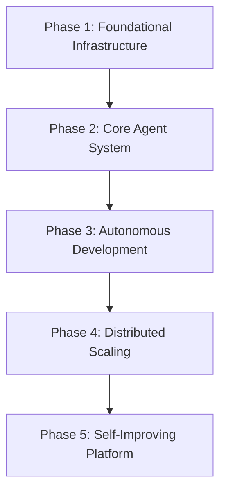
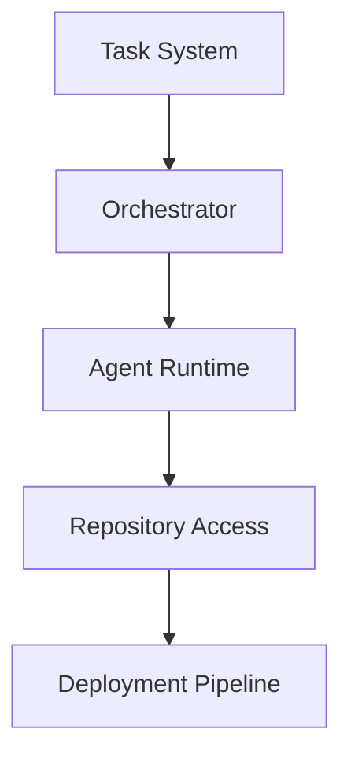
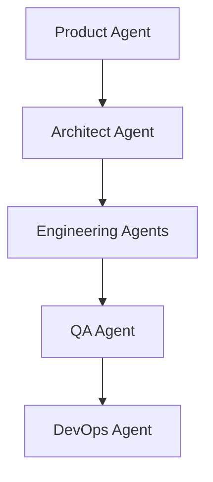
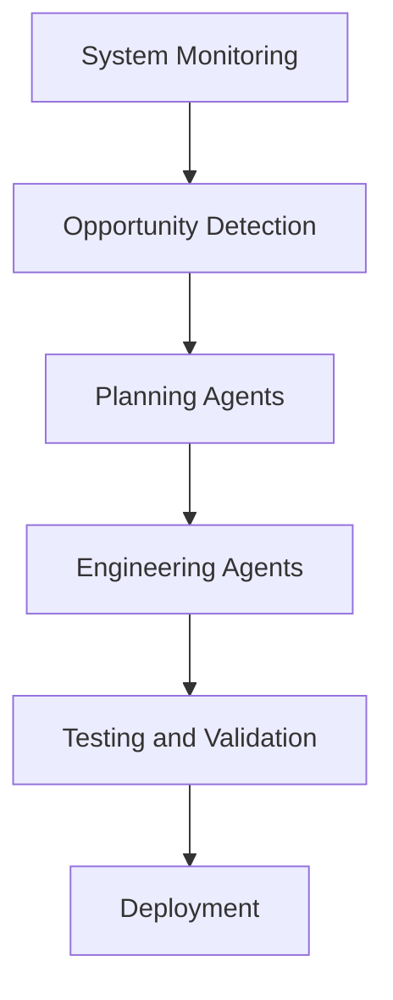
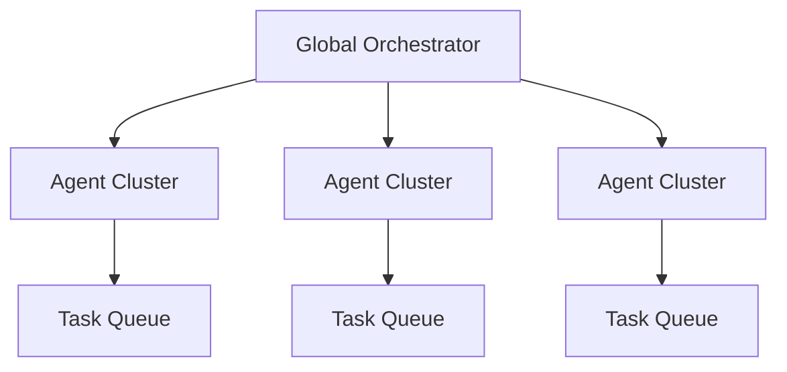
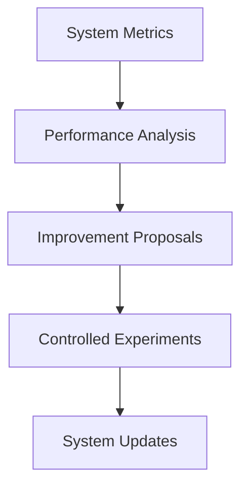
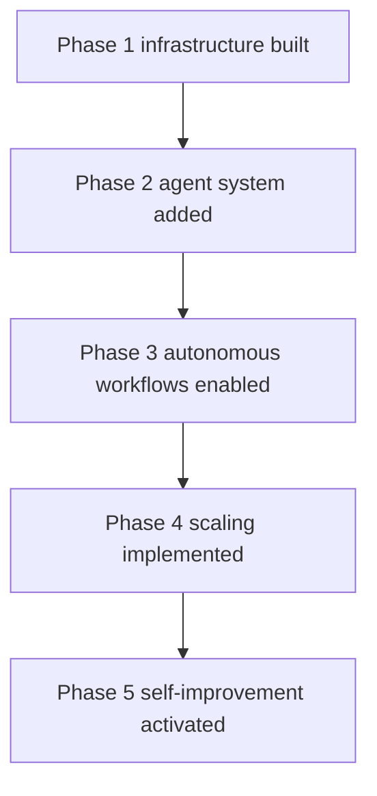

# Chapter 25 — Development Roadmap

Detailed Explanation
The Development Roadmap defines the structured, phased implementation plan for building the AI Autonomous Development Platform (AADP) from an initial prototype into a full-scale production system.
Because the platform consists of many complex subsystems—including orchestration, agent execution, knowledge systems, safety infrastructure, and deployment pipelines—it must be implemented incrementally.
Attempting to build the entire system simultaneously would introduce:
- excessive engineering complexity
- high operational risk
- long development timelines
- difficulty validating architectural decisions
Instead, the platform must evolve through multiple development phases, each introducing new capabilities while maintaining a functional system.
Each phase must deliver:
- operational functionality
- architectural validation
- incremental improvements in autonomy
The roadmap is divided into the following phases:
1.	Foundational Infrastructure
2.	Core Agent System
3.	Autonomous Development Capabilities
4.	Scalable Distributed Architecture
5.	Self-Improving System
Each phase builds upon the previous phase.

---

**Figure 25.1 — Roadmap Phases**

---

Phase 1 — Foundational Infrastructure
Objective
Establish the core platform infrastructure required to support agent execution and task orchestration.
This phase focuses on building the minimal operational platform.

---

Core Components
The following systems must be implemented first:
- Orchestration System
- Task Management System
- Basic Agent Runtime
- Repository Integration
- Deployment Infrastructure
- Observability System

---

Key Deliverables
Agent Runtime Environment
Implement containerized agent workers capable of executing tasks.

---

Task Management Infrastructure
Develop the task queue system responsible for distributing work.

---

Repository Integration
Integrate Git-based repositories for source code access.

---

Basic Deployment Pipeline
Implement a CI/CD pipeline capable of deploying software changes.

---

**Figure 25.2 — Phase 1 Architecture**

---

Success Criteria
The system must be capable of:
- executing simple development workflows
- generating code changes
- deploying test applications

---

Phase 2 — Core Agent System
Objective
Introduce specialized agents that replicate software engineering roles.

---

New Agent Types
This phase introduces:
- Product Manager Agent
- Architect Agent
- Backend Engineer Agent
- Frontend Engineer Agent
- QA Agent
- DevOps Agent

---

Key Capabilities
Workflow Coordination
Agents must collaborate through the orchestrator.

---

Code Generation
Engineering agents generate and modify source code.

---

Automated Testing
QA agents execute testing pipelines.

---

Basic Safety Checks
Security scanning and deployment validation must be implemented.

---

**Figure 25.3 — Agent Collaboration Architecture**

---

Success Criteria
The system must autonomously complete simple development workflows such as:
- implementing small features
- fixing basic bugs
- deploying updates

---

Phase 3 — Autonomous Development Capabilities
Objective
Enable the system to perform end-to-end autonomous development.

---

New Capabilities
This phase introduces:
- Planning and Execution Cycles
- Codebase Understanding System
- Memory and Knowledge Layer
- Safety and Guardrail System

---

Key Improvements
Deep Codebase Understanding
Agents gain access to codebase indexing and architecture analysis.

---

Long-Term Knowledge Storage
The system stores historical decisions and incident data.

---

Autonomous Opportunity Detection
The system identifies improvements automatically.

---

**Figure 25.4 — Autonomous Workflow Architecture**

---

Success Criteria
The platform must autonomously:
- detect bugs
- implement fixes
- deploy improvements

---

Phase 4 — Scalable Distributed Architecture
Objective
Scale the platform to support large workloads.

---

Key Enhancements
This phase introduces:
- distributed agent clusters
- distributed task queues
- scalable knowledge infrastructure
- multi-project execution support

---

**Figure 25.5 — Global Orchestrator Scaling**

---

Success Criteria
The platform must support:
- hundreds of concurrent agents
- multiple active projects
- large-scale repositories

---

Phase 5 — Self-Improving Platform
Objective
Enable the system to improve its own architecture and workflows.

---

New Capabilities
This phase introduces:
- performance analysis systems
- improvement opportunity generation
- experimentation infrastructure
- automated platform optimization

---

**Figure 25.6 — Self-Improvement Architecture**

---

Success Criteria
The system must demonstrate the ability to:
- optimize its own workflows
- improve code generation quality
- enhance deployment reliability

---

Development Timeline
The implementation timeline may span multiple development cycles.
Example timeline:
Phase	Estimated Duration
Phase 1	3–4 months
Phase 2	3 months
Phase 3	4–6 months
Phase 4	4 months
Phase 5	6+ months

---

Team Structure
Developing the platform requires a multidisciplinary team.

---

Core Engineering Roles
Key roles include:
- distributed systems engineers
- AI systems engineers
- infrastructure engineers
- security engineers
- data engineers

---

Recommended Team Composition
Role	Count
Backend Engineers	4
AI Engineers	3
Infrastructure Engineers	2
Security Engineers	1
DevOps Engineers	2

---

Development Methodology
The platform should be developed using iterative methodologies.

---

Recommended Practices
- agile development cycles
- continuous integration
- automated testing

---

Risk Management
Potential development risks include:
- architectural complexity
- AI model limitations
- scaling challenges
Mitigation strategies include:
- incremental development
- early testing of components
- modular architecture

---

**Figure 25.7 — Implementation Workflow**

---

Transition to Next Section
The next section will define the Implementation Plan, which provides detailed guidance for engineers building the platform.
 