# Chapter 26 — Implementation Plan

Detailed Explanation
The Implementation Plan translates the architecture described in this specification into a concrete engineering execution strategy. While the Development Roadmap described high-level phases, the Implementation Plan defines the actual engineering tasks, technology stacks, service boundaries, deployment strategy, and integration sequence required to build the AI Autonomous Development Platform (AADP).
The primary goals of the implementation plan are:
- provide engineers with actionable build steps
- define service boundaries and system interfaces
- define core infrastructure technologies
- establish development environments
- outline deployment strategies
- ensure reproducible system builds
The system must be implemented as a distributed microservice platform composed of independently deployable services.
Major categories of implementation include:
1.	Infrastructure Setup
2.	Core Platform Services
3.	Agent Runtime Implementation
4.	Knowledge and Codebase Systems
5.	Workflow and Task Systems
6.	Deployment Infrastructure
7.	Observability and Monitoring
8.	Security and Governance Systems
Each category contains multiple implementation tasks.

---

**Figure 26.1 — Implementation Architecture**

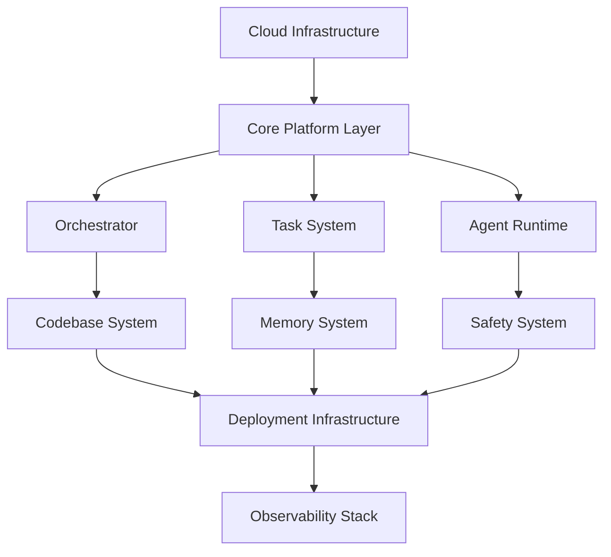

---

Implementation Stage 1 — Infrastructure Setup
Purpose
Prepare the cloud infrastructure required to support the platform.

---

Core Infrastructure Components
The platform must run on cloud infrastructure capable of supporting distributed services.
Recommended infrastructure components include:
- Kubernetes clusters
- container registries
- distributed databases
- message queues
- object storage

---

**Figure 26.2 — Infrastructure Setup Workflow**

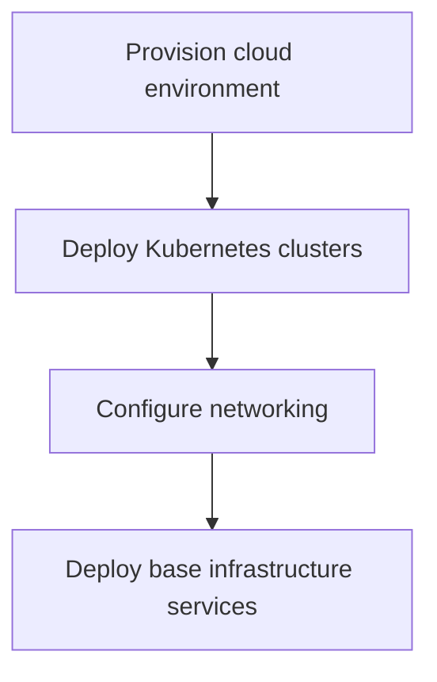

---

Core Infrastructure Services
Examples include:
Service	Purpose
Kubernetes	container orchestration
Message Broker	distributed task queues
Object Storage	artifact and document storage
Distributed Database	persistent system data

---

Implementation Stage 2 — Core Platform Services
Purpose
Build the fundamental services that coordinate system behavior.

---

Core Services
The following services must be implemented first:
- Orchestrator Service
- Task Management Service
- Agent Registry Service
- Workflow Engine

---

Service Communication
Services communicate using:
- REST APIs
- message queues
- event streams

---

**Figure 26.3 — Service Interaction**

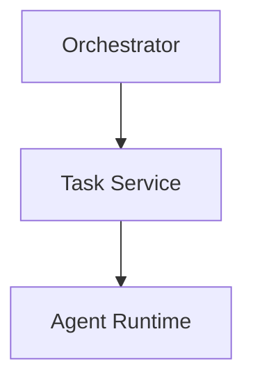

---

Implementation Stage 3 — Agent Runtime
Purpose
Implement the execution environment for autonomous agents.

---

Agent Runtime Components
The runtime includes:
- reasoning engine
- tool invocation system
- task interface
- context retrieval system

---

**Figure 26.4 — Agent Execution Workflow**

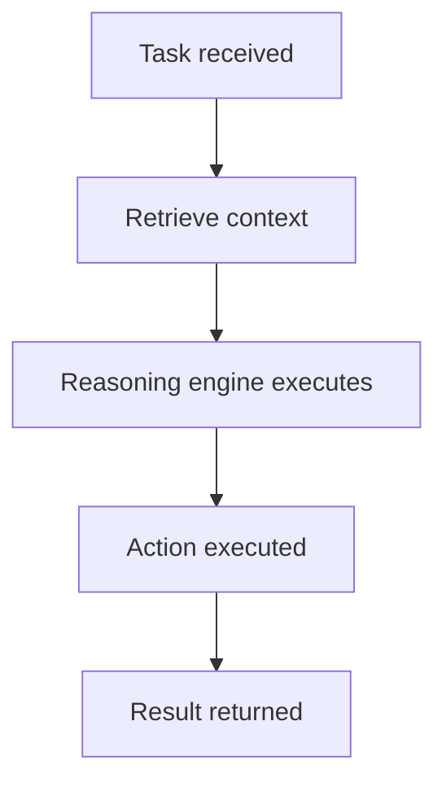

---

Agent Runtime Data Model
AgentRuntime
AgentRuntime
{
    agent_id: string
    role: string
    status: idle | running
    active_tasks: integer
}

---

Implementation Stage 4 — Knowledge and Codebase Systems
Purpose
Build systems responsible for understanding codebases and storing institutional knowledge.

---

Codebase Understanding Implementation
The system must implement:
- repository ingestion service
- code parsing workers
- dependency graph builder
- semantic search index

---

Memory System Implementation
The memory system must implement:
- vector memory store
- document knowledge repository
- knowledge graph

---

**Figure 26.5 — Knowledge System Architecture**

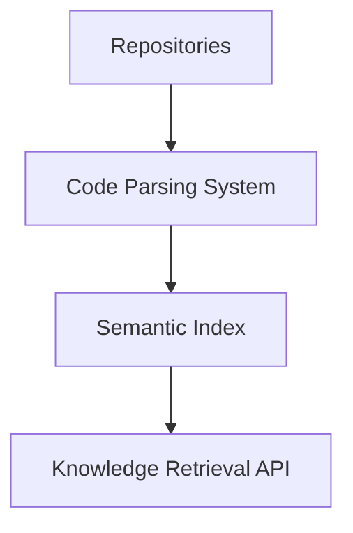

---

Implementation Stage 5 — Workflow and Task Systems
Purpose
Implement the workflow and task management infrastructure.

---

Core Components
The system must implement:
- distributed task queues
- workflow engine
- task scheduler
- dependency manager

---

**Figure 26.6 — Workflow Execution Architecture**

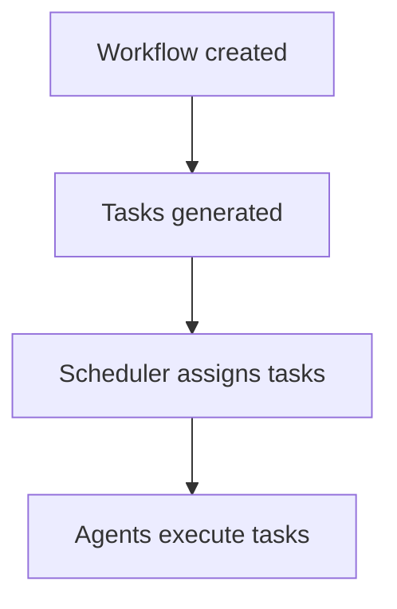

---

Implementation Stage 6 — Deployment Infrastructure
Purpose
Build the CI/CD pipeline and deployment system.

---

Key Components
Deployment infrastructure must include:
- build pipeline system
- artifact registry
- deployment controller

---

**Figure 26.7 — Deployment Pipeline Architecture**

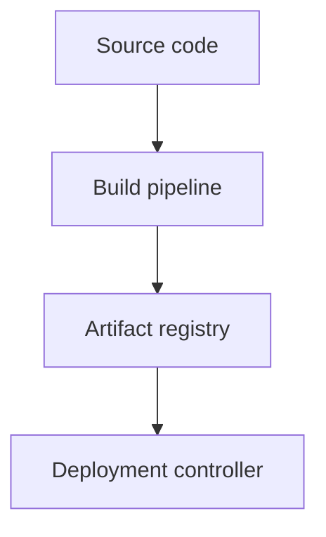

---

Implementation Stage 7 — Observability and Monitoring
Purpose
Deploy monitoring and observability infrastructure.

---

Observability Components
The system must implement:
- metrics collection system
- log aggregation pipeline
- distributed tracing system
- alerting system

---

**Figure 26.8 — Observability Pipeline**

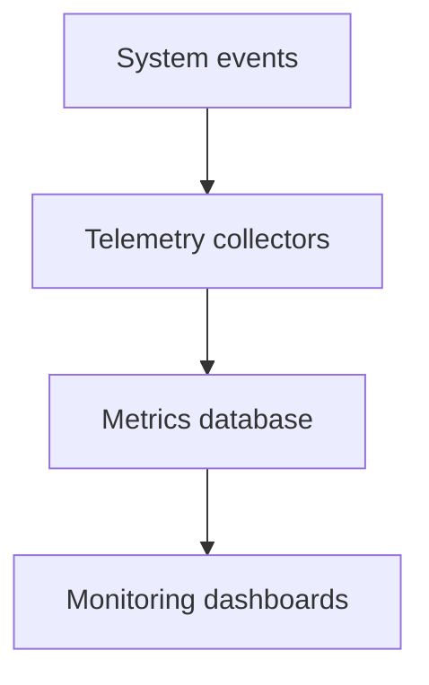

---

Implementation Stage 8 — Security and Governance Systems
Purpose
Deploy systems that enforce security and policy compliance.

---

Security Components
The system must implement:
- identity management
- access control policies
- secret management system
- security scanning pipeline

---

**Figure 26.9 — Governance Architecture**

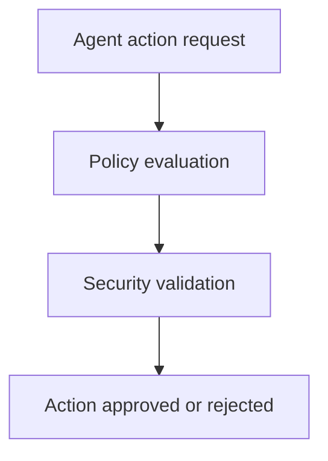

---

Development Environment Setup
Developers must be able to run the platform locally.

---

Local Development Stack
Local environments should include:
- containerized services
- local message broker
- lightweight databases

---

**Figure 26.10 — Development Workflow**

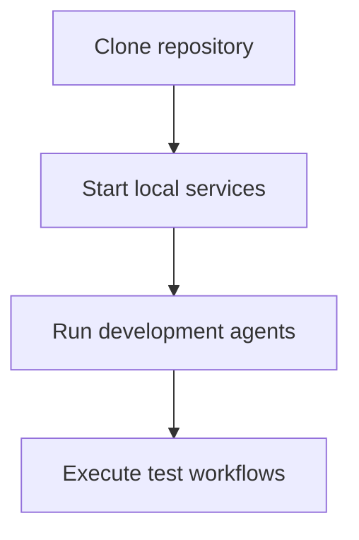

---

Testing Strategy
The implementation must include a robust testing strategy.

---

Test Types
Required tests include:
- unit tests
- integration tests
- end-to-end workflow tests

---

Continuous Integration
Every change to the platform must trigger automated tests.

---

Deployment Strategy
Platform services must be deployed using:
- rolling deployments
- versioned artifacts
- automated rollback mechanisms

---

**Figure 26.11 — Example Implementation Workflow**

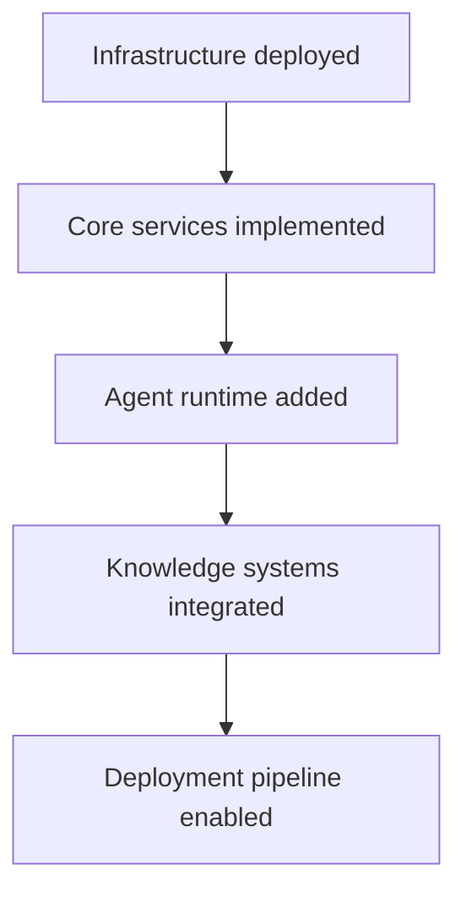

---

Transition to Next Section
The next section will define the Cost Model, which estimates the infrastructure and operational costs of running the platform.