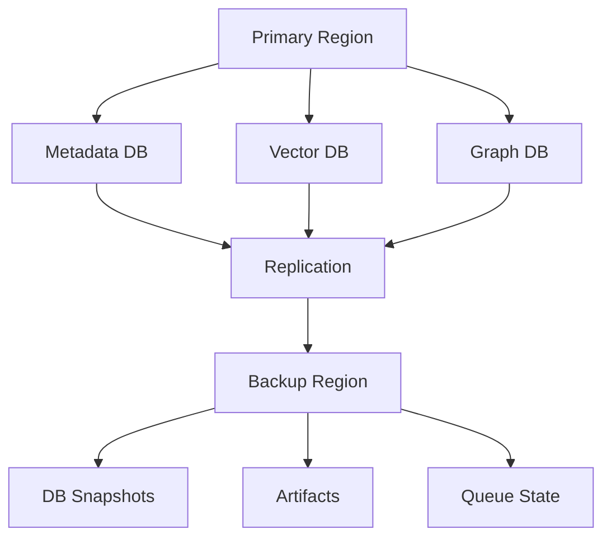
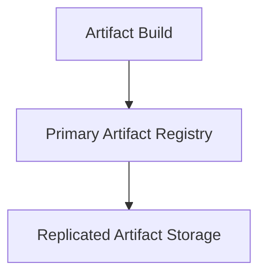
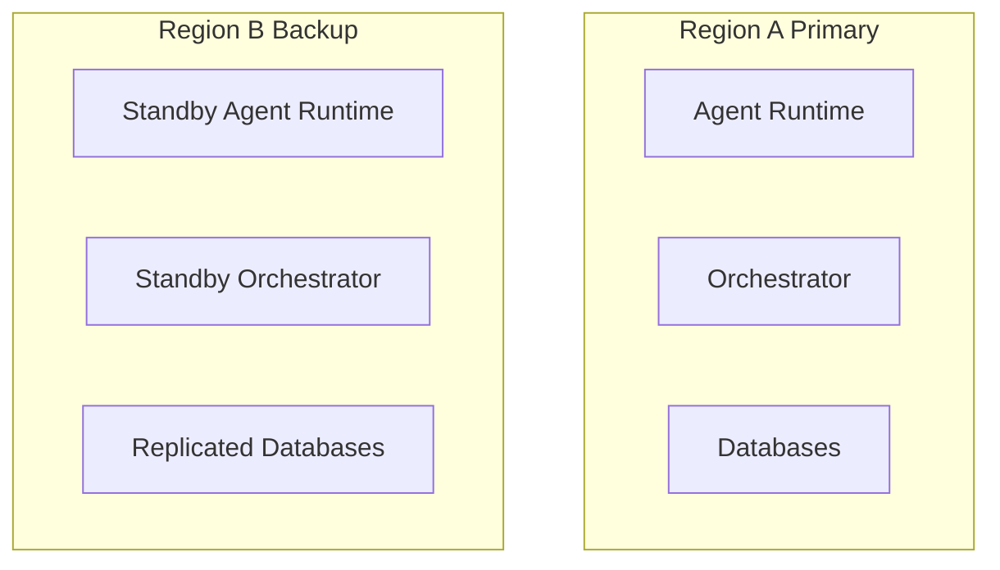
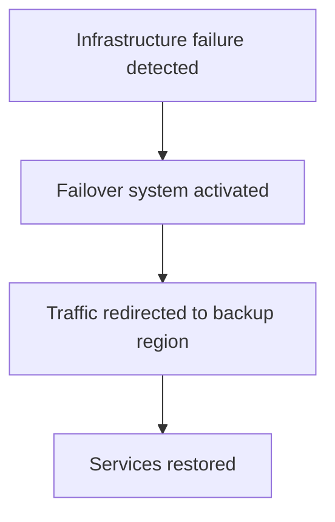
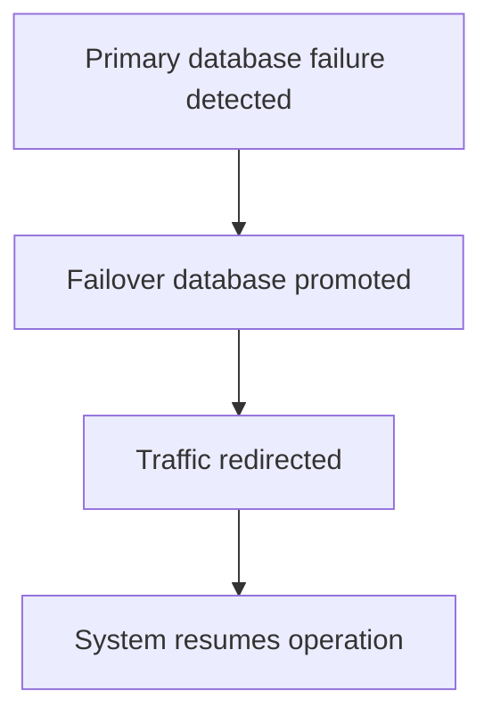

# Chapter 27 — Disaster Recovery and Backup Strategy

Detailed Explanation
The Disaster Recovery and Backup Strategy (DRBS) defines how the AI Autonomous Development Platform (AADP) maintains system availability and protects critical data in the event of infrastructure failures, service outages, or catastrophic incidents.
The platform operates a distributed system composed of multiple critical storage and processing components including:
• relational metadata databases
• vector databases used for the knowledge layer
• graph databases used for code intelligence
• artifact registries
• task queues and workflow state stores
• observability and logging systems
Loss or corruption of these systems could disrupt autonomous development workflows and cause permanent loss of platform knowledge.
The Disaster Recovery Strategy ensures that the system can recover from failures while minimizing:
• data loss
• service downtime
• operational disruption
The strategy combines multiple mechanisms including:
• automated backups
• database replication
• multi-region deployment
• infrastructure failover
• artifact replication

---

**Figure 27.1 — Disaster Recovery Architecture**

---

Recovery Objectives
The system defines two recovery targets.

---

Recovery Point Objective (RPO)
The maximum acceptable amount of data loss.
Example target:
RPO = 5 minutes
This means that no more than five minutes of data can be lost during a failure.

---

Recovery Time Objective (RTO)
The maximum acceptable system downtime.
Example target:
RTO = 30 minutes
The platform must be able to restore operations within thirty minutes after a major failure.

---

Backup Strategy
Backups are created for all critical system data.

---

Metadata Database Backups
The relational database stores:
• project metadata
• task state
• workflow information
• system configuration
Backup strategy:
• incremental backups every 5 minutes
• full snapshot every 24 hours

---

Vector Database Backups
The vector database stores:
• knowledge embeddings
• architecture knowledge
• research memory
Backup strategy:
• snapshot every 6 hours
• incremental replication to backup region

---

Graph Database Backups
Graph databases store:
• dependency graphs
• architecture graphs
• code relationships
Backup strategy:
• daily full snapshots
• streaming replication enabled

---

Artifact Registry Replication
The artifact registry stores:
• container images
• compiled binaries
• build artifacts
Artifacts are replicated across multiple storage regions.
**Figure 27.2 — Artifact Replication**

---

Task Queue Recovery
Task queues store workflow state and pending tasks.
Queue recovery mechanisms include:
• persistent message storage
• replicated queue clusters
• automatic leader election
This prevents loss of tasks during failures.

---

Knowledge Memory Backup
The Memory and Knowledge Layer stores long-term learning data.
Memory backup strategy includes:
• periodic memory snapshots
• vector index replication
• global knowledge store backups
This prevents permanent loss of learned engineering knowledge.

---

Multi-Region Deployment
Critical platform services are deployed across multiple geographic regions.
**Figure 27.3 — Multi-Region Deployment**

---

Failover Workflow
The failover system automatically detects infrastructure failures.
**Figure 27.4 — Failover Workflow**

---

Backup Verification
Backups must be periodically verified to ensure integrity.
Verification mechanisms include:
• automated backup validation
• periodic restore testing
• checksum validation
These tests ensure that backups can be restored successfully.

---

Failure Handling
Potential disaster scenarios include:
• database corruption
• infrastructure outages
• cloud provider failures
• data center failures
Mitigation strategies include:
• automated recovery procedures
• redundant infrastructure
• multi-region replication

---

Runtime Behavior
The disaster recovery system continuously monitors platform health.
while system_running:

    monitor_infrastructure_health()

    verify_replication_status()

    validate_backup_integrity()

    trigger_failover_if_required()

---

**Figure 27.5 — Database Failure Recovery**

---

Transition to Next Section
The next section defines the Cost Model and Budget Control Architecture, which describes how the platform manages operational costs and prevents uncontrolled resource consumption. 