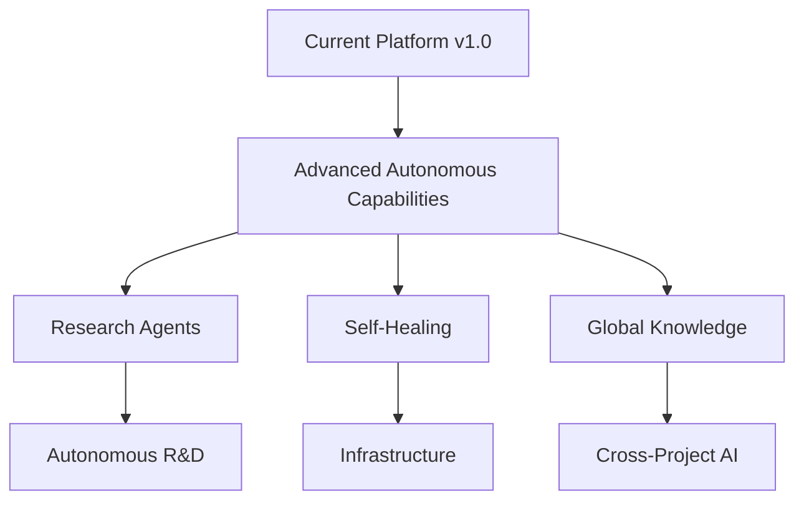
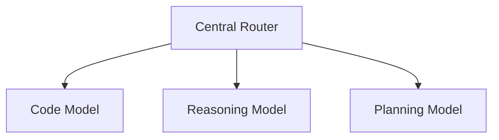
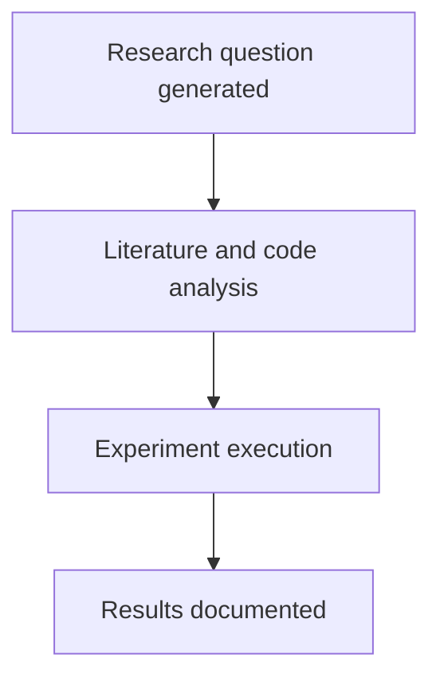
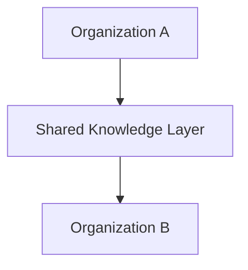
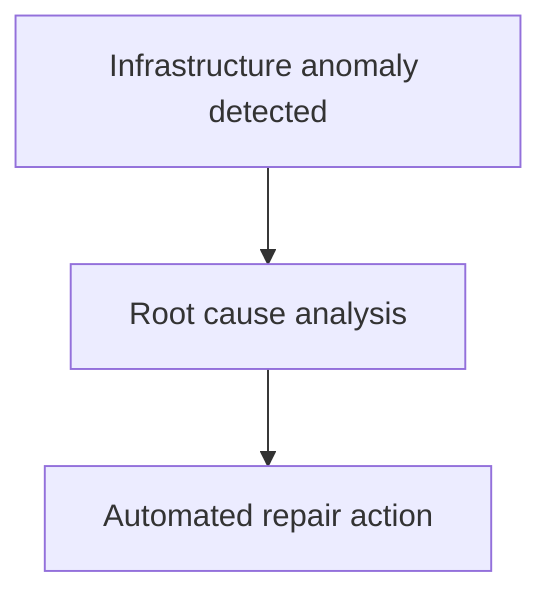
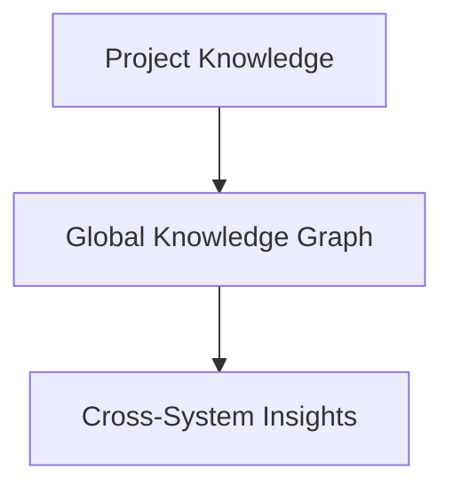
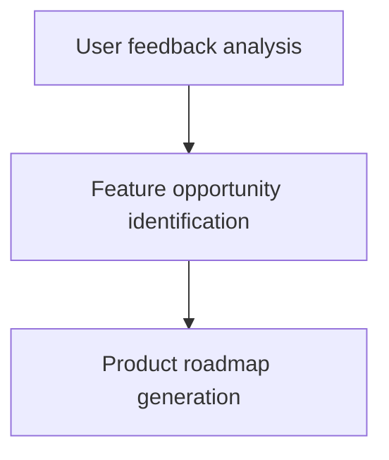
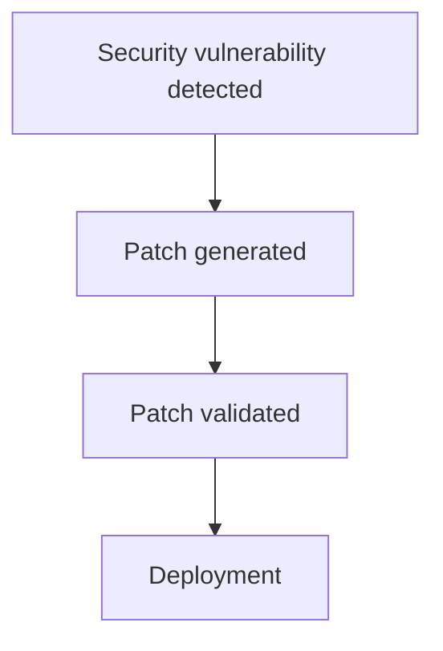
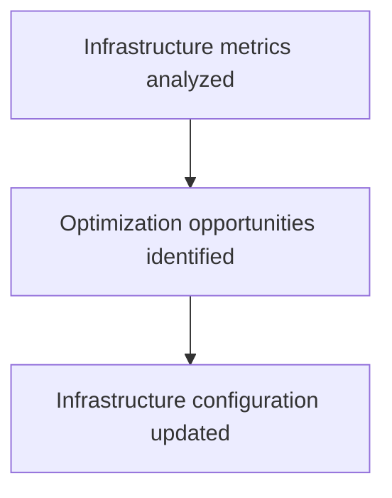
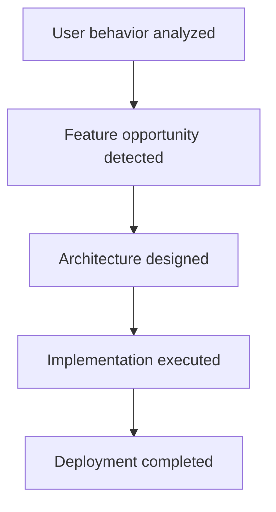

# Chapter 29 — Future Extensions

Detailed Explanation
The Future Extensions section defines potential capabilities that can be added to the AI Autonomous Development Platform (AADP) in future versions beyond Version 1.0.
While the Version 1.0 architecture already enables a fully autonomous development workflow, the long-term vision of the platform extends far beyond basic software development automation.
Future versions of the platform may evolve into a fully autonomous engineering organization, capable of:
- building complex distributed systems
- conducting software research
- optimizing its own architecture
- collaborating with human teams at strategic levels
The Future Extensions described here are not required for the initial platform implementation but represent strategic evolution paths that may significantly increase the platform's capabilities.
These extensions fall into several categories:
1.	Advanced AI Model Integration
2.	Autonomous Research Capabilities
3.	Cross-Organization Collaboration
4.	Self-Healing Infrastructure
5.	Advanced Knowledge Systems
6.	Autonomous Product Management
7.	Autonomous Security Systems
8.	Autonomous Infrastructure Optimization
Each of these areas introduces significant additional capabilities.

---

Future Architecture Overview
**Figure 29.1 — Future Platform Evolution**

---

Extension 1 — Advanced AI Model Integration
Description
Future versions of the platform may integrate a broader range of AI models optimized for specialized tasks.

---

Model Types
Examples include:
- reasoning models
- code generation models
- planning models
- architecture design models

---

Multi-Model Architecture
               AGENT RUNTIME
**Figure 29.2 — Specialized Model Types**

---

Benefits
Advantages include:
- improved code generation quality
- faster reasoning performance
- specialized capabilities for different tasks

---

Extension 2 — Autonomous Research Agents
Description
Research agents would enable the system to conduct software research independently.

---

Research Activities
Research agents may perform tasks such as:
- exploring new frameworks
- benchmarking technologies
- analyzing performance tradeoffs

---

Research Workflow
**Figure 29.3 — Research Agent Workflow**

---

Output
Research agents may produce:
- architectural recommendations
- performance reports
- experimental results

---

Extension 3 — Cross-Organization Collaboration
Description
Future versions may support collaboration across multiple organizations or teams.

---

Collaboration Capabilities
Examples include:
- shared knowledge repositories
- cross-team workflows
- shared agent infrastructure

---

Collaboration Architecture
**Figure 29.4 — Cross-Organization Collaboration**

---

Extension 4 — Self-Healing Infrastructure
Description
Self-healing infrastructure allows the platform to automatically detect and repair infrastructure failures.

---

Self-Healing Mechanisms
Examples include:
- automatic service restarts
- automatic scaling adjustments
- infrastructure anomaly detection

---

Self-Healing Workflow
**Figure 29.5 — Self-Healing Flow**

---

Extension 5 — Advanced Knowledge Systems
Description
Future knowledge systems may include deeper semantic understanding of software systems.

---

Knowledge Capabilities
Advanced systems may support:
- architecture pattern recognition
- automated documentation generation
- cross-project knowledge inference

---

Knowledge Graph Expansion
**Figure 29.6 — Advanced Knowledge Flow**

---

Extension 6 — Autonomous Product Management
Description
Future systems may include agents capable of managing product strategy.

---

Product Management Tasks
Product agents may perform tasks such as:
- analyzing user feedback
- prioritizing features
- defining product roadmaps

---

Product Strategy Workflow
**Figure 29.7 — Product Management Flow**

---

Extension 7 — Autonomous Security Systems
Description
Security agents may continuously improve system security.

---

Security Capabilities
Examples include:
- vulnerability discovery
- automated patch generation
- security policy optimization

---

Security Automation Workflow
**Figure 29.8 — Security Patch Flow**

---

Extension 8 — Autonomous Infrastructure Optimization
Description
Infrastructure optimization agents may improve system efficiency.

---

Optimization Targets
Examples include:
- compute utilization
- storage efficiency
- network traffic optimization

---

Optimization Workflow
**Figure 29.9 — Infrastructure Optimization Flow**

---

Long-Term Vision
The long-term vision for the platform is the creation of a fully autonomous engineering organization capable of building and maintaining complex software systems with minimal human intervention.
This system would eventually support:
- continuous product evolution
- automated architectural innovation
- large-scale distributed system design

---

Evolution Path
The platform may evolve across multiple generations.
Version	Capabilities
v1.0	Autonomous development platform
v2.0	Self-improving engineering system
v3.0	Autonomous research and innovation platform

---

Example Future Workflow
Example: Autonomous Feature Innovation
**Figure 29.10 — Evolution Path**

---
