<div align="center">

# AI Autonomous Development Platform

## System Design Specification

**Document Version:** 1.0  
**Last Updated:** 4th March 2026  
**Document Status:** Final  
**Author:** Zahan Turel  

Confidentiality: Internal / Restricted

</div>


---

## Copyright and Metadata

**Authors:** Zahan Turel  
**Reviewed:** All critical and structural issues addressed. Ready for implementation.

---

## Preface

### Purpose of this document

This specification describes the architecture of the **AI Autonomous Development Platform (AADP)**—a system designed to support large-scale autonomous software engineering through multi-agent collaboration, deep codebase understanding, and governed deployment pipelines. The document serves as the single source of truth for system design, data models, and architectural decisions.

### How to read this book

- **Front to back:** Readers new to the platform should start with the Terminology and Front Matter (Chapter 0), then the Executive Overview (Chapter 1), and proceed through the chapters in order. Each chapter builds on concepts introduced earlier.
- **By topic:** Use the Table of Contents below to jump to specific subsystems (e.g., Orchestration, Agent Architecture, Safety and Guardrails).
- **Reference:** The Terminology Glossary in Chapter 0 defines key terms used consistently throughout.

### Intended audience

- **Architects and technical leads** defining or reviewing the system design
- **Engineers** implementing or integrating with the platform
- **Product and project stakeholders** who need a clear picture of system scope and behavior
- **Compliance and security reviewers** assessing governance and safety measures

The specification is written to be precise enough for implementation while remaining accessible to readers with a software-engineering or systems background.


---

## Table of Contents

**PART I — FRONT MATTER AND OVERVIEW**

- Chapter 0 — Terminology and Front Matter
- Chapter 1 — Executive Overview
- Chapter 2 — System Vision
- Chapter 3 — Core Architectural Principles
- Chapter 4 — High Level Architecture

**PART II — CORE ARCHITECTURE**

- Chapter 5 — Agent Architecture
- Chapter 6 — Model Management System
- Chapter 7 — Orchestration System
- Chapter 8 — Codebase Understanding System
- Chapter 9 — Memory and Knowledge Layer
- Chapter 10 — Safety and Guardrail System

**PART III — SUBSYSTEMS AND EXECUTION**

- Chapter 11 — Planning and Execution Cycles
- Chapter 12 — Task Management System
- Chapter 13 — Autonomous Development Workflow
- Chapter 14 — Deployment Infrastructure
- Chapter 15 — Artifact and Release Management
- Chapter 16 — Observability and Monitoring
- Chapter 17 — Scalability Architecture
- Chapter 18 — Security Architecture
- Chapter 19 — Sandboxed Execution Environment
- Chapter 20 — Human Interaction Layer
- Chapter 21 — Self-Improvement and Evolution Layer
- Chapter 22 — Economic / Value Optimization System
- Chapter 23 — Product Intelligence and UX Optimization
- Chapter 24 — Multi-Project Execution System

**PART IV — STRATEGY AND ROADMAP**

- Chapter 25 — Development Roadmap
- Chapter 26 — Implementation Plan
- Chapter 27 — Disaster Recovery and Backup
- Chapter 28 — Cost Model and Budget Control
- Chapter 29 — Future Extensions

**Appendix**

- Appendix A — Architectural Review Notes

---

*Page numbers are omitted in this markdown source; they will be generated in PDF output.*

**Document structure:** Part I (Chapters 0–4) covers front matter and overview; Part II (5–10) core architecture; Part III (11–24) subsystems and execution; Part IV (25–29) strategy and roadmap; Appendix A closes the specification.

---

# Chapter 0 — Terminology and Front Matter

## Terminology Glossary

Key terms used in this specification. Alphabetical order.

**Table 1 — Terminology Glossary**

| Term | Definition |
|------|-------------|
| Agent | Autonomous software entity responsible for performing development tasks (see "[Role] Agent" naming below). |
| Agent role naming | Use "[Role] Agent" (e.g., Backend Engineer Agent, Frontend Engineer Agent, QA Agent, Security Agent) when referring to the agent role. |
| Artifact | Build output generated by CI/CD pipelines. |
| Codebase Understanding Agent | Canonical name for the agent that maintains system-wide code knowledge; "Codebase Agent" is acceptable in context. |
| Deployment Infrastructure | Section/subsystem name (Section 14) for the subsystem that implements build, CI/CD, and deployment; it aligns with Development Infrastructure Layer (build/test) and Deployment and Runtime Layer (production). |
| Development Infrastructure Layer | Canonical term for CI/CD, build systems, and sandboxed execution (same as "Infrastructure Layer" in some diagrams). For production runtime, use "Deployment and Runtime Layer." |
| Economic / Value Optimization System (EVOS) | Subsystem (Section 22) that evaluates task value and prioritizes work; may be implemented by or integrated with an Economic Agent. "Economic/Value Agent" in Appendix A refers to this system or its implementing agent. |
| Governance and Safety Layer | Same as "Safety and Guardrail System" when referring to the layer; "Governance and Safety" is used in diagrams and Section 4; "Safety and Guardrail System" is the full subsystem name (Section 10). |
| Idea Engine | Conceptual source of requirement or opportunity detection; in the main architecture this function is performed by Monitoring agents, Product Manager Agent, and Research agents (see Section 13 — Autonomous Development Workflow, Stage 1 — Requirement or Opportunity Detection). |
| Knowledge Graph / Dependency Graph | Knowledge Graph: semantic/architectural relationships. Dependency Graph: code/module/service dependencies. Both are part of the Memory and Knowledge Layer and Codebase Understanding System. |
| Knowledge Layer (in diagrams) | In architecture diagrams, "Knowledge Layer" or "Shared Knowledge Infrastructure" denotes the Memory and Knowledge Layer (canonical term). |
| Memory Agent | Agent role that maintains and writes to the Memory and Knowledge Layer; stores institutional knowledge (see "[Role] Agent" naming). |
| Memory and Knowledge Layer | Canonical term for the persistent knowledge system storing architectural insights, research, and codebase knowledge. |
| Model Router | System responsible for selecting AI models for inference. Agents obtain inference via Orchestrator → Model Router → Providers (agents never call models directly). |
| Namespace | Logical isolation boundary used for project separation. Implemented by project_id (and optionally tenant_id); one tenant may have multiple projects. |
| Orchestration System / Orchestrator | Central system coordinating workflows and agent execution. The Orchestrator is the runtime component of the Orchestration System (canonical: use "Orchestration System" for the layer, "Orchestrator" for the runtime). |
| Sandbox Execution Environment | Isolated execution environment for running generated code (canonical term; "Sandbox" acceptable in context). |
| Task | Unit of work executed by agents (lifecycle: see Canonical Task Lifecycle in Data Models). |
| Timestamp convention | Use created_at, updated_at (and optionally completed_at, assigned_at) consistently for event times. Prefer timestamp type; use created_at for record creation time. |
| Workflow | Structured sequence of tasks executed to achieve a development objective. |


---

# 1. Executive Overview

### Detailed Explanation

The AI Autonomous Development Platform (AADP) is a distributed, multi-agent software engineering system designed to autonomously design, develop, test, deploy, and continuously improve software products with minimal human intervention.

**Operating model**

- The system operates as a coordinated artificial engineering organization.
- Specialized AI agents perform the roles traditionally held by human engineers, architects, product managers, QA engineers, security specialists, and DevOps engineers.
- Unlike simple code-generation tools, this platform functions as a **continuous autonomous development factory** capable of:
  - Managing multiple software projects simultaneously
  - Understanding large codebases
  - Planning architectural changes
  - Implementing features and bug fixes
  - Running automated testing pipelines
  - Deploying software safely
  - Monitoring production systems
  - Learning from outcomes
  - Improving its own development processes

**Scale and persistence**

- Distributed orchestration, knowledge persistence, codebase understanding, and policy-controlled automation keep autonomous operations safe, observable, and scalable.
- The system is intended for large-scale production and must support:
  - Hundreds of concurrently operating agents
  - Thousands of tasks per day
  - Multiple repositories and services
  - Continuous integration and deployment
  - Long-term knowledge accumulation
  - Multi-tenant project execution

**Canonical architecture (nine layers)**

1. Human Interaction Layer  
2. Governance and Safety Layer  
3. Orchestration Layer  
4. Agent Execution Layer  
5. Codebase Understanding System  
6. Memory and Knowledge Layer  
7. Development Infrastructure Layer  
8. Observability and Monitoring Layer  
9. Deployment and Runtime Layer  

**Architecture at a glance**

```
  [Human Interface] → [Human Interaction Layer] → [Governance & Safety]
       → [Orchestration Layer] → [Agent Execution] + [Memory/Knowledge] + [Codebase System]
       → [Development Infrastructure] → [Observability] → [Deployment & Runtime] → [Deployed Systems]
```

Each layer provides critical functionality required to transform high-level goals into deployed production software. The platform operates continuously through a structured Autonomous Development Workflow: agents collaborate to break down goals, generate implementation plans, execute tasks, validate outcomes, and deploy improvements. The entire system is governed by strict safety mechanisms, approval gates, monitoring systems, and cost control policies.


---

### Primary Objectives of the Platform

The AI Autonomous Development Platform has six primary objectives.


---

## Continuous Autonomous Development

The platform must be capable of continuously improving software systems without requiring manual intervention.
Agents must be able to:
- discover issues
- propose improvements
- implement changes
- validate outcomes
- deploy updates
This creates a self-improving development loop.


---

## Multi-Agent Specialization

Instead of a single monolithic AI model attempting to perform every task, the platform uses specialized agents, each responsible for a specific engineering function.
Examples include:
- Product Manager Agent
- Architect Agent
- Backend Engineer Agent
- Frontend Engineer Agent
- QA Testing Agent
- Security Agent
- DevOps Agent
- Research Agent
- Codebase Understanding Agent
- Memory Agent
- Self-Improvement Agent
This specialization allows the system to emulate a real-world engineering organization, improving reliability, maintainability, and decision quality.


---

## Deep Codebase Understanding

The system must maintain a continuously updated understanding of:
- source code
- APIs
- architecture
- dependencies
- documentation
- historical decisions
This knowledge is stored in a Codebase Knowledge Graph and Vector Memory System, allowing agents to reason about complex systems before making changes.


---

## Safe Autonomous Operation

Because the system can modify production software, safety is a fundamental requirement.
The platform includes multiple safety mechanisms including:
- policy enforcement
- task approval workflows
- security scanning
- automated testing
- deployment safeguards
- rollback systems
These safeguards ensure that the system cannot introduce unsafe changes into production environments.


---

## Scalable Distributed Architecture

The platform is designed for distributed execution across cloud infrastructure.
Key requirements include:
- horizontal scaling of agents
- distributed task scheduling
- fault tolerance
- workload isolation
- resource optimization
The system must remain operational even when individual agents or services fail.


---

## Long-Term Organizational Memory

The platform must accumulate knowledge over time.
This includes:
- architectural decisions
- past bugs
- performance incidents
- implementation strategies
- design patterns
By storing and retrieving this knowledge, the system becomes increasingly effective over time.


---

### Platform Operating Model

The system functions as an autonomous engineering organization.
A typical development cycle proceeds through the following stages:
1.	Idea generation or requirement intake
2.	Product design and requirement specification
3.	Architecture design
4.	Task decomposition
5.	Implementation by engineering agents
6.	Automated testing and validation
7.	Security review
8.	Deployment via CI/CD pipeline
9.	Production monitoring
10.	Continuous improvement
These stages operate continuously, forming a closed-loop development lifecycle.


---

**Figure 1 — High-Level Architecture**


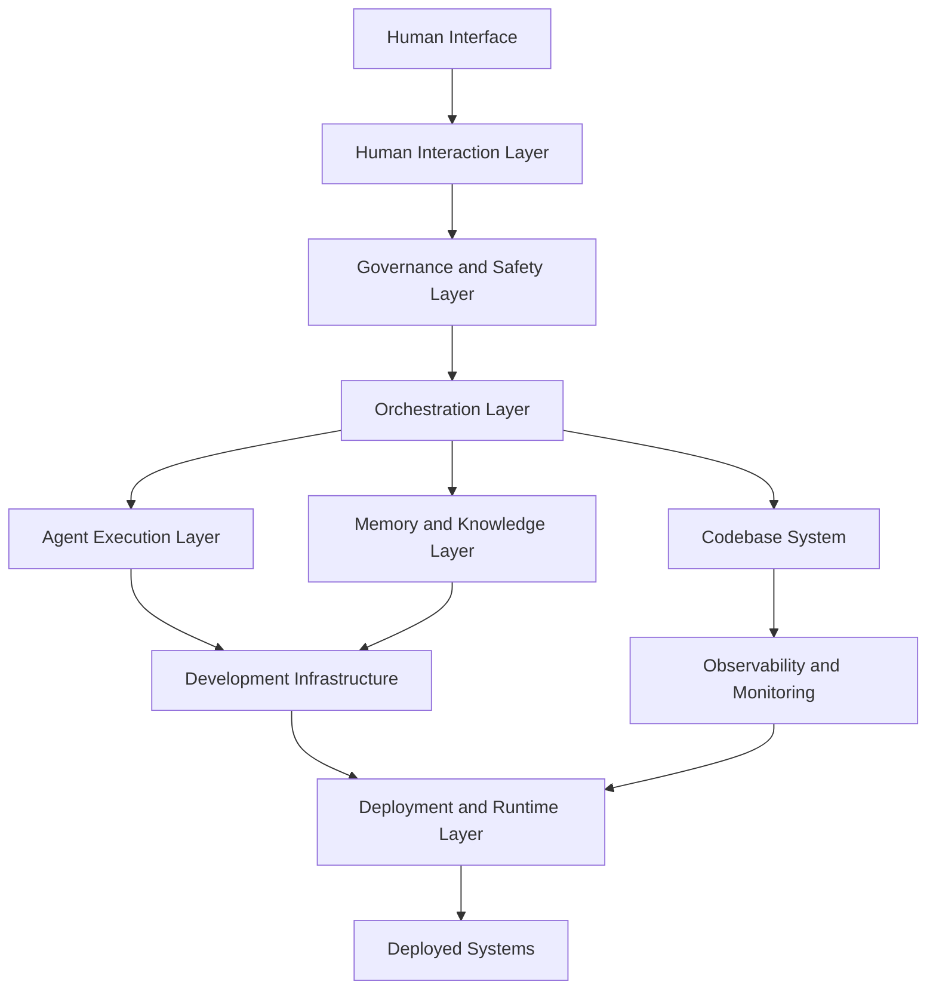
```mermaid
flowchart TB
    HI[Human Interface]
    HI --> HIL[Human Interaction Layer]
    HIL --> GSL[Governance and Safety Layer]
    GSL --> OL[Orchestration Layer]
    OL --> AEL[Agent Execution Layer]
    OL --> MKL[Memory and Knowledge Layer]
    OL --> CUS[Codebase System]
    AEL --> DI[Development Infrastructure]
    MKL --> DI
    CUS --> OM[Observability and Monitoring]
    DI --> DRL[Deployment and Runtime Layer]
    OM --> DRL
    DRL --> DS[Deployed Systems]
```


---

### Subsystem Components

The Executive Overview introduces the major subsystems that will be defined in detail in later sections. The six components below are a simplified grouping; they map to the nine-layer canonical architecture defined in Section 4 (High Level Architecture): Human Interaction; Governance and Safety; Orchestration; Agent Execution; Codebase Understanding; Memory and Knowledge; Development Infrastructure; Observability and Monitoring; Deployment and Runtime.


---

## Human Interaction Layer

Provides interfaces for human users including:
- project creation
- requirement input
- approval workflows
- monitoring dashboards
- system control
This layer ensures that humans remain in control of critical operations.


---

## Orchestration Layer

The orchestration layer is the central coordination system of the platform.
Responsibilities include:
- task scheduling
- agent coordination
- workflow execution
- resource allocation
- failure recovery
- cost monitoring
This layer ensures that hundreds of agents operate in a coordinated and safe manner.


---

## Agent Execution Layer

The agent execution layer contains the specialized AI agents responsible for performing development tasks.
Agents operate as independent workers that:
- receive tasks
- retrieve knowledge
- generate outputs
- communicate results
- create follow-up tasks
(Agent runtime is stateless; persistent state is stored in the Orchestrator state store, Memory & Knowledge Layer, and Workflow Engine. See Section 5 Agent Architecture and Section 7 Orchestration System.)
Agents may execute in parallel across distributed infrastructure.


---

## Memory and Knowledge Layer

The Memory and Knowledge Layer (canonical term used throughout this document; synonymous with "Knowledge Layer" in architecture diagrams) stores the information required for intelligent development.
This includes:
- codebase structure
- architectural decisions
- previous tasks
- research results
- historical incidents
The layer uses:
- vector databases
- relational databases
- graph databases
- document stores


---

## Safety and Guardrail Layer

The safety layer ensures that autonomous agents cannot perform unsafe operations.
Key components include:
- policy enforcement engine
- security scanning systems
- approval workflows
- deployment safeguards
This layer acts as a governance system for the entire platform.


---

## Infrastructure and Deployment Layer

This layer provides the computational resources required to run the platform.
It includes:
- Kubernetes clusters
- container orchestration
- GPU/CPU compute nodes
- storage systems
- CI/CD infrastructure
This layer must support high availability and horizontal scalability.


---

### Canonical Data Models

The following data models are the **single source of truth** for the platform. All other sections (Orchestration System, Agent Architecture, Codebase Understanding, etc.) reference these canonical definitions.

- Extended or role-specific schemas in later sections must align with these.
- Code blocks and control-flow examples in this document are pseudocode unless a specific language is indicated.


---

### Data Models

At the highest level, the system revolves around four core data entities.

---

#### Project

Represents a software project managed by the platform.

```
{
    id: UUID
    name: string
    description: text
    repository_url: string
    status: active | paused | archived
    created_at: timestamp
}
```

---

#### Task

Represents a unit of work assigned to an agent. This is the canonical Task schema; all Task schemas and workflow diagrams elsewhere in the document reference this definition.

**Canonical Task Lifecycle (single source of truth)**  
CREATED → QUEUED → ASSIGNED → RUNNING → VALIDATION → REVIEW → DEPLOYMENT → COMPLETED  

**Failure/auxiliary states:** FAILED, BLOCKED, RETRYING.

- **FAILED:** task execution or validation failed.  
- **BLOCKED:** task cannot proceed (dependency unsatisfied or resource locked).  
- **RETRYING:** orchestrator has scheduled a retry (retry_count incremented).  

**Task–Workflow relationship:** `workflow_id` identifies the workflow (DAG) the task belongs to. Set when the task is created by the workflow engine and does not change. See Workflow schema in Section 2 (System Vision) and Section 7 (Orchestration System).

```
{
    id: UUID,
    project_id: UUID,
    title: string,
    description: text,
    type: enum(feature, bug, infra, research, security, improvement, deployment),
    created_by: agent_id | human_id,
    assigned_agent: agent_role | agent_instance_id,
    dependencies: [task_id],
    priority: integer (1..100),
    status: enum(CREATED, QUEUED, ASSIGNED, RUNNING, VALIDATION, REVIEW, DEPLOYMENT, COMPLETED, FAILED, BLOCKED, RETRYING),
    budget_tokens: integer,
    cost_estimate_usd: number,
    created_at: timestamp,
    updated_at: timestamp,
    assigned_at: timestamp,
    completed_at: timestamp,
    artifact_links: [url],
    approval_required: boolean,
    approval_level: enum(none, human_approval, security_approval, legal_approval),
    workflow_id: UUID,
    retry_count: integer,
    max_retries: integer,
    correlation_id: UUID
}
```

---

#### Agent

Represents an autonomous worker capable of performing tasks.

```
{
    id: string
    role: string
    capabilities: [string]
    status: idle | busy | offline
}
```

---

#### MemoryEntry (Canonical Schema)

Stores persistent knowledge used by agents. This is the single source of truth for MemoryEntry.

```
{
    id: UUID,
    project_id: UUID,
    type: enum(decision, code_summary, research, bug, deployment),
    title: string,
    body: text,
    embeddings_id: UUID,
    vector_meta: { tags: [], source: string, created_by: agent_id, created_at: timestamp },
    ttl: timestamp | null,
    version: int,
    provenance: { commit_id, prompt_id, agent_id, raw_references: [] }
}
```

---

**Figure 2 — Example Feature Request Workflow**


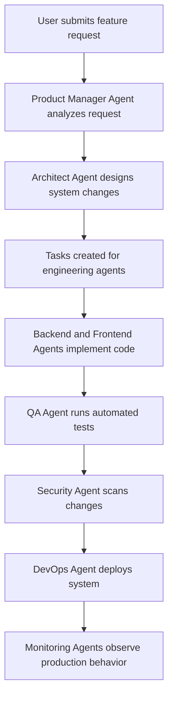
```mermaid
flowchart TB
    USR[User submits feature request]
    USR --> PM[Product Manager Agent analyzes request]
    PM --> AA[Architect Agent designs system changes]
    AA --> TC[Tasks created for engineering agents]
    TC --> BE[Backend and Frontend Agents implement code]
    BE --> QA[QA Agent runs automated tests]
    QA --> SA[Security Agent scans changes]
    SA --> DO[DevOps Agent deploys system]
    DO --> MA[Monitoring Agents observe production behavior]
```


---

### Scaling Strategy

The platform must support large-scale operation.
Key scaling strategies include:

### Horizontal Agent Scaling

Agent workers run in containerized environments and scale automatically based on workload.


---

### Distributed Task Queues

Task scheduling uses distributed message queues to allow thousands of tasks to be processed concurrently.


---

### Memory Sharding

Knowledge storage systems use partitioned storage to handle large volumes of data.


---

### Multi-Region Infrastructure

Critical services run across multiple cloud regions to ensure high availability.


---

### Role of This Document

This document provides the complete technical architecture specification for building the AI Autonomous Development Platform.
The remainder of this document will define:
- system components
- data structures
- runtime behavior
- deployment architecture
- safety mechanisms
- scaling strategies
in sufficient detail that engineering teams can directly begin implementation.
Cost and budget control are defined in Section 28 (Cost Model and Budget Control Architecture).
(See Terminology Glossary at the start of this document for definitions of Agent, Orchestrator, Task, Memory and Knowledge Layer, Model Router, and other terms.)


---


---

# 2. System Vision

### Detailed Explanation

The System Vision defines the long-term mission, architectural philosophy, and operational model of the AI Autonomous Development Platform (AADP).

**Mission**

- The platform is designed to function as a fully autonomous software engineering organization.
- It is capable of planning, designing, building, testing, deploying, and continuously improving software systems without constant human intervention.
- Traditional software development relies on human coordination across: product managers, architects, backend/frontend engineers, QA engineers, security specialists, DevOps engineers, operations teams.
- AADP recreates this organizational structure using specialized autonomous agents, a central orchestration system, persistent knowledge systems, and safety/policy enforcement.

**Design intent**

- The system must not behave as a simple code-generation engine.
- It must behave as a **persistent engineering system** capable of: understanding software systems, maintaining architectural coherence, learning from historical data, making safe decisions over long time horizons.
- The vision is a platform where software systems become self-evolving artifacts, continuously adapting to new requirements, technologies, and operational conditions.

**Required capabilities**

1. Continuous autonomous development  
2. Organizational-scale AI collaboration  
3. Deep software system comprehension  
4. Persistent institutional memory  
5. Safe autonomous decision making  
6. Scalable distributed execution  
7. Long-term learning and improvement  

The platform therefore acts as a self-operating software factory.


---

### Architectural Philosophy

The design of the platform follows several foundational architectural philosophies that guide system construction.


---

## AI Agents as Organizational Roles

Each AI component is modeled as a role within a software engineering organization.
Rather than using a single monolithic AI system, the platform uses specialized agents with clearly defined responsibilities.
Examples include (canonical naming: "[Role] Agent"):

| Agent Role | Responsibility |
|------------|----------------|
| Product Manager Agent | Defines product features and requirements |
| Architect Agent | Designs system architecture |
| Backend Engineer Agent | Implements backend systems |
| Frontend Engineer Agent | Implements UI components |
| QA Agent | Executes testing strategies |
| Security Agent | Performs vulnerability analysis |
| DevOps Agent | Manages deployment pipelines |
| Research Agent | Identifies new technologies and improvements |
| Codebase Understanding Agent | Maintains system-wide code knowledge |
| Memory Agent | Stores institutional knowledge |
| Self-Improvement Agent | Improves system processes |

This design creates a hierarchical agent ecosystem similar to a real engineering organization.


---

## Persistent Autonomous Operation

The platform is designed to operate continuously, rather than being triggered only by user prompts.

**Figure 3 — Persistent Operation Loop**


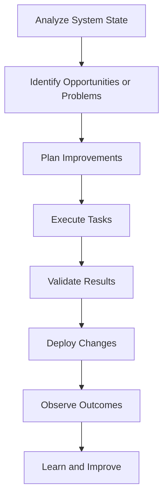
```mermaid
flowchart TB
    ASS[Analyze System State]
    ASS --> IOP[Identify Opportunities or Problems]
    IOP --> PI[Plan Improvements]
    PI --> ET[Execute Tasks]
    ET --> VR[Validate Results]
    VR --> DC[Deploy Changes]
    DC --> OO[Observe Outcomes]
    OO --> LI[Learn and Improve]
```

This continuous loop allows the system to maintain and improve software systems over time.


---

## Knowledge-Driven Decision Making

Agents must not operate purely on prompts or static instructions.
Instead, the platform must maintain deep contextual knowledge about:
- the codebase
- architecture
- previous changes
- production incidents
- historical design decisions
- technology trends
This knowledge is stored in the Knowledge and Memory Layer and is retrieved by agents when performing tasks.


---

## Autonomous but Governed

Although the platform is autonomous, it must remain governed by strict policies.
The system must enforce rules for:
- deployment safety
- security compliance
- infrastructure access
- code review policies
- data privacy
- regulatory requirements
The Safety and Guardrail System ensures that agents cannot violate operational constraints.


---

## Scalable Distributed Intelligence

The system must support hundreds or thousands of concurrent agents operating across multiple projects.
Therefore the architecture must support:
- distributed task execution
- horizontal agent scaling
- workload partitioning
- resource scheduling
The orchestration system manages this distributed workload.


---

### Long-Term Platform Vision

The long-term vision of the AI Autonomous Development Platform is to evolve into a fully autonomous engineering ecosystem capable of managing large-scale software products with minimal human supervision.

**The platform should eventually support:**

| Vision | Description |
|--------|-------------|
| **Fully Autonomous Software Companies** | Entire SaaS products could be created and maintained by autonomous AI engineering organizations. Human involvement would focus on: defining high-level product goals; setting ethical or legal boundaries; approving critical decisions. |
| **Self-Improving Engineering Systems** | The platform will improve its own development processes—e.g. optimizing testing strategies, improving deployment pipelines, redesigning agent workflows, upgrading system architectures. |
| **Continuous Technology Adaptation** | The system should monitor emerging technologies and evaluate whether they provide benefits (e.g. replacing outdated frameworks, upgrading infrastructure, adopting new security practices). The Research Agent and Self-Improvement Agent drive this evolution. |

---

**Figure 4 — System Vision Architecture**


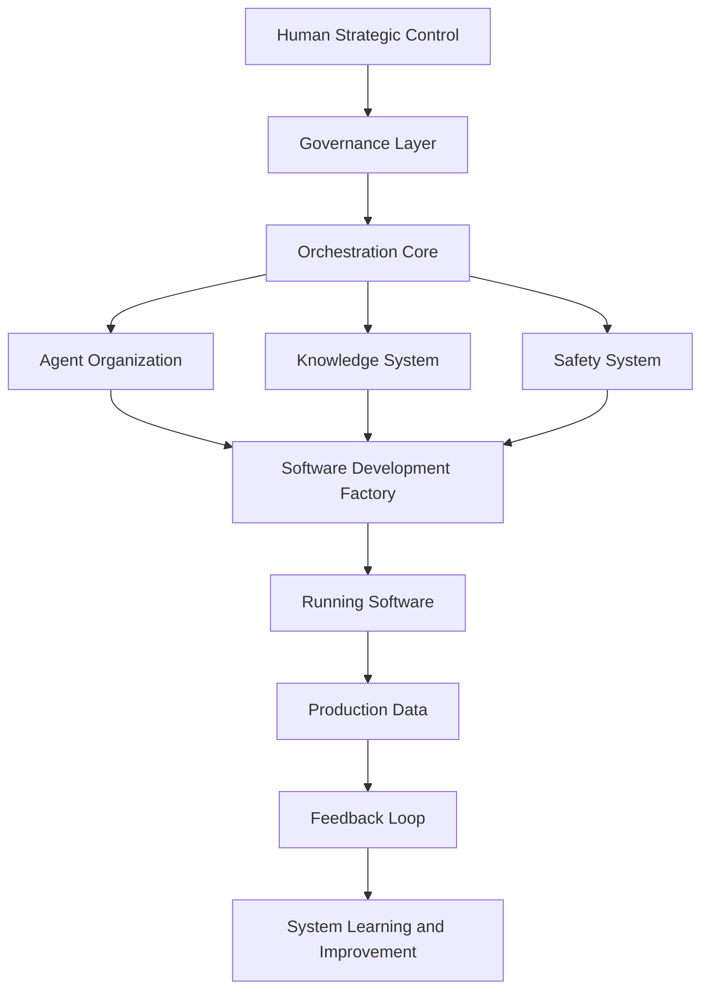
```mermaid
flowchart TB
    HSC[Human Strategic Control]
    HSC --> GL[Governance Layer]
    GL --> OC[Orchestration Core]
    OC --> AO[Agent Organization]
    OC --> KS[Knowledge System]
    OC --> SS[Safety System]
    AO --> SDF[Software Development Factory]
    KS --> SDF
    SS --> SDF
    SDF --> RS[Running Software]
    RS --> PD[Production Data]
    PD --> FL[Feedback Loop]
    FL --> SLI[System Learning and Improvement]
```


---

### Subsystem Components

The System Vision introduces several subsystems that enable this architecture.


---

### Organizational Agent System

The platform includes a network of specialized agents representing engineering roles.
Each agent:
- receives tasks
- retrieves knowledge
- performs reasoning
- produces outputs
- communicates results
Agents collaborate through the orchestration system.


---

### Autonomous Workflow Engine

The workflow engine manages the lifecycle of software development tasks.
Responsibilities include:
- task decomposition
- dependency management
- workflow execution
- state transitions
- failure recovery


---

### Knowledge Infrastructure

The knowledge infrastructure stores the system’s understanding of:
- codebases
- architecture
- research
- decisions
This knowledge allows agents to operate with context.


---

### Safety Governance System

This subsystem ensures that all autonomous operations comply with defined policies.
It enforces:
- deployment approvals
- security constraints
- operational limits


---

### Data Models

The System Vision introduces additional high-level system entities.


---

#### Workflow

Represents a sequence of tasks that accomplish a goal.

```
{
    id: UUID,
    project_id: UUID,
    name: string,
    tasks: [task_id],
    status: enum(running, completed, failed)
}
```

---

#### PolicyRule (high-level view; see Section 10 for canonical)

Defines constraints that agents must obey. The canonical schema (action_type, enforcement) is defined in Section 10 — Safety and Guardrail System.

```
{
    id: UUID
    name: string
    description: text
    rule_type: security | compliance | deployment
    enforcement_level: warning | blocking
}
```

---

**Figure 5 — Autonomous Feature Development**


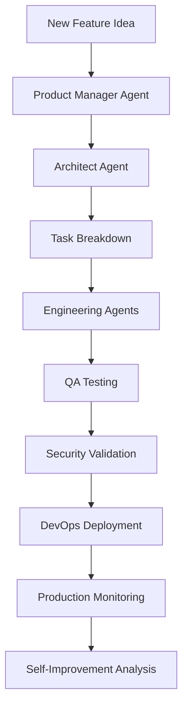
```mermaid
flowchart TB
    NFI[New Feature Idea]
    NFI --> PM[Product Manager Agent]
    PM --> AA[Architect Agent]
    AA --> TB[Task Breakdown]
    TB --> EA[Engineering Agents]
    EA --> QAT[QA Testing]
    QAT --> SV[Security Validation]
    SV --> DD[DevOps Deployment]
    DD --> PMON[Production Monitoring]
    PMON --> SIA[Self-Improvement Analysis]
```


---

### Scaling Strategy

The system vision requires the platform to scale across multiple dimensions.


---

### Agent Scaling

Agent workers scale horizontally depending on workload.


---

### Project Isolation

Each project operates within a separate logical namespace.


---

### Memory Expansion

The knowledge system must support long-term accumulation of system knowledge.


---

### Distributed Infrastructure

The platform runs across distributed cloud infrastructure to support high availability.


---

### Relationship to the Remaining Document

The remainder of the system specification will describe in detail how the vision is implemented through:
- architectural design
- subsystem definitions
- data models
- operational workflows
- deployment strategies
The next section will define the Core Principles that guide all architectural decisions in the system.


---

# 3. Core Architectural Principles

This section defines the core architectural principles that govern the platform. These principles appear before the High-Level Architecture so that all subsequent design follows from them.


---

Principle 1 — Deterministic Governance of Autonomous Agents

### Purpose

Even though agents perform autonomous reasoning and decision-making, the system must ensure that all actions occur within deterministic operational boundaries.
Autonomous systems that lack deterministic governance can:
- introduce unsafe changes
- perform unexpected actions
- create runaway task loops
- generate excessive compute costs
- modify infrastructure without authorization
Therefore, every agent action must pass through deterministic policy enforcement mechanisms.


---

### Responsibilities

The governance layer must enforce:
- deployment restrictions
- infrastructure access limits
- security policies
- regulatory compliance
- cost budgets
- task execution permissions


---

**Figure 6 — Agent Decision Pipeline**


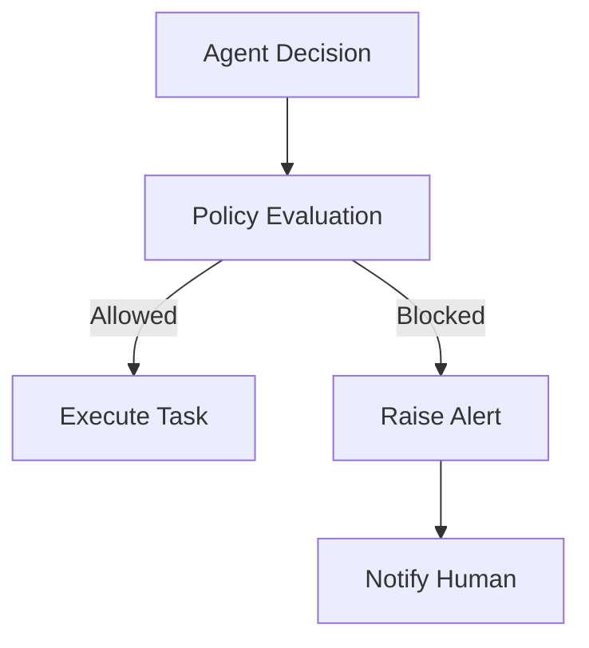
```mermaid
flowchart TB
    AD[Agent Decision]
    AD --> PE[Policy Evaluation]
    PE -->|Allowed| EA[Execute Task]
    PE -->|Blocked| RA[Raise Alert]
    RA --> NH[Notify Human]
```


---

### Subsystem Components

Policy Engine
Responsible for evaluating whether an agent's requested action is permitted.
Functions include:
- rule evaluation
- policy enforcement
- compliance validation


---

Approval System
Certain operations require human approval, including:
- production deployments
- infrastructure changes
- security configuration updates
- sensitive data access


---

Risk Evaluation Engine
Evaluates the risk level of proposed actions based on:
- code impact
- affected services
- historical incident patterns


---

### Data Models

Policy Evaluation Request

#### PolicyEvaluation

{
    action_id: UUID
    agent_id: string
    action_type: deployment | code_change | infra_change
    project_id: UUID
    risk_score: float
}


---

### Failure Handling

If a policy violation occurs:
1.	the action is blocked
2.	the orchestrator logs the event
3.	the system generates an alert
4.	the task is flagged for human review


---

### Scaling Strategy

Policy evaluation must operate at high throughput because every agent action must pass through it.
The policy engine should be implemented as:
- stateless microservices
- horizontally scalable
- low latency (<10ms per evaluation)


---

Principle 2 — Task-Oriented System Architecture

### Purpose

All operations in the platform must be represented as tasks.
This ensures that:
- actions are traceable
- workflows are reproducible
- failures can be retried
- system state remains observable


---

**Figure 7 — Task-Oriented Architecture**


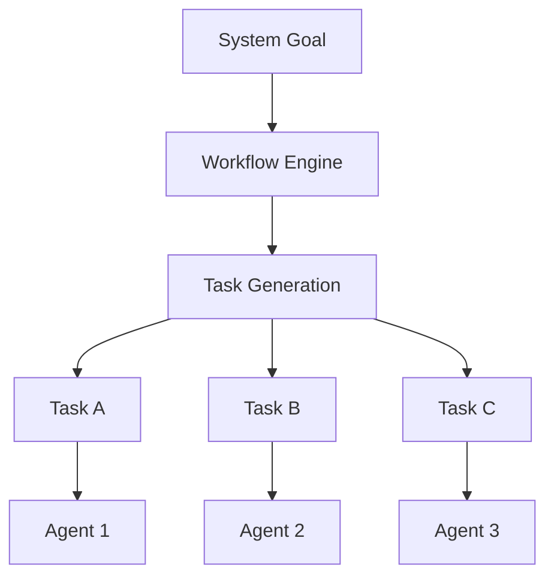
```mermaid
flowchart TB
    SG[System Goal]
    SG --> WE[Workflow Engine]
    WE --> TG[Task Generation]
    TG --> TA[Task A]
    TG --> TB[Task B]
    TG --> TC[Task C]
    TA --> A1[Agent 1]
    TB --> A2[Agent 2]
    TC --> A3[Agent 3]
```


---

### Subsystem Components

Task Scheduler
Responsible for:
- queueing tasks
- assigning tasks to agents
- managing task dependencies


---

Workflow Manager
Responsible for orchestrating multi-task workflows.
Functions include:
- workflow creation
- dependency management
- state transitions


---

Task Execution Monitor
Tracks the progress of tasks and detects failures.


---

### Data Models

Task State Model (Canonical — see Executive Overview Data Models)
TaskState enum: CREATED | QUEUED | ASSIGNED | RUNNING | VALIDATION | REVIEW | DEPLOYMENT | COMPLETED | FAILED | BLOCKED | RETRYING


---

**Figure 8 — Task Lifecycle**


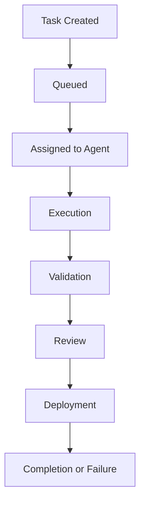
```mermaid
flowchart TB
    TC[Task Created]
    TC --> QU[Queued]
    QU --> AS[Assigned to Agent]
    AS --> EX[Execution]
    EX --> VA[Validation]
    VA --> RE[Review]
    RE --> DEP[Deployment]
    DEP --> CO[Completion or Failure]
```


---

### Failure Handling

When a task fails:
- the orchestrator records the failure
- the system retries the task (configurable retries)
- if retries fail, escalation occurs


---

### Scaling Strategy

The task system must support tens of thousands of tasks per day.
Recommended technologies:
- distributed message queues
- partitioned task storage
- asynchronous worker pools


---

Principle 3 — Knowledge Persistence and Institutional Memory

### Purpose

The platform must accumulate knowledge over time, enabling agents to operate with historical context.
Without persistent knowledge, agents would:
- repeat previous mistakes
- lose architectural decisions
- duplicate research work


---

**Figure 9 — Knowledge Retrieval**


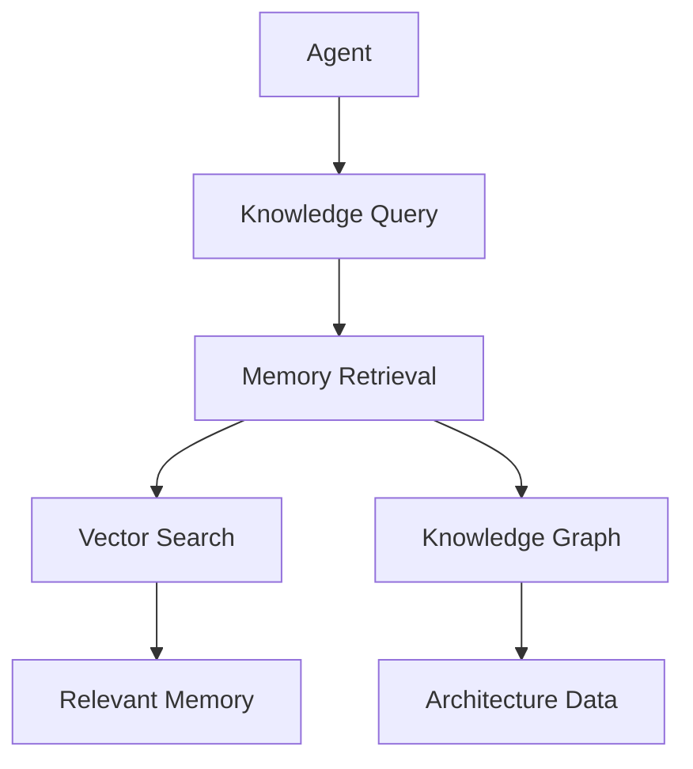
```mermaid
flowchart TB
    AG[Agent]
    AG --> KQ[Knowledge Query]
    KQ --> MR[Memory Retrieval]
    MR --> VS[Vector Search]
    MR --> KG[Knowledge Graph]
    VS --> RM[Relevant Memory]
    KG --> AD[Architecture Data]
```


---

### Subsystem Components

Vector Memory System
Stores semantic knowledge for retrieval.
Examples:
- documentation
- design decisions
- research findings


---

Knowledge Graph
Stores structured information such as:
- system architecture
- service dependencies
- API relationships


---

Memory Compression Engine
Because memory grows indefinitely, older knowledge must be summarized and compressed.


---

### Data Models

Knowledge Record (high-level abstraction; for detailed schema see MemoryEntry in Executive Overview — Canonical Data Models. Categories here map to MemoryEntry type: architecture→decision, decision→decision, research→research.)

#### KnowledgeRecord

{
    id: UUID
    category: architecture | decision | research
    content: text
    embedding: vector
    created_at: timestamp
}


---

### Failure Handling

Memory corruption or data loss could severely degrade system reasoning.
Mitigation strategies:
- database replication
- periodic backups
- integrity verification


---

### Scaling Strategy

Knowledge systems must support:
- millions of documents
- low-latency retrieval
- high write throughput


---

Principle 4 — Safety-First Autonomous Development

### Purpose

Autonomous development introduces the risk of agents making unsafe changes.
The system must therefore prioritize safety over speed.
No change may reach production unless it passes through:
- automated testing
- security validation
- policy checks
- deployment safeguards


---

**Figure 10 — Safety Validation Pipeline**


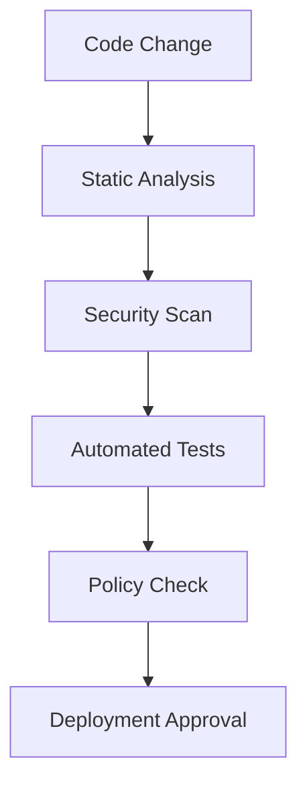
```mermaid
flowchart TB
    CC[Code Change]
    CC --> SA[Static Analysis]
    SA --> SS[Security Scan]
    SS --> AT[Automated Tests]
    AT --> PC[Policy Check]
    PC --> DA[Deployment Approval]
```


---

### Subsystem Components

Security Agent
Analyzes code for vulnerabilities.


---

QA Agent
Runs testing frameworks.


---

Deployment Guardrail System
Prevents unsafe production deployments.


---

### Runtime Behavior

All changes must pass through the validation pipeline before deployment.


---

### Failure Handling

If any validation step fails:
- the deployment is blocked
- a new task is generated to fix the issue


---

### Scaling Strategy

Testing infrastructure must scale horizontally to support parallel test execution.


---

Principle 5 — Observability and Explainability

### Purpose

Autonomous systems must be fully observable and explainable.
Every decision made by an agent must be traceable.


---

**Figure 11 — Observability Pipeline**


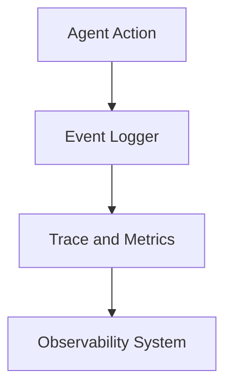
```mermaid
flowchart TB
    AA[Agent Action]
    AA --> EL[Event Logger]
    EL --> TM[Trace and Metrics]
    TM --> OS[Observability System]
```


---

### Subsystem Components

Distributed Logging
Captures detailed logs of agent activity.


---

Trace System
Tracks workflows and agent decisions.


---

Metrics System
Monitors system performance.


---

### Data Models

Agent Action Log

#### AgentActionLog

{
    id: UUID,
    agent_id: string,
    task_id: UUID,
    action: string,
    created_at: timestamp
}


---

### Scaling Strategy

Observability systems must handle high event volumes.
Recommended systems include:
- distributed log aggregation
- scalable metrics systems
- trace sampling


---

Principle 6 — Horizontal Scalability

### Purpose

The platform must scale to support:
- multiple projects
- thousands of tasks
- hundreds of agents


---

**Figure 12 — Horizontal Scaling**


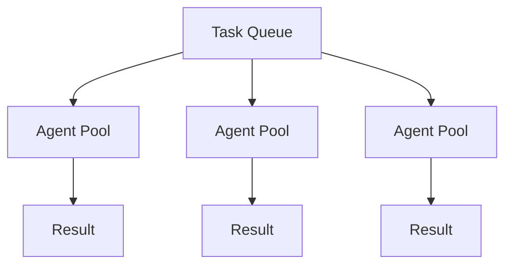
```mermaid
flowchart TB
    TQ[Task Queue]
    TQ --> AP1[Agent Pool]
    TQ --> AP2[Agent Pool]
    TQ --> AP3[Agent Pool]
    AP1 --> R1[Result]
    AP2 --> R2[Result]
    AP3 --> R3[Result]
```


---

### Subsystem Components

Agent Worker Pools
Agents run as distributed workers.


---

Distributed Queues
Task queues distribute workloads.


---

Auto-Scaling Infrastructure
Infrastructure automatically scales based on load.


---

### Failure Handling

If an agent fails:
- tasks are requeued
- another agent processes them


---

**Figure 13 — Autonomous Bug Fix Workflow**


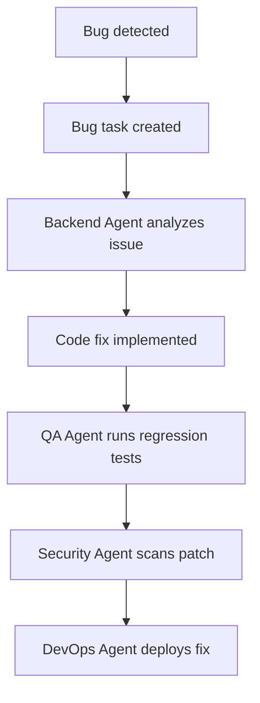
```mermaid
flowchart TB
    BD[Bug detected]
    BD --> BTC[Bug task created]
    BTC --> BAI[Backend Agent analyzes issue]
    BAI --> CFI[Code fix implemented]
    CFI --> QAR[QA Agent runs regression tests]
    QAR --> SAS[Security Agent scans patch]
    SAS --> DAD[DevOps Agent deploys fix]
```


---

### Relationship to Next Sections

The Core Principles defined in this section guide the design of every subsystem.
The next section will define the High-Level Architecture, which translates these principles into a complete system structure.


---

# 4. High Level Architecture

### Detailed Explanation

The High Level Architecture defines the structural composition of the AI Autonomous Development Platform (AADP) and explains how the system’s primary subsystems interact to support large-scale autonomous software engineering.
The architecture is designed to support:
- continuous autonomous development
- distributed multi-agent collaboration
- persistent institutional knowledge
- safe deployment pipelines
- multi-project execution
- scalable infrastructure
The system is built using a layered distributed architecture where responsibilities are separated into specialized subsystems.
Each subsystem operates independently but communicates through well-defined APIs, message queues, and shared knowledge stores.
This architecture ensures that:
- failures in one subsystem do not cascade across the system
- components can scale independently
- the platform remains maintainable over time
The system is composed of the following major layers:
1.	Human Interaction Layer
2.	Governance and Safety Layer
3.	Orchestration Layer
4.	Agent Execution Layer
5.	Codebase Understanding System
6.	Memory and Knowledge Layer
7.	Development Infrastructure Layer
8.	Observability and Monitoring Layer
9.	Deployment and Runtime Layer
Each layer is responsible for a distinct set of capabilities.


---

### Multi-Tenant Architecture

The platform supports multi-project execution and multiple teams or clients. Multi-tenant architecture is required for:
- Tenant isolation: memory, code access, and task queues are partitioned by tenant_id and project_id; no cross-tenant data access.
- Namespace design: per-tenant namespaces for memory (vector and graph), codebase indices, and workflow state.
- Resource quotas: per-tenant and per-project quotas for compute, token budgets, and storage; enforcement at Orchestrator and Model Router.


---

### System Architecture Overview

The following diagram illustrates the full architecture.
                       HUMAN USERS
                           │
                           ▼
                 HUMAN INTERACTION LAYER
         (Dashboards, Controls, Approval Systems)
                           │
                           ▼
                  GOVERNANCE & SAFETY LAYER
           (Policy Engine, Risk Evaluation, Compliance)
                           │
                           ▼
                     ORCHESTRATION LAYER
     (Workflow Engine, Task Scheduler, Resource Manager)
                           │
     ┌─────────────────────┼─────────────────────┐
     ▼                     ▼                     ▼
AGENT EXECUTION      SHARED KNOWLEDGE INFRASTRUCTURE
     LAYER           (Codebase Understanding + Memory & Knowledge)
(Product, Architect,  Code Index, Dependency Graph, Vector DB, Knowledge Graph
 Engineers, QA,       — integrated knowledge systems)
 DevOps, Research)
                           │
                           ▼
                DEVELOPMENT INFRASTRUCTURE
        (CI/CD, Build Systems, Sandboxed Execution)
                           │
                           ▼
                DEPLOYMENT & RUNTIME SYSTEMS
           (Containers, Kubernetes, Production Apps)
                           │
                           ▼
                 OBSERVABILITY & MONITORING
        (Metrics, Logs, Traces, Alerts, Incident Data)
                           │
                           ▼
                   FEEDBACK INTO MEMORY
Note: Observability is cross-cutting; it collects metrics, logs, and traces from all layers (agents, orchestrator, infrastructure, deployment), not only post-deployment.


---


---

## Layer 1 — Human Interaction Layer

### Purpose

The Human Interaction Layer provides the interfaces through which humans interact with the platform.
Although the system operates autonomously, human oversight remains necessary for:
- defining product goals
- approving critical decisions
- monitoring system behavior
- intervening during incidents


---

### Responsibilities

The layer supports:
- project creation
- requirement input
- system dashboards
- approval workflows
- manual task injection
- system configuration


---

### Internal Components

Web Dashboard
Provides a centralized interface for monitoring system activity.
Capabilities include:
- viewing active projects
- monitoring agent activity
- inspecting tasks and workflows
- reviewing deployments


---

Approval Interface
Allows humans to approve or reject high-risk operations such as:
- production deployments
- infrastructure changes
- security policy modifications


---

Incident Control Panel
Allows operators to:
- pause workflows
- cancel tasks
- rollback deployments
- restart agents


---

### Data Model

#### HumanAction

{
    id: UUID,
    user_id: UUID,
    action_type: enum(approval, reject, override, pause),
    target_id: UUID,
    created_at: timestamp
}


---


---

## Layer 2 — Governance and Safety Layer

### Purpose

The Governance Layer ensures that autonomous agents operate within strict operational boundaries.
It prevents unsafe operations and enforces organizational policies.


---

### Responsibilities

The layer enforces:
- security policies
- compliance rules
- deployment restrictions
- infrastructure access control
- data privacy requirements


---

### Internal Components

Policy Engine
Evaluates whether agent actions comply with system policies.


---

Compliance Validator
Ensures system actions comply with:
- security requirements
- regulatory constraints
- organizational standards


---

Risk Assessment Engine
Evaluates the potential impact of actions.
Examples include:
- large-scale refactoring
- database schema changes
- infrastructure modifications


---

### Runtime Behavior

All critical actions are routed through the governance layer before execution.


---


---

## Layer 3 — Orchestration Layer

### Purpose

The Orchestration Layer coordinates the activities of all agents in the system.
It acts as the central nervous system of the platform.


---

### Responsibilities

The orchestrator manages:
- task scheduling
- workflow execution
- dependency tracking
- resource allocation
- failure recovery
- cost control


---

### Architecture Diagram

**Figure 14 — Orchestration Layer**


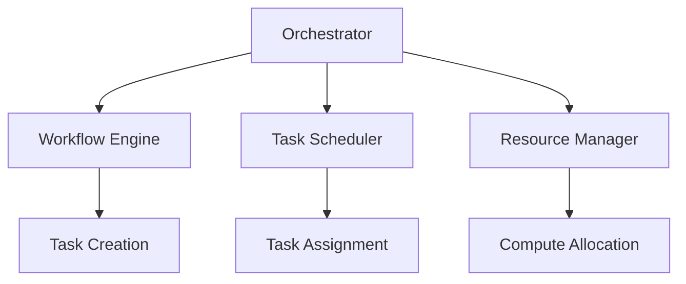
```mermaid
flowchart TB
    O[Orchestrator]
    O --> W[Workflow Engine]
    O --> T[Task Scheduler]
    O --> R[Resource Manager]
    W --> TC[Task Creation]
    T --> TA[Task Assignment]
    R --> CA[Compute Allocation]
```


---

### Subsystem Components

Workflow Engine
Manages complex multi-step processes.


---

Task Scheduler
Distributes tasks across available agents.


---

Resource Manager
Allocates compute resources for tasks.


---

### Failure Handling

If the orchestrator fails:
- standby instances take over
- state is restored from persistent storage


---


---

## Layer 4 — Agent Execution Layer

### Purpose

The Agent Execution Layer contains all autonomous agents responsible for performing development tasks.


---

Agent Categories
Product Agents
Responsible for product planning.


---

Engineering Agents
Responsible for writing code.
Examples:
- Backend Engineer Agent
- Frontend Engineer Agent


---

Quality Agents
Responsible for testing and validation.


---

Operations Agents
Responsible for infrastructure and deployment.


---

Research Agents
Responsible for identifying new technologies.


---

Self-Improvement Agents
Responsible for improving system processes.


---

Agent Architecture Diagram
                AGENT WORKER
                     │
                     ▼
               Task Retrieval
                     │
                     ▼
               Context Retrieval
                     │
                     ▼
               Reasoning Engine
                     │
                     ▼
               Result Generation
                     │
                     ▼
               Task Completion


---


---

## Layer 5 — Codebase Understanding System

### Purpose

The Codebase Understanding System maintains a continuously updated understanding of all managed software repositories.


---

### Responsibilities

The system must track:
- code structure
- dependencies
- APIs
- documentation
- commit history


---

Components
Code Indexer
Scans repositories and builds searchable indexes.


---

Dependency Graph Builder
Constructs graphs representing system architecture.


---

API Catalog
Maintains documentation for internal APIs.


---


---

## Layer 6 — Memory and Knowledge Layer

### Purpose

Stores long-term knowledge used by agents.


---

Components
Vector Database
Stores semantic knowledge.


---

Knowledge Graph
Stores structured relationships.


---

Research Repository
Stores external knowledge sources.


---


---

## Layer 7 — Development Infrastructure

### Purpose

Provides the infrastructure required for software development.


---

Components
CI/CD Systems
Automates build and deployment processes.


---

Sandboxed Execution Environment
Allows generated code to run safely during testing.


---

Artifact Storage
Stores build artifacts and container images.


---


---

## Layer 8 — Observability and Monitoring

### Purpose

Ensures that the system remains observable and debuggable.


---

Components
Metrics System
Tracks system performance.


---

Logging Infrastructure
Stores system logs.


---

Alerting System
Notifies operators of failures.


---


---

## Layer 9 — Deployment and Runtime Systems

### Purpose

Runs the software built by the platform.


---

Components
Container Orchestration
Manages application containers.


---

Production Services
The deployed applications themselves.


---

Example System Workflow
Feature Development Workflow
Feature Request
      │
      ▼
Product Manager Agent
      │
      ▼
Architect Agent
      │
      ▼
Task Breakdown
      │
      ▼
Engineering Agents
      │
      ▼
Testing Pipeline
      │
      ▼
Security Validation
      │
      ▼
Deployment
      │
      ▼
Monitoring


---

### Scaling Strategy

The architecture supports scalability through:
Distributed Agent Pools
Agents run across distributed infrastructure.


---

Partitioned Task Queues
Task queues are partitioned to handle high workloads.


---

Replicated Databases
Critical data stores use replication for availability.


---

### Multi-Region Infrastructure

System components run across multiple cloud regions.


---

### Transition to Next Section

The next section will describe the Agent Architecture, which defines the internal design of individual AI agents and how they perform tasks within the platform.


---

# 5. Agent Architecture

### Detailed Explanation

The Agent Architecture defines the internal design, lifecycle, communication model, and runtime behavior of autonomous agents operating within the AI Autonomous Development Platform (AADP).
Agents are the primary execution entities responsible for performing software development tasks such as:
- product planning
- architectural design
- code implementation
- testing and validation
- security analysis
- deployment operations
- research and experimentation
Each agent represents a specialized role within a virtual engineering organization and operates as a distributed worker within the platform.
Agents do not operate independently. Instead, they are coordinated by the Orchestration Layer, which assigns tasks and manages workflows.
The Agent Architecture must support:
- high concurrency
- stateless horizontal scaling
- deterministic task execution
- controlled resource consumption
- structured communication
- auditability
The system must support hundreds or thousands of simultaneously active agents, distributed across multiple projects and repositories.


---

### Agent Design Model

Agents operate using a task-driven reasoning model.
Each agent executes the following operational cycle:
1.	Receive task from orchestrator
2.	Retrieve relevant knowledge and context
3.	Perform reasoning and planning
4.	Execute required actions
5.	Generate outputs
6.	Report results
7.	Create follow-up tasks if necessary
This cycle ensures that agent behavior remains structured and observable.


---

### Agent Runtime Architecture

The following diagram illustrates the internal architecture of an agent.
                     AGENT PROCESS
                          │
                          ▼
                   TASK RETRIEVAL
                          │
                          ▼
                CONTEXT RETRIEVAL LAYER
          (Memory, Codebase Knowledge, APIs)
                          │
                          ▼
                   REASONING ENGINE
     (Requests inference via Orchestrator → Model Router; no direct model calls)
                          │
                          ▼
              TOOL INVOCATION MANAGER
     (External systems: repos, CI/CD, APIs — mediated by Orchestrator)
                          │
                          ▼
                   ACTION EXECUTOR
        (Code Generation, API Calls, Analysis)
                          │
                          ▼
                   RESULT GENERATOR
                          │
                          ▼
                TASK COMPLETION REPORT
                          │
                          ▼
                 ORCHESTRATOR FEEDBACK


---

### Agent Types

The system contains several categories of agents, each designed to perform specific tasks.


---

Product Management Agents

### Purpose

Define product direction and requirements.

### Responsibilities

- analyzing feature requests
- defining product specifications
- prioritizing development tasks
- coordinating with architect agents


---

Architect Agents

### Purpose

Design system architecture and high-level technical solutions.

### Responsibilities

- system design
- API design
- component definition
- technology selection


---

Engineering Agents
Backend Engineer Agents
Responsible for:
- implementing backend services
- writing business logic
- database integration
- API development
Frontend Engineer Agents
Responsible for:
- UI development
- user experience implementation
- frontend state management


---

Quality Assurance Agents
Responsible for validating system correctness.
Responsibilities include:
- unit testing
- integration testing
- regression testing
- performance testing


---

Security Agents
Responsible for identifying vulnerabilities and security risks.
Responsibilities include:
- static code analysis
- dependency scanning
- vulnerability detection


---

DevOps Agents
Responsible for deployment and infrastructure management.
Responsibilities include:
- CI/CD pipeline management
- container orchestration
- monitoring configuration


---

Research Agents
Responsible for evaluating new technologies and optimization strategies.
Responsibilities include:
- analyzing emerging tools
- recommending system improvements


---

Self-Improvement Agents
Responsible for improving the platform itself.
Responsibilities include:
- optimizing workflows
- improving agent coordination
- updating system processes


---

### Agent Lifecycle

Agents follow a structured lifecycle managed by the orchestrator.


---

### Lifecycle Stages

Agent Created
      │
      ▼
Agent Registered
      │
      ▼
Waiting for Task
      │
      ▼
Task Execution
      │
      ▼
Result Submission
      │
      ▼
Idle or Next Task


---

### Agent Registration

Agents must register with the orchestrator when they start.
Registration includes:
- agent role
- capabilities
- resource requirements
- supported tools


---

### Subsystem Components


---

Agent Runtime Container
Agents run inside isolated container environments.
Each container includes:
- reasoning engine
- tool interface
- task interface
- logging systems
This isolation prevents interference between agents.


---

Reasoning Engine
The reasoning engine is responsible for:
- interpreting tasks
- generating solutions
- planning actions
Agents never call LLM providers directly. All inference is requested via the Orchestrator inference API: Agent → Orchestrator (policy, quota check) → Model Router → Model Providers. The reasoning engine issues inference requests to the Orchestrator; the Orchestrator enforces policy and forwards to the Model Router. This ensures centralized budget enforcement, audit, and model selection.


---

Tool Interface
Agents must be able to interact with external systems.
Examples include:
- code repositories
- testing frameworks
- deployment systems
- knowledge databases
The tool interface standardizes these interactions.


---

Context Retrieval System
Before performing tasks, agents retrieve context from:
- vector memory
- knowledge graphs
- codebase indexes
This ensures informed decision-making.


---

Agent Communication Protocol
Agents communicate with the orchestrator and other agents through structured messages.


---

### Message Flow

Agent A
   │
   ▼
Message Queue
   │
   ▼
Orchestrator
   │
   ▼
Agent B


---

### Message Types

- task request
- task result
- clarification request
- dependency notification
- system alert


---

### Data Models

Agent Definition

#### Agent

{
    id: string
    role: string
    capabilities: [string]
    status: idle | busy | offline
    registered_at: timestamp
}


---

Agent Task Assignment

#### AgentTaskAssignment

{
    task_id: UUID
    agent_id: string
    assigned_at: timestamp
}


---

Agent Message

#### AgentMessage

{
    id: UUID
    sender_agent: string
    receiver_agent: string
    message_type: request | result | clarification
    payload: json
    timestamp: timestamp
}


---

### Runtime Behavior

The runtime behavior of agents follows a consistent execution loop.
while agent_is_active:

    task = request_task_from_orchestrator()

    context = retrieve_context(task)

    plan = generate_solution(task, context)

    result = execute_plan(plan)

    submit_result(result)


---

### Failure Handling

Agents must be resilient to failure.
Possible failures include:
- reasoning failures
- tool invocation failures
- runtime errors
- infrastructure interruptions
Mitigation strategies include:
- retry mechanisms
- fallback strategies
- task reassignment


---

### Scaling Strategy

The agent architecture supports horizontal scalability.


---

Agent Worker Pools
Agents run in worker pools based on their role.
Examples:
- backend agent pool
- QA agent pool
- research agent pool


---

Auto Scaling
Agent pools automatically scale based on:
- task queue size
- system load
- resource utilization


---

Tool Invocation Manager
Agents interact with external systems (repositories, CI/CD, APIs, file systems) through a central Tool Invocation Manager. The Tool Invocation Manager:
- validates and sandboxes tool calls
- logs invocations for observability and audit
- enforces policy (e.g., no direct production writes without approval)
- provides idempotency and correlation with task_id/trace_id
All tool calls are mediated by the Orchestrator (or an Orchestrator-authorized Tool Service); agents do not call external systems directly.


---

Stateless Execution and State Persistence
Agents are stateless workers between tasks: they do not retain in-process state across task boundaries. All persistent state required for long-term reasoning, workflow context, task chain memory, and multi-agent coordination is stored in:
- Orchestrator state store (task state, workflow progress, assignment)
- Memory and Knowledge Layer (retrieved context, decisions, research)
- Workflow engine (DAG state, dependencies)
This ensures that workflow DAG execution, multi-step tasks, and collaboration remain consistent while agents scale horizontally.


---

### Example Workflow

Feature Implementation
Architect Agent creates system design
        │
        ▼
Backend Agent implements service
        │
        ▼
Frontend Agent implements UI
        │
        ▼
QA Agent runs tests
        │
        ▼
Security Agent scans code
        │
        ▼
DevOps Agent deploys service


---

### Transition to Next Section

The next section will describe the Model Management System, which provides centralized model access, routing, and prompt governance.


---

# 6. Model Management System

### Detailed Explanation

The Model Management System (MMS) provides centralized control over all AI models used by the AI Autonomous Development Platform (AADP).
Autonomous agents rely heavily on large language models and other AI systems for tasks such as:
• architectural reasoning
• code generation
• debugging
• documentation generation
• research and analysis
• task planning
Without a centralized management system, agents would rely on ad-hoc model configurations, leading to inconsistent behavior, uncontrolled costs, and operational fragility.
The Model Management System ensures that model usage across the platform is:
• standardized
• cost-controlled
• observable
• versioned
• fault tolerant
The MMS provides a unified interface between platform services and underlying AI model providers.
This abstraction allows the system to support multiple model providers and dynamically route requests based on task requirements.


---

### Model Management Architecture

Architecture: Agents → Orchestrator → Model Router → Model Providers
Agents do not call the Model Router directly. All inference requests are mediated by the Orchestrator, which enforces policy, quotas, and cost controls before forwarding to the Model Router.
                  AGENTS
                    │
                    ▼

**Figure 15 — Model Management Architecture**


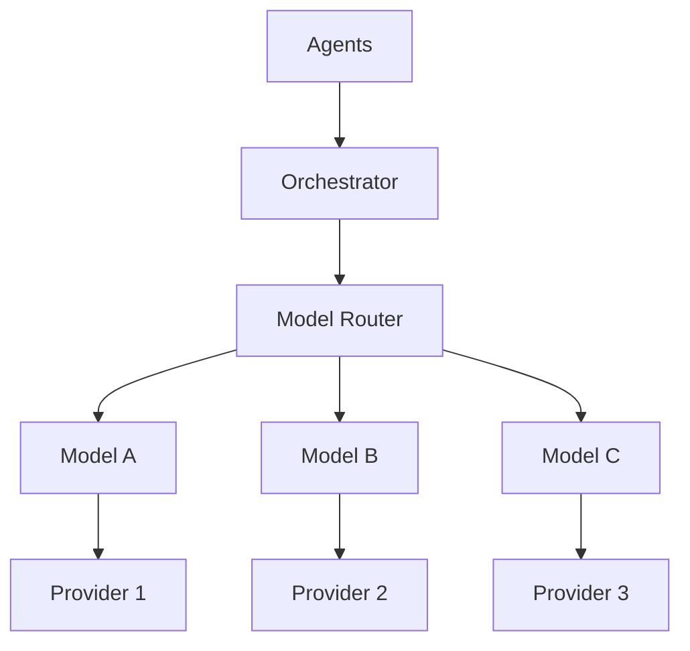
```mermaid
flowchart TB
    AG[Agents]
    AG --> O[Orchestrator]
    O --> MR[Model Router]
    MR --> M1[Model A]
    MR --> M2[Model B]
    MR --> M3[Model C]
    M1 --> P1[Provider 1]
    M2 --> P2[Provider 2]
    M3 --> P3[Provider 3]
```

Agents never call models directly. All model requests pass through the Orchestrator to the Model Router.


---

### Core Objectives

The Model Management System must achieve several goals.
Standardized Model Access
Provide a unified API for model inference.
Cost Optimization
Route requests to models that minimize operational cost.
Fault Tolerance
Automatically fall back to alternative models if one fails.
Experimentation
Enable model evaluation and A/B testing.
Prompt Governance
Maintain version control for prompts used across the system.


---

### Subsystem Components

The Model Management System consists of several subsystems.


---

Model Registry

### Purpose

Maintain metadata about all available models.
The registry stores information including:
• model capabilities
• supported tasks
• cost per token
• latency characteristics
• provider information


---

Model Registry Data Model

#### Model

{
    id: string,
    provider: string,
    capabilities: [enum(reasoning, coding, analysis, vision, embedding)]  // array; models may support multiple capabilities
    context_window: integer,
    cost_per_token: float,
    latency_ms: integer,
    status: enum(active, deprecated),
    created_at: timestamp,
    updated_at: timestamp
}


---

Model Router

### Purpose

Route model requests to the most appropriate model.
The router evaluates:
• task complexity
• model capabilities
• cost constraints
• latency requirements


---

### Routing Workflow

Agent Request → Orchestrator (policy, quota check) → Model Router → Model Selection → Inference Execution


---

Cost-Aware Model Selection
The router may select different models depending on the complexity of the task.
Example routing strategy:
Simple analysis → Small model
Code generation → Medium model
Architecture reasoning → Large model
This ensures efficient use of compute resources.


---

Model Fallback System
Model providers may occasionally fail or become unavailable.
The Model Management System therefore includes an automatic fallback mechanism.
If the primary model fails:
Primary Model Failure
       │
       ▼
Fallback Model Selected
       │
       ▼
Inference Request Retried
Fallback models must provide compatible capabilities.


---

Prompt Version Control
Agents rely on prompts to guide reasoning behavior.
Prompts must therefore be version controlled.
Prompt versions allow the system to:
• track prompt improvements
• reproduce previous behavior
• rollback faulty prompts


---

Prompt Data Model

#### Prompt

{
    id: UUID
    version: integer
    task_type: string
    content: text
    created_at: timestamp
}


---

Model Experimentation and A/B Testing
The system must support experimentation across models.
A/B testing allows evaluation of different models for the same task.
Example experiment:
Task Type: Code Generation

Group A → Model X
Group B → Model Y
Metrics evaluated include:
• success rate
• cost efficiency
• latency
• output quality


---

Model Usage Monitoring
The platform continuously tracks model usage.
Metrics collected include:
• token consumption
• request latency
• success rate
• error rate
This data feeds into the Cost Model and Budget Control Architecture.


---

Model Request API and Orchestrator Integration
All model inference is requested via the Orchestrator, which then calls the Model Router. The following applies:
- Authentication: Requests must carry agent_id and task_id; Orchestrator validates against active tasks and agent registry.
- Request quotas: Orchestrator enforces per-task and per-project token budgets before forwarding to the Model Router.
- Model routing policy: Orchestrator may attach policy constraints (e.g., allowed models, cost ceiling) that the Model Router must respect.
- Retry logic: Retries are coordinated by the Orchestrator (task-level retry state); the Model Router handles provider-level retries (e.g., fallback model).
Example interface (Orchestrator → Model Router):
POST /model/inference
Headers: X-Task-ID, X-Agent-ID, X-Correlation-ID, Authorization

{
  "task_type": "code_generation",
  "prompt_id": "prompt_103",
  "context": "...",
  "max_tokens": 2000
}
The Model Router performs model selection within Orchestrator-defined policy. Timeouts and error response formats should be defined in the Orchestrator–Model Router API contract for each deployment.


---

### Runtime Behavior

The Model Management System operates continuously.
while system_running:

    receive_model_request()

    select_optimal_model()

    execute_inference()

    record_usage_metrics()


---

### Failure Handling

Potential failures include:
• model provider outages
• latency spikes
• inference errors
Mitigation strategies include:
• fallback models
• retry policies
• provider failover


---

### Scaling Strategy

The Model Management System must support high request volumes.
Scaling mechanisms include:
• stateless routing services
• distributed inference gateways
• request batching


---

### Example Workflow

Example: Agent Code Generation
Backend Agent requests code generation
        │
        ▼
Model Router evaluates task complexity
        │
        ▼
Code-optimized model selected
        │
        ▼
Inference executed
        │
        ▼
Generated code returned to agent


---

### Transition to Next Section

The next section defines the Orchestration System, which coordinates agent workflows and task execution across the platform.


---

# 7. Orchestration System

### Detailed Explanation

The Orchestration System is the central coordination mechanism of the AI Autonomous Development Platform (AADP). It functions as the control plane that manages the lifecycle of tasks, coordinates agent execution, enforces system policies, and maintains overall system stability.
While agents perform individual units of work, the orchestrator ensures that all activities occur in a structured, deterministic, and safe workflow.
Without orchestration, autonomous agents would:
- duplicate work
- conflict with each other
- create uncontrolled task chains
- exceed compute budgets
- break system invariants
The orchestration system therefore acts as the central nervous system of the entire platform.
It is responsible for:
- task lifecycle management
- workflow execution
- agent scheduling
- dependency resolution
- resource allocation
- failure recovery
- budget enforcement
- distributed coordination
The orchestration system must support large-scale distributed execution, coordinating hundreds of agents and thousands of concurrent tasks across multiple projects.


---

### Core Responsibilities

The orchestrator manages several critical responsibilities.
Task Scheduling
Assign tasks to appropriate agents based on:
- agent role
- agent availability
- system load
- project context


---

Workflow Management
Complex operations such as feature development involve multiple tasks executed in sequence.
The orchestrator maintains workflow graphs that represent task dependencies. DAG and workflow state are persisted in the Task State Store (and optionally a dedicated Workflow Store) so that they can be restored after orchestrator failover (see High Availability).


---

Resource Management
The orchestrator tracks system resources including:
- compute usage
- token budgets
- memory consumption
- agent availability


---

Failure Recovery
If tasks fail or agents crash, the orchestrator must recover gracefully by:
- retrying tasks
- reassigning tasks
- triggering escalation


---

Policy Enforcement
All agent actions must pass through the orchestrator to ensure compliance with system policies.


---

### High-Level Architecture

The orchestration system is composed of several internal subsystems.

**Figure 16 — Orchestrator High-Level Architecture**


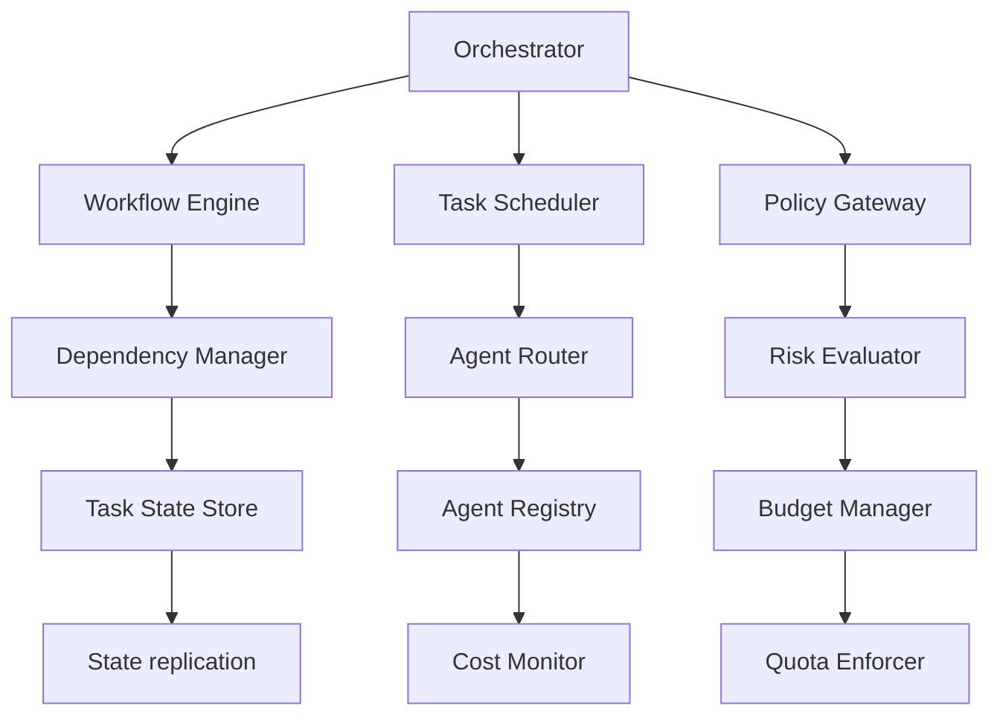
```mermaid
flowchart TB
    O[Orchestrator]
    O --> WE[Workflow Engine]
    O --> TS[Task Scheduler]
    O --> PG[Policy Gateway]
    WE --> DM[Dependency Manager]
    TS --> AR[Agent Router]
    PG --> RE[Risk Evaluator]
    DM --> TSS[Task State Store]
    AR --> AReg[Agent Registry]
    RE --> BM[Budget Manager]
    TSS --> SR["State replication"]
    AReg --> CM[Cost Monitor]
    BM --> QE[Quota Enforcer]
```


---

Orchestrator Subsystems
Workflow Engine

### Purpose

Manages multi-step processes composed of interconnected tasks.

### Responsibilities

- creating workflows
- tracking workflow progress
- resolving task dependencies
- managing state transitions


---

Workflow Representation
Workflows are represented as Directed Acyclic Graphs (DAGs).
Each node represents a task.
Edges represent dependencies.


---

Workflow Diagram
         FEATURE DEVELOPMENT WORKFLOW

           Task A (Architecture)
                │
       ┌────────┴────────┐
       ▼                 ▼
 Task B (Backend)   Task C (Frontend)
       │                 │
       └────────┬────────┘
                │ (convergence: B and C complete before D)
                ▼
         Task D (Testing)
                │
                ▼
         Task E (Deployment)


---

Task Scheduler

### Purpose

Assigns tasks to agents.


---

### Responsibilities

- selecting appropriate agent pools
- balancing workload across agents
- ensuring fair scheduling


---

Scheduling Algorithm
The scheduler may use strategies such as:
- priority queues
- weighted round-robin
- capability-based matching


---

Example Scheduling Logic
function schedule_task(task):

    eligible_agents = find_agents_with_capability(task.type)

    selected_agent = choose_agent_with_lowest_load(eligible_agents)

    assign_task(selected_agent, task)


---

Dependency Manager

### Purpose

Ensures tasks are executed only when their dependencies are satisfied.


---

### Responsibilities

- tracking dependency graphs
- unlocking tasks when dependencies complete
- detecting dependency cycles


---

Dependency State Model

#### TaskDependency

{
    task_id: UUID
    dependency_task_id: UUID
}


---

Agent Router

### Purpose

Routes tasks to appropriate agents.


---

### Responsibilities

- mapping task types to agent roles
- routing messages
- managing communication


---

Example Routing Table (Orchestrator)
Schema: Task Type (enum) → Agent Role. This table maps workflow/routing task types (how the orchestrator assigns work) to agent roles; the Task entity's type field (feature, bug, infra, etc.) is used for lifecycle and categorization—see Canonical Task in Executive Overview. Task Type values are constrained to the following enumeration (extensible per deployment):
task_type_enum: architecture_design | backend_feature | frontend_feature | testing | deployment | security_review | research | infrastructure | bug_fix
Task Type	Agent Role
architecture_design	Architect Agent
backend_feature	Backend Engineer Agent
frontend_feature	Frontend Engineer Agent
testing	QA Agent
security_review	Security Agent
deployment	DevOps Agent
research	Research Agent
infrastructure	DevOps Agent
bug_fix	Backend Engineer Agent


---

Agent Registry

### Purpose

Maintains a registry of all active agents.


---

### Responsibilities

- agent registration
- health monitoring
- capability tracking


---

### Data Model

#### AgentRegistryEntry

{
    agent_id: string
    role: string
    status: idle | busy | offline
    last_heartbeat: timestamp
}


---

Budget Manager

### Purpose

Prevents uncontrolled compute usage.


---

### Responsibilities

- tracking token usage
- monitoring cloud costs
- enforcing budget limits


---

Budget Enforcement
If budgets are exceeded:
- tasks are paused
- alerts are generated
- human review may be required


---

Policy Gateway

### Purpose

Acts as the enforcement point for system policies.


---

### Responsibilities

- evaluating agent actions
- blocking unauthorized operations
- logging policy decisions


---

Risk Evaluation Engine

### Purpose

Analyzes potential risks of proposed actions.
Examples include:
- large refactors
- database migrations
- infrastructure changes
High-risk operations may require human approval.


---

Task Lifecycle
The orchestrator manages the full lifecycle of every task.


---

Task State Transitions (Canonical Task Lifecycle — see Executive Overview)
CREATED → QUEUED → ASSIGNED → RUNNING → VALIDATION → REVIEW → DEPLOYMENT → COMPLETED
Failure/auxiliary states: FAILED, BLOCKED, RETRYING


---

### Data Models

Workflow Definition

#### Workflow

{
    id: UUID,
    project_id: UUID,
    name: string,
    tasks: [task_id],
    status: enum(running, completed, failed)
}


---

Task Queue Entry

#### TaskQueueEntry

{
    task_id: UUID
    priority: integer
    created_at: timestamp
}


---

Resource Usage Record

#### ResourceUsage

{
    project_id: UUID
    tokens_used: integer
    compute_hours: float
    cost_estimate: float
}


---

### Runtime Behavior

The orchestrator operates continuously using a scheduling loop.
while system_running:

    new_tasks = fetch_new_tasks()

    for task in new_tasks:

        if dependencies_resolved(task):

            schedule_task(task)

    monitor_running_tasks()

    handle_failures()

    enforce_budgets()


---

### Failure Handling

The orchestration system must tolerate failures in agents or infrastructure.
Possible failures include:
- agent crashes
- task execution failures
- dependency conflicts
- resource exhaustion
Recovery strategies include:
- task retries
- task reassignment
- workflow rollback


---

### Scaling Strategy

The orchestration system must support large-scale distributed execution.


---

### Distributed Task Queues

Task queues are partitioned by:
- project
- task type
This prevents queue contention.


---

Stateless Scheduler Nodes
Scheduler nodes are stateless and can scale horizontally.


---

High Availability
Multiple orchestrator nodes operate simultaneously.
Distributed Consensus and Leader Election
Orchestrator HA requires a distributed consensus mechanism so that scheduling and state transitions remain consistent across nodes. Leader election (e.g., via etcd, Consul, or Zookeeper) determines the active leader; only the leader may mutate workflow state and assign tasks. Followers replicate state and may serve read-only queries. On leader failure, the consensus layer triggers a new election; the new leader resumes from persisted state. This is critical for avoiding duplicate task assignment and inconsistent workflow state.


---

### Example Workflow

Example: Autonomous Bug Resolution
Bug detected
      │
      ▼
Bug task created
      │
      ▼
Orchestrator schedules analysis
      │
      ▼
Backend Agent analyzes issue
      │
      ▼
Fix implementation
      │
      ▼
QA testing
      │
      ▼
Security validation
      │
      ▼
Deployment


---

### Transition to Next Section

The next section will define the Codebase Understanding System, which allows agents to maintain deep knowledge of software repositories and architecture.


---

# 8. Codebase Understanding System

### Detailed Explanation

The Codebase Understanding System (CUS) is a critical subsystem of the AI Autonomous Development Platform (AADP) responsible for building and maintaining a continuously updated, machine-readable representation of all software repositories managed by the platform.
Autonomous development systems cannot safely modify large software systems without a deep understanding of:
- source code structure
- module relationships
- API contracts
- dependency graphs
- architectural boundaries
- historical commit patterns
- documentation
- test coverage
Traditional AI coding tools rely only on prompt context, which is insufficient for large codebases. Modern production repositories often contain:
- millions of lines of code
- hundreds of services
- complex dependency chains
- distributed microservices
- evolving architecture
The Codebase Understanding System solves this problem by constructing a persistent semantic representation of the entire codebase.
This representation allows agents to:
- search code semantically
- understand architectural boundaries
- identify where features should be implemented
- detect code ownership patterns
- analyze impact of proposed changes
- prevent unsafe modifications
The CUS acts as the primary knowledge interface between agents and source code repositories.


---

System Objectives
The Codebase Understanding System must provide the following capabilities:
Continuous Repository Indexing
Automatically analyze and index repositories whenever code changes occur.


---

Semantic Code Search
Allow agents to search the codebase using semantic queries rather than simple keyword searches.


---

Dependency Graph Construction
Build a graph representation of relationships between:
- modules
- services
- APIs
- libraries
- databases


---

Architecture Mapping
Identify system boundaries and architectural layers.


---

Code Change Impact Analysis
Estimate which files, services, and tests will be affected by a change.


---

Historical Knowledge Extraction
Extract patterns from commit history including:
- common bug areas
- code ownership
- frequently modified modules


---

System Architecture
The Codebase Understanding System is composed of several subsystems. Data synchronization is governed by a versioned indexing pipeline so that AST, semantic index, and dependency graph remain consistent.


---

Versioned Indexing Pipeline (Data Synchronization Strategy)
To prevent embeddings or dependency graph from referencing outdated code, all indexing is driven by a single pipeline with commit-level versioning:
commit (commit_sha) → parse → AST → embeddings → graph update
- Every index entry (AST node, embedding, graph edge) is tagged with commit_sha (and optionally branch).
- Repository ingestion triggers the pipeline on new commits; incremental updates propagate through parse → AST → semantic index → dependency graph in order.
- Queries can be scoped to a specific commit_sha for consistent snapshots.
This ensures the AST index, Semantic Index, and Dependency Graph stay aligned with repository state.


---

                 CODE REPOSITORIES (commit_sha tracked)
                       │
                       ▼
                REPOSITORY INGESTION
                       │
                       ▼
                CODE PARSING ENGINE → AST INDEX (CODE DB)
                       │
                       ▼
          ┌────────────┼─────────────┐
          ▼            ▼             ▼
    SEMANTIC INDEX   AST INDEX   DEPENDENCY GRAPH
    (Vector DB)     (CODE DB)      (GRAPH DB)
          │            │             │
          └────────────┴─────────────┘
                       │
                       ▼
     AGENT QUERY INTERFACE


---

### Subsystem Components

Repository Ingestion Service

### Purpose

Detects changes in source code repositories and triggers indexing workflows.


---

### Responsibilities

- monitoring repository changes
- cloning repositories
- fetching commits
- triggering code analysis pipelines


---

Inputs
- Git commits
- pull requests
- repository metadata


---

Outputs
- indexing jobs
- change events


---

### Example Workflow

Git Commit Detected
        │
        ▼
Repository Ingestion Service
        │
        ▼
Trigger Code Parsing Pipeline


---

Code Parsing Engine

### Purpose

Analyzes source code to extract structured information.


---

### Responsibilities

- parsing source code files
- extracting syntax trees
- identifying functions and classes
- detecting API definitions


---

### Internal Components

Language-specific parsers for:
- Python
- Java
- JavaScript / TypeScript
- Go
- Rust
- C++


---

Data Produced
- Abstract Syntax Trees (ASTs)
- function metadata
- class definitions
- file summaries


---

Semantic Index Builder

### Purpose

Creates embeddings representing the semantic meaning of code segments.


---

### Responsibilities

- embedding generation
- semantic clustering
- similarity search indexing


---

Example Use Case
An agent may query:
"Where is user authentication handled?"
The semantic index returns:
- authentication middleware
- login controller
- user service


---

### Data Model

CodeEmbedding

#### CodeEmbedding

{
    id: UUID
    repository: string
    file_path: string
    code_segment: text
    embedding_vector: vector
}


---

Dependency Graph Builder

### Purpose

Builds a graph representation of the system architecture.


---

### Responsibilities

- identifying module dependencies
- mapping service interactions
- tracking database relationships


---

### Architecture Diagram

         SERVICE GRAPH

   Frontend App
        │
        ▼
   API Gateway
        │
 ┌──────┴──────┐
 ▼             ▼
User Service   Order Service
     │               │
     ▼               ▼
User DB          Order DB


---

Graph Data Model
ServiceDependency
ServiceDependency
{
    source_service: string
    target_service: string
    dependency_type: api | database | library
}


---

Code Metadata Database

### Purpose

Stores structured information extracted from code.


---

Data Stored
- file metadata
- function definitions
- class structures
- documentation


---

### Data Model

CodeFile

#### CodeFile

{
    id: UUID
    repository: string
    path: string
    language: string
    summary: text
    last_modified: timestamp
}


---

Code Change Analyzer

### Purpose

Analyzes potential impacts of proposed changes.


---

### Responsibilities

- identifying affected modules
- predicting test coverage impact
- identifying dependency conflicts


---

Example Impact Analysis
Proposed Change: Modify Authentication Middleware

Affected Components:

- login controller
- session service
- auth tests
- user service


---

Agent Query Interface
Agents interact with the Codebase Understanding System through a query API.


---

Query Types
Agents may request:
- file summaries
- API definitions
- dependency graphs
- related code segments
- architecture diagrams


---

Query Example
GET /codebase/search

{
  "query": "payment processing logic"
}


---

Response Example
{
  "results": [
    "payment_service.py",
    "checkout_controller.js",
    "transaction_handler.go"
  ]
}


---

### Runtime Behavior

The Codebase Understanding System operates continuously.


---

Continuous Indexing Loop
while system_running:

    detect_repository_changes()

    if change_detected:

        parse_modified_files()

        update_semantic_index()

        update_dependency_graph()


---

### Failure Handling

Potential failures include:
- repository access issues
- parsing errors
- indexing failures
Mitigation strategies include:
- retry mechanisms
- incremental indexing
- fallback parsing


---

### Scaling Strategy

The Codebase Understanding System must support extremely large repositories.


---

Incremental Indexing
Only modified files are re-indexed.


---

Distributed Parsing Workers
Parsing tasks are distributed across multiple workers.


---

Sharded Vector Databases
Semantic embeddings are partitioned across shards.


---

Graph Database Scaling
Dependency graphs are stored in scalable graph databases.


---

### Example Workflow

Example: Implementing a New Feature
Agent receives task
      │
      ▼
Query codebase knowledge
      │
      ▼
Identify relevant modules
      │
      ▼
Analyze dependencies
      │
      ▼
Generate implementation plan


---

### Transition to Next Section

The next section will define the Memory and Knowledge Layer, which provides persistent institutional memory for the platform.


---

# 9. Memory and Knowledge Layer

### Detailed Explanation

The Memory and Knowledge Layer (MKL) provides the persistent institutional memory of the AI Autonomous Development Platform (AADP). It stores, organizes, retrieves, and evolves knowledge that agents rely on for reasoning, planning, and decision making.
Unlike traditional software systems that treat logs or documentation as static artifacts, the AADP Memory Layer functions as an active knowledge substrate that continuously accumulates information about:
- architectural decisions
- development history
- bugs and incidents
- performance characteristics
- research insights
- deployment outcomes
- system behavior
This knowledge enables agents to:
- avoid repeating previous mistakes
- understand historical design decisions
- recall prior implementations
- reuse architectural patterns
- learn from production incidents
Over time, the platform develops a growing institutional knowledge base, similar to the long-term experience accumulated by human engineering organizations.
The Memory Layer is therefore essential for:
- long-term reasoning
- cross-project learning
- system explainability
- autonomous improvement


---

System Objectives
The Memory and Knowledge Layer must satisfy several critical requirements.
Persistent Knowledge Storage
The system must store knowledge generated across:
- agents
- workflows
- deployments
- incidents
- research tasks
This knowledge must remain accessible over long time horizons.


---

Semantic Retrieval
Agents must be able to retrieve relevant knowledge using natural language queries.
Example:
"How was authentication implemented in previous projects?"


---

Structured Knowledge Representation
Certain knowledge must be represented in structured form.
Examples include:
- architectural diagrams
- service relationships
- configuration standards


---

Knowledge Evolution
As the system grows, memory must evolve through:
- summarization
- compression
- deduplication
- archival


---

Memory Lifecycle Management
Memory lifecycle must be explicitly managed to control growth, quality, and compliance:
- TTL (time-to-live): optional expiration per memory entry or category; expired entries are archived or purged per retention policy.
- Summarization: older or low-usage entries may be summarized to reduce storage while preserving key information.
- Deduplication: detect and merge or suppress duplicate or near-duplicate memories (e.g., by embedding similarity).
- Poisoning detection: monitor for malicious or low-quality memories (e.g., anomaly detection on retrieval patterns, human review sampling); quarantine or purge detected poison entries.


---

Knowledge Provenance
Every memory entry must contain metadata describing:
- which agent generated it
- which workflow produced it
- what evidence supports it
This ensures traceability and reliability.


---

Memory System Architecture
The Memory and Knowledge Layer combines multiple storage technologies to represent different types of knowledge.
                KNOWLEDGE GENERATION
                        │
                        ▼
                MEMORY INGESTION API
                        │
                        ▼
          ┌─────────────┼──────────────┐
          ▼             ▼              ▼
      VECTOR STORE   DOCUMENT DB   GRAPH DB
          │             │              │
          ▼             ▼              ▼
    Semantic Memory   Knowledge     Relationship
                      Repository       Graph
                        │
                        ▼
                  RETRIEVAL API
                        │
                        ▼
                       AGENTS


---

### Subsystem Components

Memory Ingestion Service

### Purpose

Captures new knowledge generated by agents and workflows.


---

### Responsibilities

- receiving memory entries
- validating metadata
- assigning embeddings
- storing knowledge


---

Inputs
Examples of knowledge inputs include:
- architecture documents
- bug analyses
- deployment reports
- research summaries


---

Example Ingestion Workflow
Agent completes task
       │
       ▼
Knowledge summary generated
       │
       ▼
Memory ingestion service
       │
       ▼
Knowledge stored in memory system


---

Knowledge Provenance
Every memory entry carries provenance (see canonical MemoryEntry schema in Executive Overview). The Memory Ingestion Service populates commit_id, prompt_id, agent_id, and raw_references when ingesting; this supports auditing and traceability of how knowledge was generated.


---

Vector Memory Store

### Purpose

Stores semantic representations of knowledge to enable similarity search.


---

### Responsibilities

- storing embeddings
- performing vector similarity search
- retrieving relevant context


---

Example Query
Agent query:
"Previous incidents involving payment failures"
Vector search retrieves similar incident reports.


---

### Data Model

MemoryEmbedding

#### MemoryEmbedding

{
    id: UUID
    memory_id: UUID
    embedding_vector: vector
    created_at: timestamp
}


---

Document Knowledge Repository

### Purpose

Stores full-text knowledge documents.


---

Examples
- architectural documents
- design proposals
- postmortems
- research reports


---

### Data Model

KnowledgeDocument

#### KnowledgeDocument

{
    id: UUID
    title: string
    content: text
    category: architecture | research | incident | decision
    created_by_agent: string
    created_at: timestamp
}


---

Knowledge Graph

### Purpose

Stores relationships between knowledge entities.


---

Relationships
Examples include:
- service dependencies
- decision rationales
- incident causes


---

Graph Representation
        SERVICE RELATIONSHIP GRAPH

    Payment Service
          │
          ▼
    Transaction Processor
          │
          ▼
    Banking API


---

Graph Data Model
KnowledgeRelationship
KnowledgeRelationship
{
    source_entity: string
    target_entity: string
    relationship_type: depends_on | caused_by | improves
}


---

Knowledge Compression Engine

### Purpose

Prevents memory systems from growing indefinitely.


---

### Responsibilities

- summarizing historical knowledge
- merging duplicate records
- archiving outdated knowledge


---

Example
Multiple bug reports related to the same issue may be summarized into a single consolidated record.


---

Retrieval System
Agents retrieve knowledge through a unified retrieval interface.


---

Retrieval Pipeline
Agent Query
      │
      ▼
Query Interpreter
      │
      ▼
Vector Search
      │
      ▼
Graph Query
      │
      ▼
Document Retrieval
      │
      ▼
Context Assembly


---

Retrieval API
Example query request:
POST /memory/query

{
  "query": "authentication architecture",
  "project_id": "123"
}


---

Example response:
{
  "documents": [
    "auth_architecture_doc",
    "session_management_design"
  ]
}


---

Knowledge Lifecycle
Knowledge entries pass through several lifecycle stages.


---

Knowledge Lifecycle Diagram
Knowledge Created
       │
       ▼
Knowledge Indexed
       │
       ▼
Knowledge Retrieved
       │
       ▼
Knowledge Referenced
       │
       ▼
Knowledge Updated
       │
       ▼
Knowledge Archived


---

### Runtime Behavior

The memory system operates continuously alongside agent workflows.
while system_running:

    ingest_new_knowledge()

    update_embeddings()

    maintain_graph_relationships()

    compress_old_knowledge()


---

### Failure Handling

Potential failures include:
- corrupted embeddings
- incomplete knowledge records
- inconsistent graph relationships
Mitigation strategies:
- replication
- periodic integrity checks
- backup snapshots


---

### Scaling Strategy

The memory system must support long-term accumulation of knowledge across many projects.


---

Distributed Vector Databases
Embeddings are partitioned across multiple nodes.


---

Graph Database Clustering
Knowledge graphs run on distributed clusters.


---

Tiered Storage
Older knowledge is moved to lower-cost storage.


---

### Example Workflow

Example: Incident Learning
Production failure occurs
       │
       ▼
Incident report generated
       │
       ▼
Memory ingestion service stores report
       │
       ▼
Embedding generated
       │
       ▼
Future agents retrieve incident knowledge


---

### Transition to Next Section

The next section will define the Safety and Guardrail System, which ensures that autonomous agents operate within strict safety boundaries.


---

# 10. Safety and Guardrail System

### Detailed Explanation

The Safety and Guardrail System (SGS) is the governance and protection framework of the AI Autonomous Development Platform (AADP). It ensures that autonomous agents operate within strictly defined operational, security, and regulatory boundaries.
Because the platform is capable of:
- modifying production software
- deploying infrastructure changes
- interacting with sensitive systems
- executing code autonomously
it must enforce strong safety controls that prevent dangerous actions from occurring without proper validation.
The Safety and Guardrail System ensures that:
- autonomous behavior remains predictable
- unsafe changes cannot reach production
- security vulnerabilities are detected early
- regulatory policies are enforced
- human oversight is applied to high-risk actions
This system acts as the central governance layer that sits between agents and any action that could impact the outside world.
All potentially dangerous actions must pass through this system before execution.
Examples of guarded actions include:
- code merges to production branches
- database migrations
- infrastructure configuration changes
- deployment of new services
- access to sensitive data
- external API integrations
The Safety and Guardrail System integrates tightly with:
- the Orchestration System
- the Deployment Infrastructure
- the Codebase Understanding System
- the Observability System
to provide comprehensive protection across the entire platform.


---

Safety Architecture Overview
The Safety and Guardrail System consists of several independent safety mechanisms working together. Policy evaluation is integrated with the CI/CD pipeline so that deployment safety is enforced before any deployment or infrastructure modification.


---

CI/CD and Policy Integration
Explicit architecture: CI Pipeline → Policy Engine → Deployment Approval
- Before deployment: every deployment request is evaluated by the Policy Engine; only approved requests proceed.
- Before infrastructure modification: infra change tasks are gated by the Policy Engine and optional human approval.
- Before artifact publishing: artifact promotion (e.g., to production) triggers policy evaluation and approval workflow.


---

                     AGENT ACTION
                          │
                          ▼
                  SAFETY VALIDATION
                          │
        ┌─────────────────┼─────────────────┐
        ▼                 ▼                 ▼
   POLICY ENGINE     RISK ANALYZER    SECURITY SCANNER
        │                 │                 │
        └───────────┬─────┴─────┬───────────┘
                    ▼           ▼
            APPROVAL WORKFLOW   AUTOMATED TESTS
                    │
                    ▼
             DEPLOYMENT GUARDRAILS
                    │
                    ▼
                ACTION EXECUTION


---

System Objectives
The Safety and Guardrail System must enforce the following objectives.
Prevent Unsafe Autonomous Actions
Agents must never execute dangerous operations without passing validation.


---

Enforce Organizational Policies
All actions must comply with defined policies.
Examples:
- coding standards
- deployment procedures
- security requirements


---

Detect Security Vulnerabilities
The system must automatically detect vulnerabilities in generated code.


---

Manage Risky Operations
High-risk actions require additional validation steps.


---

Maintain System Integrity
The system must prevent:
- destructive operations
- privilege escalation
- unauthorized data access


---

Core Subsystems
The Safety and Guardrail System contains several subsystems.


---

Policy Engine

### Purpose

Evaluates whether an agent action complies with system policies.


---

### Responsibilities

- validating actions
- enforcing constraints
- blocking unauthorized operations


---

Policy Evaluation Workflow
Agent requests action
        │
        ▼
Policy engine evaluates request
        │
        ├── Allowed → continue
        │
        └── Blocked → raise violation


---

### Data Model

PolicyRule

#### PolicyRule

{
    id: UUID
    name: string
    description: text
    action_type: deployment | code_change | infra_change
    enforcement: allow | deny | approval_required
}


---

Risk Analysis Engine

### Purpose

Evaluates the potential impact of proposed actions.


---

Risk Factors
Risk scoring considers:
- number of affected files
- affected services
- infrastructure impact
- historical incident patterns


---

Risk Scoring Example
RiskScore
{
    change_size: 0.4
    service_impact: 0.3
    infrastructure_impact: 0.2
    historical_risk: 0.1
}
Total risk score determines whether additional validation is required.


---

Security Scanning System

### Purpose

Detects security vulnerabilities in generated code.


---

Security Checks
The system performs:
- static code analysis
- dependency vulnerability scanning
- secret detection
- insecure API usage detection


---

Vulnerability Detection Workflow
Code generated
       │
       ▼
Static analysis
       │
       ▼
Dependency scan
       │
       ▼
Secret detection
       │
       ▼
Security report generated


---

### Data Model

SecurityReport

#### SecurityReport

{
    id: UUID
    task_id: UUID
    vulnerabilities: [string]
    severity: low | medium | high | critical
}


---

Approval Workflow System

### Purpose

Allows humans to review high-risk actions before execution.


---

Examples of Approval-Requiring Actions
- production deployments
- infrastructure changes
- database schema migrations
- external integrations


---

Approval Workflow Diagram
High Risk Action
      │
      ▼
Approval Request
      │
      ▼
Human Reviewer
      │
      ├── Approve → continue
      │
      └── Reject → cancel action


---

### Data Model

ApprovalRequest

#### ApprovalRequest

{
    id: UUID
    action_type: deployment | infra_change
    requested_by_agent: string
    status: pending | approved | rejected
}


---

Deployment Guardrails

### Purpose

Prevent unsafe deployments.


---

Guardrail Mechanisms
Examples include:
- canary deployments
- automatic rollback
- health monitoring
- deployment rate limits


---

Deployment Flow
Deployment request
       │
       ▼
Safety validation
       │
       ▼
Canary deployment
       │
       ▼
Health monitoring
       │
       ▼
Full rollout


---

### Runtime Behavior

All actions executed by agents must pass through the Safety System.
function execute_agent_action(action):

    policy_result = evaluate_policy(action)

    if policy_result == BLOCK:
        raise_violation()

    risk = evaluate_risk(action)

    if risk > threshold:
        request_human_approval()

    security_scan(action)

    execute_action()


---

### Failure Handling

Potential failures include:
- policy misconfiguration
- false-positive security alerts
- approval delays
Mitigation strategies include:
- audit logs
- override mechanisms
- fallback workflows


---

### Scaling Strategy

The Safety System must handle high volumes of agent actions.


---

Distributed Policy Evaluation
Policy checks run across scalable stateless services.


---

Parallel Security Scanning
Code scans run across distributed scanning workers.


---

Approval Queue Scaling
Approval requests are managed through queue-based systems.


---

### Example Workflow

Example: Production Deployment
DevOps agent requests deployment
       │
       ▼
Policy validation
       │
       ▼
Risk analysis
       │
       ▼
Security validation
       │
       ▼
Human approval required
       │
       ▼
Deployment guardrails activated
       │
       ▼
Service deployed safely


---

### Transition to Next Section

The next section will define the Planning and Execution Cycles, which describe how autonomous development workflows are executed continuously.


---

# 11. Planning and Execution Cycles

### Detailed Explanation

The Planning and Execution Cycles (PEC) define the operational loop through which the AI Autonomous Development Platform (AADP) performs continuous software development.
Autonomous software development requires more than simply executing tasks. The system must continuously:
- observe system state
- identify opportunities or problems
- plan improvements
- execute tasks
- validate outcomes
- learn from results
This iterative loop is referred to as the Autonomous Development Cycle.
The Planning and Execution Cycles ensure that:
- development remains structured and deterministic
- agents collaborate in coordinated workflows
- system changes are validated before deployment
- learning occurs after each execution cycle
The cycle operates continuously across all projects managed by the platform.
Each cycle consists of multiple stages:
1.	System Observation
2.	Opportunity Identification
3.	Planning and Task Decomposition
4.	Task Execution
5.	Validation and Testing
6.	Deployment
7.	Monitoring and Feedback
8.	Knowledge Integration
These stages together form a closed-loop autonomous development system.


---

Autonomous Development Cycle Overview
The following diagram illustrates the complete development cycle.
            SYSTEM OBSERVATION
                   │
                   ▼
        OPPORTUNITY IDENTIFICATION
                   │
                   ▼
         PLANNING & TASK CREATION
                   │
                   ▼
              TASK EXECUTION
                   │
                   ▼
           VALIDATION & TESTING
                   │
                   ▼
               DEPLOYMENT
                   │
                   ▼
           MONITORING & FEEDBACK
                   │
                   ▼
            KNOWLEDGE INTEGRATION
                   │
                   ▼
             NEXT DEVELOPMENT CYCLE


---

Cycle Stage 1 — System Observation

### Purpose

The platform continuously monitors all managed systems to understand their current state.


---

Inputs
Observation data may include:
- application logs
- performance metrics
- error reports
- user feedback
- monitoring alerts
- system usage patterns


---

Responsible Agents
Observation is performed by:
- monitoring agents
- incident analysis agents
- performance analysis agents


---

Example Observation Workflow
Monitoring system detects high latency
        │
        ▼
Observation agents collect metrics
        │
        ▼
Incident analysis report generated


---

Cycle Stage 2 — Opportunity Identification

### Purpose

Identify potential improvements or issues requiring action.


---

Examples of Opportunities
- performance optimizations
- bug fixes
- feature enhancements
- infrastructure improvements
- security updates


---

Opportunity Detection Sources
Sources include:
- production incidents
- research insights
- product roadmap updates
- system monitoring signals


---

Example Opportunity
High API latency detected
        │
        ▼
Opportunity identified:
Optimize database queries


---

Cycle Stage 3 — Planning and Task Decomposition

### Purpose

Convert high-level opportunities into actionable development plans.


---

### Responsibilities

Planning agents must:
- analyze system architecture
- determine required changes
- generate task lists
- define dependencies


---

Responsible Agents
- Product Manager Agent
- Architect Agent


---

Planning Workflow
Opportunity identified
       │
       ▼
Architect agent analyzes system
       │
       ▼
Implementation plan created
       │
       ▼
Tasks generated


---

Task Decomposition Example
Opportunity:
Implement caching for API responses.
Generated tasks:
1.	Design caching strategy
2.	Modify backend service
3.	Update API gateway configuration
4.	Add performance tests
5.	Deploy caching infrastructure


---

Cycle Stage 4 — Task Execution

### Purpose

Agents perform the tasks generated during planning.


---

Responsible Agents
Execution tasks are handled by:
- backend engineering agents
- frontend engineering agents
- DevOps agents


---

Execution Workflow
Task assigned to agent
        │
        ▼
Agent retrieves context
        │
        ▼
Agent generates implementation
        │
        ▼
Code committed to repository


---

Cycle Stage 5 — Validation and Testing

### Purpose

Ensure that implemented changes meet quality and safety requirements.


---

Validation Steps
- unit testing
- integration testing
- performance testing
- security scanning


---

Responsible Agents
- QA agents
- Security agents


---

Validation Workflow
Code committed
      │
      ▼
Automated tests run
      │
      ▼
Security scans executed
      │
      ▼
Validation report generated


---

Cycle Stage 6 — Deployment

### Purpose

Deploy validated changes into production environments.


---

Deployment Strategies
The system supports:
- rolling deployments
- canary releases
- blue-green deployments


---

Responsible Agents
Deployment tasks are handled by:
- DevOps agents


---

Deployment Workflow
Validated build
      │
      ▼
Deployment pipeline triggered
      │
      ▼
Canary deployment
      │
      ▼
System health verified
      │
      ▼
Full deployment


---

Cycle Stage 7 — Monitoring and Feedback

### Purpose

Observe system behavior after deployment.


---

Monitoring Metrics
Examples include:
- error rates
- latency
- throughput
- resource utilization


---

Responsible Systems
- monitoring infrastructure
- observability agents


---

Feedback Workflow
Deployment completed
       │
       ▼
Monitoring agents observe metrics
       │
       ▼
Performance data collected


---

Cycle Stage 8 — Knowledge Integration

### Purpose

Integrate lessons learned into the knowledge system.


---

### Responsibilities

- storing incident reports
- recording architectural decisions
- summarizing deployment results


---

Example Knowledge Entry
Deployment of caching system reduced latency by 40%
This knowledge becomes available for future decision-making.


---

Planning Cycle Scheduling
The system runs planning cycles continuously.


---

Cycle Scheduling Strategies
The orchestrator may trigger cycles based on:
- time intervals
- system events
- user requests


---

Scheduling Example
Every 6 hours:

    analyze_system_state()

    identify_opportunities()

    create_planning_tasks()


---

### Data Models

Opportunity Record

#### Opportunity

{
    id: UUID
    project_id: UUID
    description: text
    priority: integer
    source: monitoring | research | user_request
}


---

Planning Session

#### PlanningSession

{
    id: UUID
    opportunity_id: UUID
    generated_tasks: [task_id]
}


---

### Failure Handling

Failures may occur during planning or execution cycles.
Examples include:
- incorrect task decomposition
- implementation errors
- deployment failures
Mitigation strategies include:
- task retries
- workflow rollback
- incident investigation


---

### Scaling Strategy

Planning and execution cycles must scale across many projects.


---

Parallel Project Execution
Each project may run independent cycles.


---

Distributed Task Execution
Tasks are distributed across agent pools.


---

Incremental Planning
Planning cycles focus only on new opportunities.


---

### Example Workflow

Example: Performance Optimization Cycle
Latency increase detected
       │
       ▼
Opportunity identified
       │
       ▼
Architect designs caching strategy
       │
       ▼
Backend agent implements caching
       │
       ▼
QA tests performance
       │
       ▼
DevOps deploys change
       │
       ▼
Monitoring confirms improvement


---

### Transition to Next Section

The next section will define the Task Management System, which handles creation, storage, prioritization, and execution of tasks.


---

# 12. Task Management System

### Detailed Explanation

The Task Management System (TMS) is the operational backbone of the AI Autonomous Development Platform (AADP). It defines how work is created, prioritized, scheduled, tracked, executed, retried, and completed across the entire system.
All autonomous work within the platform is represented as tasks. A task is the smallest unit of work that can be assigned to an agent and executed independently.
Examples of tasks include:
- designing an API endpoint
- implementing a backend service
- writing unit tests
- performing a security scan
- executing a deployment pipeline
- analyzing production incidents
Because the platform may manage:
- hundreds of agents
- thousands of concurrent tasks
- multiple projects
- multiple repositories
the Task Management System must provide a highly scalable, fault-tolerant, distributed task orchestration mechanism.
The TMS ensures that work is:
- clearly defined
- properly prioritized
- executed in the correct order
- retried if failures occur
- fully observable and auditable
The system also integrates closely with:
- the Orchestration System
- the Agent Execution Layer
- the Planning and Execution Cycles
- the Safety and Guardrail System
to maintain deterministic execution of autonomous workflows.


---

System Objectives
The Task Management System must support the following capabilities.
Task Creation
Generate tasks from:
- planning sessions
- agent outputs
- monitoring signals
- user requests


---

Task Prioritization
Determine which tasks should execute first based on:
- urgency
- project priorities
- resource availability
- risk levels


---

Task Scheduling
Assign tasks to the most appropriate agent.


---

Dependency Management
Ensure tasks execute only when their dependencies are satisfied.


---

Task Tracking
Maintain a complete history of task execution.


---

Failure Recovery
Automatically retry tasks or escalate failures.


---

Task Management Architecture
The Task Management System is composed of multiple subsystems.
                    TASK CREATION
                         │
                         ▼
                   TASK QUEUE SYSTEM
                         │
        ┌────────────────┼─────────────────┐
        ▼                ▼                 ▼
  PRIORITY ENGINE   DEPENDENCY MANAGER   TASK STORE
        │                │                 │
        ▼                ▼                 ▼
              TASK SCHEDULER
                     │
                     ▼
                 AGENT POOLS
                     │
                     ▼
               TASK RESULTS
                     │
                     ▼
                TASK MONITOR


---

Core Subsystems
Task Creation Engine

### Purpose

Creates new tasks based on system inputs.


---

Sources of Task Creation
Tasks may originate from:
- planning sessions
- agent-generated subtasks
- monitoring alerts
- human input


---

Example Task Creation Workflow
Planning session identifies new feature
         │
         ▼
Task generation engine creates tasks
         │
         ▼
Tasks inserted into task queue


---

Task Queue System

### Purpose

Stores pending tasks awaiting execution.


---

### Responsibilities

- maintaining task queues
- supporting priority-based scheduling
- distributing tasks to agents


---

Queue Partitioning
Queues may be partitioned by:
- project
- task type
- priority level
This improves scalability and reduces queue contention.


---

### Data Model

TaskQueueEntry

#### TaskQueueEntry

{
    task_id: UUID
    priority: integer
    created_at: timestamp
}


---

Priority Engine

### Purpose

Determines the order in which tasks should be executed.


---

Priority Factors
Priority may be influenced by:
- production incidents
- security vulnerabilities
- customer-impacting bugs
- scheduled feature releases


---

Example Priority Calculation
priority_score =
    urgency_weight * urgency +
    impact_weight * user_impact +
    risk_weight * risk_score
Higher scores indicate higher priority.


---

Dependency Manager

### Purpose

Ensures tasks execute only when prerequisite tasks are complete.


---

Dependency Example
Task A: Design API
Task B: Implement Backend
Task C: Write Tests

Dependencies:

B depends on A
C depends on B


---

Dependency Graph
Tasks are represented in a Directed Acyclic Graph (DAG).
Task A
  │
  ▼
Task B
  │
  ▼
Task C


---

Task Scheduler

### Purpose

Assigns tasks to agents.


---

### Responsibilities

- selecting appropriate agent pools
- balancing workload
- ensuring fairness across projects


---

Scheduling Workflow
Task becomes ready
        │
        ▼
Scheduler identifies eligible agents
        │
        ▼
Task assigned to agent


---

Task Store

### Purpose

Maintains the persistent record of all tasks.


---

Stored Data
The system stores:
- task definitions
- task states
- execution logs
- task dependencies


---

### Data Model

Task (schema aligned to Canonical Task — see Executive Overview Data Models)

#### Task

{
    id: UUID,
    project_id: UUID,
    title: string,
    description: text,
    type: enum(feature, bug, infra, research, security, improvement, deployment),
    assigned_agent: string,
    status: enum(CREATED, QUEUED, ASSIGNED, RUNNING, VALIDATION, REVIEW, DEPLOYMENT, COMPLETED, FAILED, BLOCKED, RETRYING),
    priority: integer,
    dependencies: [task_id]
}


---

Task Monitor

### Purpose

Tracks the execution of tasks and detects anomalies.


---

### Responsibilities

- monitoring execution times
- detecting stalled tasks
- identifying failed tasks


---

Monitoring Workflow
Task execution started
        │
        ▼
Task monitor tracks progress
        │
        ▼
Completion or failure recorded


---

Task Lifecycle (Canonical — see Executive Overview)
CREATED → QUEUED → ASSIGNED → RUNNING → VALIDATION → REVIEW → DEPLOYMENT → COMPLETED
Failure/auxiliary states: FAILED, BLOCKED, RETRYING


---

Retry and Escalation Mechanism
When tasks fail, the system must attempt recovery.


---

Retry Strategy
Tasks may be retried a configurable number of times.
max_retries = 3


---

Escalation Workflow
Task fails repeatedly
        │
        ▼
Escalation triggered
        │
        ▼
Human review required


---

### Runtime Behavior

The Task Management System runs continuously.
while system_running:

    new_tasks = fetch_created_tasks()

    enqueue_tasks(new_tasks)

    ready_tasks = resolve_dependencies()

    schedule_ready_tasks()

    monitor_task_execution()


---

### Failure Handling

The Task Management System must handle multiple failure scenarios.
Examples include:
- agent crashes
- dependency deadlocks
- task timeouts
Mitigation strategies include:
- task retries
- deadlock detection
- automatic task reassignment


---

### Scaling Strategy

The system must scale to support extremely high task volumes.


---

Distributed Queue Systems
Task queues run across distributed message brokers.


---

Horizontal Scheduler Scaling
Multiple scheduler nodes operate simultaneously.


---

Task Partitioning
Tasks are partitioned by project and type.


---

Database Sharding
Task storage databases are sharded across multiple nodes.


---

### Example Workflow

Example: Bug Fix Workflow
Bug report created
      │
      ▼
Task created
      │
      ▼
Scheduler assigns backend agent
      │
      ▼
Bug fix implemented
      │
      ▼
QA task triggered
      │
      ▼
Security scan executed
      │
      ▼
Deployment task created


---

### Transition to Next Section

The next section will define the Autonomous Development Workflow, which integrates tasks, agents, and orchestration into a full development lifecycle.


---

# 13. Autonomous Development Workflow

### Detailed Explanation

The Autonomous Development Workflow (ADW) defines the end-to-end lifecycle through which the AI Autonomous Development Platform (AADP) converts ideas, system signals, or human requests into production-ready software changes.
While previous sections defined individual subsystems such as:
- Agent Architecture
- Task Management System
- Planning and Execution Cycles
- Safety and Guardrail System
- Codebase Understanding System
the Autonomous Development Workflow defines how these components interact to form a complete development pipeline.
The workflow replicates the operational behavior of a real-world software engineering organization, but executed by autonomous agents coordinated by the orchestrator.
The system must support multiple types of workflows, including:
- feature development
- bug resolution
- security patching
- infrastructure changes
- performance optimization
- research-driven improvements
Each workflow follows a structured lifecycle with clearly defined stages.


---

Workflow Lifecycle Overview
The Autonomous Development Workflow consists of the following major stages:
1.	Requirement or Opportunity Detection
2.	Product Analysis
3.	Architecture Design
4.	Task Decomposition
5.	Implementation
6.	Testing and Validation
7.	Security Review
8.	Deployment
9.	Post-Deployment Monitoring
10.	Knowledge Integration
These stages ensure that development remains safe, traceable, and repeatable.


---

Workflow Architecture Diagram
            REQUIREMENT / SIGNAL
                   │
                   ▼
             PRODUCT ANALYSIS
                   │
                   ▼
          ARCHITECTURE DESIGN
                   │
                   ▼
           TASK DECOMPOSITION
                   │
                   ▼
             IMPLEMENTATION
                   │
                   ▼
           TESTING & VALIDATION
                   │
                   ▼
             SECURITY REVIEW
                   │
                   ▼
               DEPLOYMENT
                   │
                   ▼
        POST-DEPLOYMENT MONITORING
                   │
                   ▼
           KNOWLEDGE INTEGRATION


---

Stage 1 — Requirement or Opportunity Detection

### Purpose

The workflow begins when the system identifies a new development opportunity.


---

Sources of Opportunities
Opportunities may originate from:
- human feature requests
- monitoring alerts
- production incidents
- performance metrics
- research recommendations


---

Responsible Components
- Monitoring agents
- Product management agents
- Research agents


---

Example Detection Workflow
Monitoring system detects increased error rate
        │
        ▼
Incident analysis agent generates report
        │
        ▼
Opportunity created: investigate API failure


---

Stage 2 — Product Analysis

### Purpose

Define the product requirements and scope of the proposed change.


---

Responsible Agent
Product Manager Agent


---

### Responsibilities

- understanding the problem
- defining expected outcomes
- determining priority
- estimating business impact


---

Output
A Product Specification Document containing:
- problem description
- success criteria
- user impact analysis


---

Product Specification Data Model

#### ProductSpecification

{
    id: UUID
    opportunity_id: UUID
    description: text
    success_metrics: [string]
    priority: integer
}


---

Stage 3 — Architecture Design

### Purpose

Define the technical solution required to implement the change.


---

Responsible Agent
Architect Agent


---

### Responsibilities

- analyzing current system architecture
- identifying affected components
- designing implementation strategy


---

Output
Architecture Plan


---

Architecture Plan Example
ArchitecturePlan
{
    affected_services: ["api_gateway", "auth_service"],
    design_summary: "Introduce token caching layer",
    risk_level: medium
}


---

Stage 4 — Task Decomposition

### Purpose

Convert the architecture plan into executable tasks.


---

Responsible Components
- Architect Agent
- Orchestrator


---

Task Types
Typical tasks include:
- backend implementation
- frontend updates
- database migration
- infrastructure configuration
- testing


---

Task Decomposition Example
Architecture Plan: Introduce caching layer

Generated Tasks:

## Implement caching module

## Modify API gateway

## Add cache invalidation logic

## Write performance tests

## Deploy cache infrastructure


---

Stage 5 — Implementation

### Purpose

Engineering agents implement the required changes.


---

Responsible Agents
- Backend Engineer Agents
- Frontend Engineer Agents
- DevOps Agents


---

Implementation Workflow
Task assigned to backend agent
        │
        ▼
Agent queries codebase understanding system
        │
        ▼
Code implementation generated
        │
        ▼
Pull request created


---

Stage 6 — Testing and Validation

### Purpose

Ensure correctness and quality of implemented changes.


---

Validation Types
- unit tests
- integration tests
- regression tests
- performance tests


---

Responsible Agent
QA Agent


---

Validation Workflow
Pull request created
        │
        ▼
Test pipeline triggered
        │
        ▼
Test results generated


---

Stage 7 — Security Review

### Purpose

Identify vulnerabilities before deployment.


---

Responsible Agent
Security Agent


---

Security Checks
- static code analysis
- dependency vulnerability scanning
- secret detection


---

Security Review Workflow
Code changes submitted
        │
        ▼
Security scan executed
        │
        ▼
Security report generated


---

Stage 8 — Deployment

### Purpose

Deploy validated software into production environments.


---

Responsible Agent
DevOps Agent


---

Deployment Strategies
Supported strategies include:
- rolling deployments
- canary deployments
- blue-green deployments


---

Deployment Workflow
Validated build artifact
        │
        ▼
Deployment pipeline triggered
        │
        ▼
Canary release
        │
        ▼
Production rollout


---

Stage 9 — Post-Deployment Monitoring

### Purpose

Ensure deployed changes behave correctly.


---

Monitoring Data
The system observes:
- error rates
- response times
- system load


---

Responsible Systems
- observability infrastructure
- monitoring agents


---

Monitoring Workflow
Deployment completed
       │
       ▼
Monitoring agents observe metrics
       │
       ▼
Performance report generated


---

Stage 10 — Knowledge Integration

### Purpose

Store lessons learned into the knowledge system.


---

### Responsibilities

- recording architectural decisions
- documenting deployment outcomes
- storing incident analyses


---

Knowledge Entry Example
Cache layer reduced API latency by 35%


---

Workflow State Machine
The Autonomous Development Workflow is implemented as a state machine.
DETECTED
   │
   ▼
ANALYZED
   │
   ▼
DESIGNED
   │
   ▼
TASKED
   │
   ▼
IMPLEMENTED
   │
   ▼
TESTED
   │
   ▼
SECURE
   │
   ▼
DEPLOYED
   │
   ▼
MONITORED


---

### Data Models

Workflow (Section 2, 7) defines the workflow schema (id, project_id, name, tasks, status). WorkflowInstance below represents a single running instance of an autonomous development workflow—the same logical entity with current_stage and type; it references the same task set and aligns with the Workflow schema.
Workflow Instance

#### WorkflowInstance

{
    id: UUID
    project_id: UUID
    type: feature | bug | optimization
    current_stage: string
    tasks: [task_id]
}


---

Workflow Event

#### WorkflowEvent

{
    workflow_id: UUID
    event_type: stage_transition
    timestamp: timestamp
}


---

### Failure Handling

Workflow failures may occur at multiple stages.
Examples include:
- implementation errors
- test failures
- deployment failures
Mitigation strategies include:
- workflow rollback
- retry mechanisms
- human intervention


---

### Scaling Strategy

The Autonomous Development Workflow must scale across many concurrent projects.


---

Parallel Workflow Execution
Each project may run multiple workflows simultaneously.


---

Distributed Agent Pools
Agents execute workflow tasks in parallel.


---

Incremental Workflow Execution
Only relevant stages are executed when necessary.


---

### Example Workflow

Example: Feature Development
Feature request detected
       │
       ▼
Product analysis completed
       │
       ▼
Architecture plan created
       │
       ▼
Tasks generated
       │
       ▼
Code implemented
       │
       ▼
Tests executed
       │
       ▼
Deployment completed
       │
       ▼
Monitoring confirms success


---

### Transition to Next Section

The next section will define the Deployment Infrastructure, which enables safe and scalable software deployment.


---

# 14. Deployment Infrastructure

### Detailed Explanation

The Deployment Infrastructure (DI) provides the execution environment where software artifacts generated by the AI Autonomous Development Platform (AADP) are built, tested, packaged, and deployed into production environments.
Autonomous development systems require extremely robust deployment infrastructure because code is generated and deployed by agents rather than humans. Therefore the deployment layer must enforce strict guarantees for:
- artifact integrity
- deterministic builds
- safe rollout strategies
- automated rollback mechanisms
- reproducible environments
- environment isolation
The Deployment Infrastructure integrates closely with:
- the Task Management System
- the Orchestration System
- the Safety and Guardrail System
- the Observability and Monitoring Layer
to ensure that autonomous deployments remain safe and verifiable.
The deployment system must support modern cloud-native infrastructure patterns, including:
- containerized applications
- microservice architectures
- infrastructure as code
- distributed services
The platform must also support multi-environment deployment pipelines, including:
- development environments
- staging environments
- production environments
Each environment provides increasing levels of safety validation before changes reach production.


---

Deployment Architecture Overview
The following diagram illustrates the deployment architecture.
                  CODE REPOSITORIES
                        │
                        ▼
                    BUILD SYSTEM
             (Compilation, Dependency Install)
                        │
                        ▼
                 ARTIFACT GENERATION
           (Containers, Binaries, Packages)
                        │
                        ▼
                ARTIFACT REGISTRY
                        │
                        ▼
                CI/CD PIPELINE ENGINE
                        │
       ┌────────────────┼────────────────┐
       ▼                ▼                ▼
  DEV ENVIRONMENT   STAGING ENV      PRODUCTION ENV
       │                │                │
       ▼                ▼                ▼
   HEALTH CHECKS    VALIDATION      MONITORING
       │                │                │
       └───────────────┴────────────────┘
                       ▼
                 OBSERVABILITY


---

### Core Objectives

The Deployment Infrastructure must provide the following capabilities.
Deterministic Builds
All builds must be reproducible using the same source code and dependencies.


---

Artifact Versioning
Every build artifact must be versioned and traceable to a specific commit.


---

Deployment Strategy
The system must support explicit deployment strategies to reduce risk and enable safe rollback:
- Canary deployment: route a small percentage of traffic to the new version; monitor metrics; promote or roll back based on SLOs.
- Blue-green deployment: run new version alongside current (blue/green); switch traffic in one cutover; instant rollback by switching back.
- Rollback policy: automated rollback triggers (e.g., error rate threshold, latency degradation); manual rollback via approval interface; immutable artifact registry so previous versions are always available.


---

Safe Deployment Strategies
The system must support gradual deployment strategies that reduce risk (see Deployment Strategy above).


---

Automated Rollback
The platform must automatically revert changes when deployments cause failures (see Rollback policy above).


---

Environment Isolation
Different environments must remain isolated to prevent accidental production changes.


---

### Subsystem Components

Build System

### Purpose

Transforms source code into executable artifacts.


---

### Responsibilities

- compiling source code
- installing dependencies
- running build scripts
- packaging applications


---

Supported Artifact Types
The system must support building:
- container images
- compiled binaries
- serverless packages
- frontend bundles


---

Build Workflow
Source code commit
        │
        ▼
Build pipeline triggered
        │
        ▼
Dependencies installed
        │
        ▼
Application compiled
        │
        ▼
Build artifact created


---

Artifact Registry

### Purpose

Stores build artifacts for deployment.


---

### Responsibilities

- artifact versioning
- artifact storage
- artifact retrieval


---

Artifact Metadata
Each artifact contains metadata describing:
- source commit
- build timestamp
- build environment


---

### Data Model

Artifact

#### Artifact

{
    id: UUID
    repository: string
    version: string
    commit_hash: string
    build_timestamp: timestamp
}


---

CI/CD Pipeline Engine

### Purpose

Automates build, test, and deployment processes.


---

### Responsibilities

- executing build pipelines
- running automated tests
- deploying artifacts


---

Pipeline Stages
Typical pipeline stages include:
1.	build
2.	test
3.	security scan
4.	artifact packaging
5.	deployment


---

Pipeline Workflow
Pipeline triggered
      │
      ▼
Build stage
      │
      ▼
Testing stage
      │
      ▼
Security validation
      │
      ▼
Artifact publishing
      │
      ▼
Deployment


---

Environment Management System

### Purpose

Manages deployment environments.


---

Supported Environments
The system must support:
- development
- staging
- production


---

Environment Configuration
Each environment may have different:
- configuration variables
- scaling rules
- monitoring settings


---

Environment Data Model
Environment

#### Environment

{
    id: UUID
    name: development | staging | production
    cluster_endpoint: string
    configuration: json
}


---

Deployment Controller

### Purpose

Manages deployment execution.


---

### Responsibilities

- executing deployment strategies
- monitoring deployment health
- coordinating rollout phases


---

Supported Deployment Strategies


---

Rolling Deployment
Gradually replaces running instances.


---

Canary Deployment
Deploys to a small subset of users first.


---

Blue-Green Deployment
Runs two environments simultaneously.


---

Canary Deployment Workflow
New version deployed to 5% traffic
        │
        ▼
Monitor metrics
        │
        ▼
Expand deployment
        │
        ▼
Full rollout


---

Health Monitoring System

### Purpose

Verify system health after deployments.


---

Health Indicators
The system checks:
- response latency
- error rates
- resource utilization


---

Health Check Workflow
Deployment completed
       │
       ▼
Health monitoring activated
       │
       ▼
Metrics evaluated


---

Rollback System

### Purpose

Automatically revert faulty deployments.


---

Rollback Triggers
Rollback occurs when:
- error rates increase
- latency exceeds thresholds
- service crashes occur


---

Rollback Workflow
Deployment anomaly detected
       │
       ▼
Rollback triggered
       │
       ▼
Previous version restored


---

### Runtime Behavior

The deployment system operates continuously alongside development workflows.
while pipeline_active:

    build_artifact()

    run_tests()

    publish_artifact()

    deploy_to_environment()

    monitor_health()

    if anomaly_detected:
        rollback()


---

### Failure Handling

Deployment infrastructure must handle various failures.
Examples include:
- build failures
- artifact corruption
- deployment failures
Mitigation strategies include:
- artifact verification
- pipeline retries
- rollback mechanisms


---

### Scaling Strategy

The Deployment Infrastructure must support large-scale distributed applications.


---

Distributed Build Workers
Build jobs run on distributed worker nodes.


---

Container Orchestration
Applications are deployed on container orchestration platforms.


---

Multi-Cluster Deployment
Production deployments may span multiple clusters.


---

Artifact Replication
Artifact registries replicate data across regions.


---

### Example Workflow

Example: Feature Deployment
Code committed
       │
       ▼
Build pipeline triggered
       │
       ▼
Artifact created
       │
       ▼
Tests executed
       │
       ▼
Canary deployment
       │
       ▼
Monitoring verifies health
       │
       ▼
Full production rollout


---

### Transition to Next Section

The next section will define the Observability and Monitoring System, which ensures the platform remains observable and debuggable.


---

# 15. Artifact and Release Management

### Detailed Explanation

The Artifact and Release Management System (ARMS) manages the lifecycle of software artifacts generated by the AI Autonomous Development Platform (AADP).
As autonomous agents generate code and execute builds, the system must maintain strict control over:
• build artifacts
• container images
• release versions
• deployment packages
Artifact management ensures that all software releases are:
• reproducible
• verifiable
• traceable
• secure
The system integrates with the CI/CD pipelines to automatically store and manage artifacts produced during the build process.
The Artifact and Release Management System ensures that all deployed software can be traced back to:
• the source code commit
• the build environment
• the build configuration
• the responsible workflow
This capability is essential for debugging, auditing, and secure software delivery.


---

Artifact Management Architecture (Container Registry, Signing, Release Versioning)
- Container registry: all container images are stored in a dedicated registry (e.g., OCI-compliant); access control and namespacing by project/tenant.
- Artifact signing: artifacts (containers, binaries) are signed at build time; deployment pipelines verify signatures before promotion; prevents tampering and ensures provenance.
- Release versioning: semantic versioning (e.g., MAJOR.MINOR.PATCH) or commit-based tags; every release is immutable and traceable to a specific build and commit.


---

Artifact Lifecycle Architecture
      CODE COMMIT
           │
           ▼
        BUILD PIPELINE
           │
           ▼
     ARTIFACT GENERATION
           │
           ▼
     ARTIFACT REGISTRY
           │
           ▼
     RELEASE MANAGEMENT
           │
           ▼
        DEPLOYMENT


---

### Core Objectives

The Artifact and Release Management System must achieve several goals.
Artifact Traceability
Every deployed artifact must be traceable to its source code and build process.
Immutable Artifacts
Artifacts cannot be modified once created.
Secure Software Supply Chain
Artifacts must be verified before deployment.
Reliable Rollbacks
The system must support rapid rollback to previous stable versions.


---

Artifact Registry

### Purpose

The Artifact Registry stores all build outputs generated by the platform.
Artifacts include:
• container images
• compiled binaries
• build packages
• deployment bundles


---

Artifact Storage Architecture
         BUILD SYSTEM
              │
              ▼
        ARTIFACT REGISTRY
              │
      ┌───────┼────────┐
      ▼       ▼        ▼
 Container  Binaries  Packages
   Images
The registry acts as the single source of truth for deployable artifacts.


---

Artifact Metadata Model

#### Artifact

{
    id: UUID
    repository_id: UUID
    commit_hash: string
    version: string
    build_timestamp: timestamp
    artifact_type: container | binary | package
}
This metadata ensures traceability between code and deployments.


---

Container Versioning
All container images follow a versioning strategy.
The platform uses semantic versioning.
Example:
major.minor.patch
Example versions:
v1.0.0
v1.1.0
v1.1.1
Version numbers are automatically generated by the release pipeline.


---

Immutable Build Strategy
Artifacts must be immutable.
Once an artifact is created:
• it cannot be modified
• it cannot be overwritten
• it can only be replaced by a new version
This guarantees reproducibility of deployments.


---

Signed Artifacts
To prevent supply-chain attacks, artifacts must be cryptographically signed.
Signing ensures that artifacts:
• originate from trusted build pipelines
• have not been tampered with
Artifact verification occurs before deployment.


---

Release Management
Release management coordinates the promotion of artifacts across environments.
Typical environments include:
• development
• staging
• production


---

Release Promotion Workflow
Artifact built
      │
      ▼
Deployed to staging
      │
      ▼
Validation tests executed
      │
      ▼
Promoted to production
Agents may trigger promotion workflows automatically after validation.


---

Rollback Strategy
If a deployment introduces errors, the system must revert to a previously stable version.
Rollback procedure:
Deployment failure detected
        │
        ▼
Previous artifact version selected
        │
        ▼
Rollback deployment executed
Rollback artifacts are retrieved from the artifact registry.


---

Canary Deployment Strategy
The system supports gradual rollout of new releases.
Example deployment flow:
New version deployed to 5% of traffic
        │
        ▼
System health monitored
        │
        ▼
Traffic increased to 50%
        │
        ▼
Full deployment executed
If issues are detected, deployment is halted automatically.


---

Supply Chain Security
Artifact security includes:
• dependency vulnerability scanning
• Software Bill of Materials (SBOM) generation
• artifact signature verification
These checks prevent deployment of compromised software.


---

### Runtime Behavior

The artifact management system operates as part of the CI/CD pipeline.
while system_running:

    receive_build_output()

    store_artifact()

    verify_artifact_signature()

    update_release_registry()


---

### Failure Handling

Potential failures include:
• artifact registry outages
• corrupted build artifacts
• failed release promotions
Mitigation strategies include:
• artifact replication
• release rollback mechanisms
• retry policies


---

### Scaling Strategy

The Artifact and Release Management System must support high build volumes.
Scaling mechanisms include:
Distributed Artifact Storage
Artifacts are stored across replicated storage clusters.
Parallel Build Pipelines
Multiple builds may run concurrently.
Registry Caching
Artifact registries use caching to accelerate deployments.


---

### Example Workflow

Example: Autonomous Feature Release
Agent completes feature implementation
        │
        ▼
Build pipeline triggered
        │
        ▼
Artifact generated
        │
        ▼
Artifact stored in registry
        │
        ▼
Release promoted to production


---

### Transition to Next Section

The next section will define the Observability and Monitoring System, which provides visibility into system health and operational performance.


---

# 16. Observability and Monitoring

### Detailed Explanation

The Observability and Monitoring System (OMS) provides the visibility, diagnostics, and operational intelligence required to operate the AI Autonomous Development Platform (AADP) at production scale.
Autonomous software development systems introduce additional operational complexity compared to traditional software systems because they involve:
- distributed AI agents
- dynamic task generation
- autonomous decision making
- continuous deployment cycles
- large volumes of automated code changes
Without strong observability, it would be impossible to:
- understand why agents made specific decisions
- diagnose failures
- detect system anomalies
- measure system performance
- audit system behavior
The Observability and Monitoring System therefore provides:
- system health monitoring
- distributed tracing
- structured logging
- performance metrics
- anomaly detection
- operational alerts
The OMS must ensure that every action within the system is observable and traceable.


---

Correlation ID Model (Traceability)
To trace task → agent action → model request → output → commit, all events carry correlation identifiers that propagate through the pipeline:
- workflow_id: UUID — identifies the workflow (DAG) the task belongs to
- task_id: UUID — identifies the task
- trace_id: UUID — unique identifier for a single end-to-end request or operation chain
- span_id: string — identifier for a single span within a trace (e.g., one agent call, one model request)
These IDs must be propagated in headers and log fields so that logs, metrics, and traces can be correlated across the Orchestrator, agents, Model Router, and deployment systems.


---

This includes visibility into:
- agent reasoning processes
- task execution flows
- deployment outcomes
- infrastructure performance
- system resource utilization
The OMS also provides the data foundation for:
- automated incident response
- system optimization
- safety auditing
- long-term system improvement


---

Observability Architecture
The Observability System aggregates data from all subsystems in the platform.
                 SYSTEM COMPONENTS
                       │
        ┌──────────────┼──────────────┐
        ▼              ▼              ▼
     AGENTS        ORCHESTRATOR    INFRASTRUCTURE
        │              │              │
        └───────┬──────┴──────┬───────┘
                ▼             ▼
            EVENT STREAM   METRICS STREAM
                │             │
                ▼             ▼
         LOG AGGREGATION   METRICS STORE
                │             │
                ▼             ▼
         TRACE PROCESSOR   ALERT ENGINE
                │
                ▼
           OBSERVABILITY UI


---

System Objectives
The Observability System must achieve several objectives.
System Visibility
Provide a complete view of system activity across all components.


---

Root Cause Analysis
Enable engineers and operators to diagnose failures quickly.


---

Autonomous System Monitoring
Monitor the behavior of agents and workflows.


---

Performance Monitoring
Track system performance metrics.


---

Safety Auditing
Provide a historical record of system actions.


---

Core Subsystems
The Observability and Monitoring System is composed of several subsystems.


---

Logging Infrastructure

### Purpose

Capture structured logs from all system components.


---

Log Sources
Logs are generated by:
- agents
- orchestrator services
- deployment pipelines
- infrastructure systems


---

Logging Architecture
Application Logs
        │
        ▼
Log Collectors
        │
        ▼
Log Aggregation System
        │
        ▼
Log Storage


---

Structured Log Format
Logs must follow a structured schema. All log entries must include correlation fields (workflow_id, task_id, trace_id, span_id) when available.
LogEntry
{
    created_at: timestamp,
    component: string,
    agent_id: string,
    task_id: UUID,
    workflow_id: UUID,
    trace_id: UUID,
    span_id: string,
    message: string,
    severity: enum(info, warning, error)
}
(Timestamp convention: use created_at consistently; see Terminology and Canonical Data Models.)


---

Metrics System

### Purpose

Collect performance metrics from system components.


---

Example Metrics
System metrics include:
- agent task execution time
- task queue latency
- deployment success rates
- API response times
- resource utilization


---

Metrics Architecture
System Components
       │
       ▼
Metrics Collectors
       │
       ▼
Time-Series Database
       │
       ▼
Metrics Dashboard


---

Metric Data Model
MetricRecord
MetricRecord
{
    metric_name: string
    value: float
    timestamp: timestamp
    labels: json
}


---

Distributed Tracing System

### Purpose

Track workflows and agent actions across system boundaries.


---

Trace Structure
A trace represents a sequence of related operations.
Example:
Feature Deployment Trace

Step 1: Task created
Step 2: Agent implementation
Step 3: QA validation
Step 4: Security scan
Step 5: Deployment


---

Trace Architecture
Agent Action
     │
     ▼
Trace Event
     │
     ▼
Trace Collector
     │
     ▼
Trace Database


---

Alerting System

### Purpose

Notify operators when anomalies occur.


---

Alert Triggers
Alerts may be triggered by:
- high error rates
- system outages
- agent failures
- deployment failures


---

Alert Workflow
Metric threshold exceeded
       │
       ▼
Alert generated
       │
       ▼
Notification sent


---

Alert Data Model
Alert

#### Alert

{
    id: UUID
    metric_name: string
    threshold_value: float
    current_value: float
    timestamp: timestamp
}


---

Agent Activity Monitoring

### Purpose

Monitor the behavior and performance of autonomous agents.


---

Monitored Attributes
The system tracks:
- agent task throughput
- agent error rates
- reasoning latency
- tool invocation failures


---

Agent Health Data Model
AgentHealth

#### AgentHealth

{
    agent_id: string
    status: healthy | degraded | offline
    active_tasks: integer
    last_heartbeat: timestamp
}


---

Observability Dashboard

### Purpose

Provide a unified interface for system operators.


---

Dashboard Capabilities
Operators can:
- view system metrics
- inspect agent activity
- analyze task flows
- investigate incidents


---

### Runtime Behavior

The observability system runs continuously.
while system_running:

    collect_logs()

    collect_metrics()

    process_traces()

    detect_anomalies()

    trigger_alerts()


---

### Failure Handling

The Observability System must remain operational even during partial system failures.
Possible failures include:
- log collector crashes
- metrics ingestion delays
- trace pipeline overload
Mitigation strategies include:
- distributed collectors
- buffering and retries
- redundant storage systems


---

### Scaling Strategy

The Observability System must handle extremely high data volumes.


---

Distributed Logging Pipelines
Log ingestion is distributed across multiple collectors.


---

Metrics Aggregation
Metrics are aggregated using scalable time-series databases.


---

Trace Sampling
Trace systems may use sampling to reduce storage overhead.


---

### Example Workflow

Example: Deployment Incident Investigation
Deployment failure detected
       │
       ▼
Alert triggered
       │
       ▼
Operator views trace
       │
       ▼
Logs reveal root cause
       │
       ▼
Issue resolved


---

### Transition to Next Section

The next section will define the Scalability Architecture, which ensures the platform can support large numbers of agents, tasks, and projects.


---

# 17. Scalability Architecture

### Detailed Explanation

The Scalability Architecture defines how the AI Autonomous Development Platform (AADP) scales to support large-scale autonomous software development across multiple projects, repositories, and agent pools.
The system must be capable of supporting:
- hundreds to thousands of autonomous agents
- tens of thousands of tasks per day
- hundreds of concurrent workflows
- multiple repositories and services
- continuous deployment pipelines
- long-term knowledge accumulation
Unlike traditional applications where scaling primarily focuses on user traffic, the AADP must scale across multiple operational dimensions, including:
- agent execution capacity
- task orchestration throughput
- knowledge retrieval performance
- codebase indexing pipelines
- observability data ingestion
- deployment pipelines
The architecture must ensure that the system can grow horizontally while maintaining:
- deterministic task execution
- low latency coordination
- operational safety
- cost efficiency
The system must avoid bottlenecks at any single subsystem.
Therefore, scalability must be designed into every major component.


---

Scalability Dimensions
The platform must scale across several critical dimensions.


---

### Agent Scaling

Support large numbers of concurrently active agents.


---

Task Scaling
Support extremely high volumes of task execution.


---

Knowledge Scaling
Handle large knowledge stores and semantic indexes.


---

Repository Scaling
Support indexing and analysis of very large codebases.


---

Deployment Scaling
Handle frequent deployments across many services.


---

Observability Scaling
Process large volumes of monitoring data.


---

High-Level Scaling Architecture
                  GLOBAL LOAD BALANCER
                         │
                         ▼
                  ORCHESTRATOR CLUSTER
        ┌─────────────────┼─────────────────┐
        ▼                 ▼                 ▼
    TASK QUEUES       AGENT POOLS      POLICY SERVICES
        │                 │                 │
        ▼                 ▼                 ▼
   TASK DATABASE      AGENT RUNTIME      SAFETY ENGINE
        │
        ▼

### KNOWLEDGE INFRASTRUCTURE

 (Vector DB, Graph DB, Document DB)
        │
        ▼
   DEPLOYMENT PIPELINES
        │
        ▼
   OBSERVABILITY SYSTEM


---

Core Scalability Principles
The platform follows several architectural principles to ensure scalability.


---

Horizontal Scaling
Components scale by adding additional nodes rather than increasing the capacity of individual nodes.
Examples include:
- agent workers
- task schedulers
- indexing workers


---

Stateless Service Design
Most services must remain stateless.
State is stored in:
- databases
- distributed caches
- message queues
This allows services to scale horizontally without coordination overhead.


---

Workload Partitioning
Workloads are partitioned by:
- project
- repository
- task type
Partitioning reduces resource contention.


---

Asynchronous Processing
Long-running tasks must execute asynchronously.
Examples include:
- code indexing
- large-scale testing
- deployment pipelines


---

Agent Scaling Architecture
Agents are deployed as worker pools that process tasks from distributed queues.
           TASK QUEUE
               │
    ┌──────────┼──────────┐
    ▼          ▼          ▼
Agent Worker Agent Worker Agent Worker
    │          │          │
    ▼          ▼          ▼
Task Result  Task Result  Task Result


---

Agent Auto-Scaling
Agent pools scale based on:
- queue length
- task latency
- resource utilization
Example scaling logic:
if task_queue_length > threshold:
    scale_agent_pool(up)


---

Task System Scaling
The Task Management System must support high task throughput.


---

### Distributed Task Queues

Tasks are distributed across multiple queue partitions.


---

Partition Strategy
Partition keys may include:
- project_id
- task_type


---

Partition Example
Queue Partition A: backend tasks
Queue Partition B: frontend tasks
Queue Partition C: testing tasks


---

Task Storage Scaling
Task databases are sharded across multiple nodes.


---

Knowledge System Scaling
The memory and knowledge layer must support extremely large data volumes.


---

Vector Database Scaling
Embeddings are distributed across multiple shards.


---

Knowledge Graph Scaling
Graph databases run in clustered mode.


---

Document Storage Scaling
Documents are stored in distributed object storage systems.


---

Codebase Understanding Scaling
Codebase indexing must support large repositories.


---

Incremental Indexing
Only modified files are reprocessed.


---

Parallel Parsing
Code parsing is distributed across worker clusters.


---

Repository Partitioning
Large monorepos may be partitioned by module.


---

Deployment Infrastructure Scaling
Deployment systems must support frequent deployments across many services.


---

Distributed Build Workers
Build jobs run across worker clusters.


---

Multi-Cluster Deployment
Production environments may span multiple Kubernetes clusters.


---

Artifact Replication
Artifact registries replicate data across multiple regions.


---

Observability Scaling
Observability systems must handle massive telemetry volumes.


---

Distributed Logging
Logs are processed using distributed ingestion pipelines.


---

Metrics Aggregation
Metrics are stored in scalable time-series databases.


---

Trace Sampling
Tracing systems may sample traces to reduce storage costs.


---

### Data Models

AgentPool
AgentPool
{
    role: string
    active_agents: integer
    max_agents: integer
}


---

QueuePartition

#### QueuePartition

{
    id: UUID
    task_type: string
    queue_size: integer
}


---

ScalingEvent
ScalingEvent
{
    component: string
    action: scale_up | scale_down
    timestamp: timestamp
}


---

### Runtime Behavior

Scaling operations run continuously based on system metrics.
while system_running:

    evaluate_queue_lengths()

    evaluate_agent_utilization()

    scale_agent_pools()

    rebalance_workloads()


---

### Failure Handling

Scaling infrastructure must tolerate failures.
Examples include:
- worker node crashes
- queue partition failures
- database node failures
Mitigation strategies include:
- automatic failover
- workload redistribution
- data replication


---

Cost Optimization
Scaling must also consider infrastructure cost.
Strategies include:
- dynamic resource allocation
- idle resource shutdown
- efficient workload scheduling


---

### Example Workflow

Example: Handling Task Surge
Large number of tasks generated
        │
        ▼
Queue length increases
        │
        ▼
Auto-scaling triggers
        │
        ▼
Additional agent workers launched
        │
        ▼
Task processing capacity increases


---

### Transition to Next Section

The next section will define the Security Architecture, which ensures that the platform protects sensitive systems, data, and infrastructure.


---

# 18. Security Architecture

### Detailed Explanation

The Security Architecture defines the mechanisms used by the AI Autonomous Development Platform (AADP) to protect platform infrastructure, software repositories, knowledge systems, agent execution environments, and production deployments.
Because the platform operates autonomously and has the ability to generate code, execute tasks, modify infrastructure, and deploy applications, the security requirements are significantly stricter than those of traditional software systems.
Autonomous engineering platforms introduce unique risks including:
• autonomous agents generating insecure code
• accidental exposure of secrets or credentials
• unauthorized infrastructure modifications
• compromised agents performing malicious actions
• unintended cross-project data access
• supply-chain vulnerabilities introduced through dependencies
The Security Architecture therefore implements defense-in-depth, ensuring that multiple independent security layers protect the system.
Security enforcement occurs across all major subsystems including:
• agent runtime environments
• orchestration and task management systems
• CI/CD pipelines
• codebase understanding services
• memory and knowledge stores
• deployment infrastructure
• monitoring and observability services
Security is treated as a continuous operational capability rather than a single subsystem.


---

Security Architecture Layers
The system security model is divided into nine layers.
1.	Identity and Access Management
2.	Authentication and Service Identity
3.	Secret Management
4.	Infrastructure Security
5.	Application Security
6.	Code Security and Supply Chain Security
7.	Data Protection
8.	Network Security
9.	Security Monitoring and Incident Response
Each layer protects a different attack surface.


---

Security Architecture Overview
                    USERS / AGENTS
                          │
                          ▼
                IDENTITY MANAGEMENT
                          │
                          ▼
               AUTHENTICATION LAYER
                          │
                          ▼
                 AUTHORIZATION LAYER
                          │
                          ▼
                   PLATFORM SERVICES
                          │
        ┌─────────────────┼─────────────────┐
        ▼                 ▼                 ▼
  CODE SECURITY      DATA SECURITY    INFRA SECURITY
        │                 │                 │
        └──────────────┬──┴──┬──────────────┘
                       ▼     ▼
              SECURITY MONITORING
                       │
                       ▼
                INCIDENT RESPONSE


---

Core Security Objectives
The platform security architecture enforces the following objectives.
Protect Sensitive Data
Ensure that system data, credentials, and user information remain confidential.
Prevent Unauthorized Access
Ensure that only authorized users, agents, and services can access system resources.
Secure Autonomous Code Generation
Prevent generated code from introducing vulnerabilities or exposing secrets.
Protect Infrastructure
Prevent agents from performing unauthorized infrastructure changes.
Enable Full Auditability
Ensure every action taken by agents or humans can be traced and audited.


---

Identity and Access Management (IAM)

### Purpose

Manage identities for all users, agents, and system services.
The IAM system ensures that every entity interacting with the platform has a verifiable identity.


---

Identity Types
The system supports three identity categories.
• User identities
• Agent identities
• Service identities
Each identity receives a unique identifier and role definition.


---

Identity Data Model

#### Identity

{
    id: UUID
    type: user | agent | service
    role: string
    project_scope: UUID
    created_at: timestamp
}


---

Authentication Architecture
Authentication verifies the identity of users, agents, and services before allowing access to the platform.
Supported authentication mechanisms include:
• OAuth for human users
• API tokens for system integrations
• mutual TLS (mTLS) for service-to-service authentication
• signed service identity tokens for agents


---

Service-to-Service Authentication
All internal platform services authenticate using mutual TLS (mTLS).
This ensures that:
• every service presents a verifiable identity
• encrypted communication is enforced
• unauthorized services cannot join the network
Service identity certificates are issued by an internal certificate authority.


---

Authorization System
Authorization determines what actions an identity is allowed to perform.
The platform implements Role-Based Access Control (RBAC).


---

Example Roles
Role	Permissions
Product Agent	create feature tasks
Architect Agent	design architecture
Backend Agent	modify backend services
DevOps Agent	execute deployments
Security Agent	run vulnerability scans
Roles align with the canonical "[Role] Agent" naming (see Terminology Glossary).


---

Permission Model
Permission
{
    role: string
    resource: string
    action: read | write | execute
}


---

Secret Management System

### Purpose

Securely store and distribute sensitive credentials used by the platform.
Examples of secrets include:
• database credentials
• API tokens
• encryption keys
• infrastructure credentials


---

Secret Storage Architecture
Application Service
        │
        ▼
Secret Manager API
        │
        ▼
Encrypted Secret Store
Secrets are encrypted using a centralized key management system.
Agents access secrets through short-lived tokens.


---

Key Management and Rotation
All encryption keys must support automated rotation.
Key rotation policies include:
• database credentials rotated every 30 days
• API tokens rotated every 7 days
• encryption keys rotated every 90 days
Key rotation is handled automatically by the secret management system.


---

Infrastructure Security

### Purpose

Protect the compute infrastructure used by the platform.
Infrastructure protections include:
• container isolation
• sandboxed execution environments
• Kubernetes namespace isolation
• infrastructure access policies


---

Infrastructure Security Workflow
Agent requests infrastructure action
       │
       ▼
Access validation
       │
       ▼
Policy evaluation
       │
       ▼
Infrastructure action executed
All infrastructure changes require policy validation.


---

Application Security
Application security ensures that services built by the platform follow secure coding practices.
Security practices include:
• secure coding standards
• dependency scanning
• input validation
• API access restrictions


---

Code Security and Supply Chain Security
The platform automatically analyzes generated code for vulnerabilities.
Security checks include:
• Static Application Security Testing (SAST)
• dependency vulnerability scanning
• secret detection in source code
• Software Bill of Materials (SBOM) generation


---

Code Security Workflow
Code generated
       │
       ▼
Static analysis
       │
       ▼
Dependency scanning
       │
       ▼
Security report generated


---

Security Finding Data Model

#### SecurityFinding

{
    id: UUID
    file_path: string
    vulnerability_type: string
    severity: low | medium | high | critical
}


---

Data Protection

### Purpose

Protect sensitive data stored within the platform.
Data protection mechanisms include:
• encryption at rest
• encryption in transit
• strict access control policies


---

Encryption Workflow
Data written to database
       │
       ▼
Data encrypted
       │
       ▼
Stored securely
All communications between services use TLS encryption.


---

Network Security
Network security protects internal service communication.
Security mechanisms include:
• service-to-service authentication
• encrypted communication channels
• firewall rules
• network segmentation
Agents cannot directly access production infrastructure networks.


---

Security Monitoring
Security monitoring continuously analyzes system activity to detect threats.
Monitoring sources include:
• authentication events
• suspicious API activity
• abnormal agent behavior
• security scan results


---

Incident Response System
The incident response system manages security incidents detected by monitoring systems.


---

Incident Response Workflow
Security incident detected
        │
        ▼
Alert generated
        │
        ▼
Component isolated
        │
        ▼
Root cause investigation
        │
        ▼
Security remediation


---

Audit Logging
All security-relevant actions generate immutable audit logs.
Examples include:
• deployments
• policy violations
• secret access events
• infrastructure changes
Audit logs are stored in a tamper-resistant logging system.


---

### Runtime Behavior

Security enforcement runs continuously across the platform.
while system_running:

    validate_access_requests()

    scan_code_changes()

    monitor_security_events()

    trigger_incident_response_if_needed()


---

### Failure Handling

Security systems must remain operational even during partial infrastructure failures.
Mitigation strategies include:
• redundant authentication services
• replicated secret storage
• distributed monitoring systems


---

### Scaling Strategy

Security services must scale alongside the platform.
Distributed Authentication Services
Authentication servers run across multiple nodes.
Parallel Security Scanning
Code scans run across worker clusters.
Distributed Monitoring
Security monitoring agents run across multiple collectors.


---

### Example Workflow

Example: Secure Deployment
Deployment request initiated
       │
       ▼
Identity verification
       │
       ▼
Permission validation
       │
       ▼
Security scan executed
       │
       ▼
Deployment approved


---

### Transition to Next Section

The next section will define the Human Interaction Layer, which enables humans to monitor, control, and collaborate with the autonomous platform.


---

# 19. Sandboxed Execution Environment

### Detailed Explanation

The Sandboxed Execution Environment (SEE) provides a secure and isolated runtime for executing code generated or modified by autonomous agents within the AI Autonomous Development Platform (AADP).
Because the platform autonomously generates, tests, and executes code, strict isolation controls must be enforced to prevent unsafe code execution from compromising the platform or its infrastructure.
Examples of potentially unsafe operations include:
• executing malicious code generated by agents
• accessing system files outside the project scope
• accessing unauthorized network resources
• leaking credentials or secrets
• consuming excessive compute resources
The Sandboxed Execution Environment mitigates these risks by executing code inside isolated runtime environments with restricted permissions.
All code execution tasks initiated by agents must occur inside a sandbox. This section defines the sandbox execution architecture for autonomous code execution: ephemeral containers, filesystem and network isolation, resource limits, and whitelisted API access (see Subsystem Components below).
Integration with CI/CD: CI/CD pipelines (Section 14 — Deployment Infrastructure) run builds and tests; agent-initiated test runs and validation execute inside this Sandbox. The same CI/CD pipeline may run both sandboxed agent-initiated test stages and pre-production builds; production deployment is a gated stage of that pipeline. Deployment of approved artifacts to production uses the CI/CD pipeline and is gated by policy and approval; production deployment does not run inside the sandbox.


---

Sandboxed Execution Architecture
                AGENT TASK
                    │
                    ▼
             EXECUTION REQUEST
                    │
                    ▼
             SANDBOX MANAGER
                    │
                    ▼
          EPHEMERAL CONTAINER
        ┌────────────┼────────────┐
        ▼            ▼            ▼
   FILESYSTEM     NETWORK      RESOURCE
    ISOLATION     CONTROL       LIMITS
                    │
                    ▼
            EXECUTION RESULTS


---

### Core Objectives

The Sandboxed Execution Environment must achieve several objectives.
Secure Code Execution
Prevent generated code from affecting host infrastructure.
Resource Isolation
Limit the compute resources available to each execution task.

### Project Isolation

Ensure code execution cannot access resources belonging to other projects.
Controlled External Access
Prevent unauthorized communication with external systems.


---

### Subsystem Components

The SEE consists of several core subsystems.


---

Sandbox Manager

### Purpose

The Sandbox Manager is responsible for creating, managing, and terminating execution environments.
It performs the following operations:
• provision execution containers
• enforce resource limits
• mount project repositories
• destroy containers after execution


---

Ephemeral Execution Environments
All agent-generated code runs inside ephemeral containers.
Ephemeral containers have the following properties:
• created on demand
• destroyed after execution completes
• contain no persistent state
This ensures that each execution environment is isolated and disposable.


---

Container Isolation
Execution environments run inside containerized sandboxes.
Isolation is enforced through:
• container namespaces
• process isolation
• restricted system calls
Container runtimes prevent code from escaping the sandbox.


---

Filesystem Isolation
The sandbox filesystem is restricted to the project workspace.
Accessible directories include:
• project repository files
• temporary execution directories
The sandbox cannot access host filesystem paths.
Filesystem structure example:
/sandbox
    /project
    /temp
Any attempt to access host filesystem resources is blocked.


---

Network Restrictions
Sandboxed environments have restricted network access.
Default restrictions include:
• no access to internal platform services
• no access to infrastructure control APIs
• no outbound internet access unless explicitly allowed
If network access is required, a whitelist policy is applied.


---

API Access Restrictions
Agent-generated code is prevented from calling sensitive APIs.
Restricted APIs include:
• infrastructure provisioning APIs
• secret management APIs
• internal orchestration services
Only explicitly approved APIs can be accessed from the sandbox.


---

Resource Quotas
Each sandbox environment has strict resource limits.
Resource limits include:
• CPU usage limits
• memory limits
• execution time limits
• disk usage limits
Example configuration:
CPU: 2 cores
Memory: 4 GB
Execution timeout: 10 minutes
Disk quota: 2 GB
These limits prevent runaway execution tasks.


---

Execution Lifecycle
The sandbox execution process follows a defined lifecycle.
Agent requests execution
        │
        ▼
Sandbox Manager provisions container
        │
        ▼
Code executed inside sandbox
        │
        ▼
Execution logs collected
        │
        ▼
Container destroyed
Execution artifacts such as logs or test results are stored outside the sandbox.


---

### Runtime Behavior

The Sandboxed Execution Environment operates continuously as part of the task execution pipeline.
while system_running:

    receive_execution_request()

    create_sandbox()

    execute_code()

    collect_results()

    destroy_sandbox()


---

### Failure Handling

Potential failures include:
• execution timeout
• container startup failure
• resource exhaustion
• sandbox escape attempts
Mitigation strategies include:
• automatic container termination
• task failure reporting
• retry policies for recoverable failures


---

Security Monitoring
Sandbox executions are monitored for abnormal behavior.
Examples of monitored events:
• excessive CPU usage
• unauthorized network access attempts
• restricted filesystem access attempts
Suspicious activity triggers security alerts.


---

### Scaling Strategy

The Sandboxed Execution Environment must support large numbers of concurrent execution tasks.
Scaling mechanisms include:
Distributed Sandbox Workers
Execution containers are distributed across worker nodes.
Dynamic Worker Scaling
Worker nodes scale automatically based on workload.
Task Queue Integration
Execution requests are processed through distributed task queues.


---

### Example Workflow

Example: Running Agent-Generated Tests
Agent generates unit tests
        │
        ▼
Execution request created
        │
        ▼
Sandbox container launched
        │
        ▼
Tests executed
        │
        ▼
Results returned to agent


---

### Transition to Next Section

The next section will define the Human Interaction Layer, which enables users to monitor, guide, and control the autonomous development platform.


---

# 20. Human Interaction Layer

### Detailed Explanation

The Human Interaction Layer (HIL) provides the interfaces and mechanisms through which humans interact with the AI Autonomous Development Platform (AADP).
Although the platform is designed to operate autonomously, complete autonomy without human oversight introduces significant operational, ethical, and governance risks. The Human Interaction Layer ensures that humans remain capable of:
- supervising the system
- providing strategic direction
- approving high-risk operations
- investigating incidents
- modifying system behavior
- collaborating with autonomous agents
The Human Interaction Layer therefore acts as the control interface for the autonomous development organization.
It enables humans to operate at multiple levels of interaction:
1.	Strategic input — defining goals, features, and priorities
2.	Operational supervision — monitoring workflows and deployments
3.	Governance and approvals — reviewing high-risk actions
4.	Debugging and incident response — investigating failures
5.	Knowledge collaboration — contributing insights or documentation
The layer integrates with nearly every subsystem in the platform including:
- the Orchestration System
- the Task Management System
- the Safety and Guardrail System
- the Observability System
- the Memory and Knowledge Layer
Through these integrations, humans can inspect and influence system behavior at any stage of the development lifecycle.


---

Human Interaction Architecture
The following diagram illustrates the structure of the Human Interaction Layer.
                     HUMAN USERS
                          │
                          ▼
                    WEB INTERFACE
                          │
        ┌─────────────────┼─────────────────┐
        ▼                 ▼                 ▼
   PROJECT CONTROL    APPROVAL SYSTEM   OBSERVABILITY UI
        │                 │                 │
        ▼                 ▼                 ▼
    ORCHESTRATOR      SAFETY SYSTEM     MONITORING DATA
        │
        ▼
      AGENTS


---

### Core Objectives

The Human Interaction Layer must achieve several key objectives.
Maintain Human Oversight
Allow humans to review and intervene in autonomous operations.


---

Provide System Visibility
Expose internal system state and workflows.


---

Enable Strategic Guidance
Allow humans to define system goals and product direction.


---

Support Incident Response
Provide tools for diagnosing and resolving system failures.


---

Enable Collaboration with Agents
Allow humans to communicate directly with agents.


---

### Subsystem Components

The Human Interaction Layer consists of several major components.


---

Web Dashboard

### Purpose

Provide a centralized interface for interacting with the platform.


---

Dashboard Capabilities
The dashboard provides access to:
- project management tools
- workflow monitoring
- agent activity dashboards
- deployment status


---

Dashboard Architecture
User Browser
      │
      ▼
Web Frontend
      │
      ▼
Backend API
      │
      ▼
Platform Services


---

Project Management Interface

### Purpose

Allow users to create and manage software projects.


---

### Responsibilities

Users can:
- create new projects
- configure repositories
- define product goals
- set priorities


---

Project Data Model

#### Project

{
    id: UUID
    name: string
    description: text
    repository_url: string
    status: active | paused | archived
    created_by: user_id
    created_at: timestamp
}


---

Workflow Monitoring Interface

### Purpose

Allow users to observe active workflows.


---

Displayed Information
The interface shows:
- active workflows
- workflow stages
- task progress
- agent assignments


---

Workflow Visualization
Workflow Timeline

Detected → Planned → Implemented → Tested → Deployed


---

Approval System Interface

### Purpose

Enable humans to approve high-risk actions.


---

Examples of Approval Requests
Actions requiring approval may include:
- production deployments
- database schema changes
- infrastructure modifications


---

Approval Workflow
Agent requests action
        │
        ▼
Approval request created
        │
        ▼
Human reviewer notified
        │
        ▼
Approve or reject


---

Approval Request Data Model

#### ApprovalRequest

{
    id: UUID
    action_type: deployment | infra_change
    requested_by_agent: string
    status: pending | approved | rejected
}


---

Incident Response Interface

### Purpose

Allow operators to investigate and respond to incidents.


---

Incident Tools
Operators can:
- inspect logs
- view traces
- analyze metrics
- restart agents


---

Incident Data Model
Incident

#### Incident

{
    id: UUID
    description: text
    severity: low | medium | high
    created_at: timestamp
}


---

Agent Communication Interface

### Purpose

Allow humans to interact directly with agents.


---

Communication Capabilities
Humans may:
- request explanations
- provide clarifications
- issue manual tasks


---

Example Interaction
User: Explain why deployment failed.

Agent: Deployment failed due to increased error rate detected during canary rollout.


---

Knowledge Contribution Interface

### Purpose

Allow humans to contribute knowledge to the system.


---

Knowledge Contributions
Humans may add:
- architecture documentation
- best practices
- operational guidelines


---

Knowledge Entry Data Model
KnowledgeEntry

#### KnowledgeEntry

{
    id: UUID
    author: user_id
    content: text
    category: documentation | architecture | incident
}


---

### Runtime Behavior

The Human Interaction Layer continuously synchronizes with platform services.
while system_running:

    fetch_active_workflows()

    fetch_agent_status()

    update_dashboard()

    process_user_actions()


---

### Failure Handling

Potential failures include:
- dashboard downtime
- delayed approval notifications
- communication failures
Mitigation strategies include:
- redundant web servers
- message queue notifications
- fallback notification systems


---

### Scaling Strategy

The Human Interaction Layer must scale to support many users.


---

Distributed Web Servers
Frontend servers run across multiple nodes.


---

API Load Balancing
Backend APIs use load balancers.


---

Event Streaming
Workflow updates are delivered via event streams.


---

### Example Workflow

Example: Human Approval of Deployment
Deployment request created
        │
        ▼
Approval request sent to dashboard
        │
        ▼
Human reviewer evaluates request
        │
        ▼
Deployment approved


---

### Transition to Next Section

The next section will define the Self-Improvement and Evolution Layer, which enables the platform to continuously improve its own architecture, workflows, and agents.


---

# 21. Self-Improvement and Evolution Layer

### Detailed Explanation

The Self-Improvement and Evolution Layer (SIEL) enables the AI Autonomous Development Platform (AADP) to improve its own capabilities over time.
Traditional software systems evolve only through external development efforts. In contrast, the AADP is designed to be a self-evolving engineering system capable of analyzing its own performance and implementing improvements to:
- agent workflows
- task execution strategies
- code generation quality
- deployment reliability
- testing strategies
- architectural design
This layer transforms the platform from a static system into an adaptive engineering organization.
The Self-Improvement and Evolution Layer operates continuously by:
1.	collecting operational data
2.	analyzing system performance
3.	identifying improvement opportunities
4.	proposing system modifications
5.	validating improvements through controlled experiments
6.	deploying successful optimizations
Through this cycle, the platform gradually improves its own performance and reliability.
The Self-Improvement Layer integrates closely with:
- the Observability and Monitoring System
- the Memory and Knowledge Layer
- the Task Management System
- the Orchestration System
to analyze system behavior and implement improvements.


---

Evolution Architecture
                 SYSTEM OPERATIONS
                        │
                        ▼
                 PERFORMANCE DATA
                        │
                        ▼
                ANALYSIS ENGINE
                        │
                        ▼
            IMPROVEMENT OPPORTUNITIES
                        │
                        ▼
             EXPERIMENTATION SYSTEM
                        │
                        ▼
              VALIDATION & TESTING
                        │
                        ▼
                APPROVED IMPROVEMENTS
                        │
                        ▼
                SYSTEM UPDATE


---

### Core Objectives

The Self-Improvement Layer must achieve several objectives.
Continuous System Optimization
Improve system performance and efficiency.


---

Workflow Optimization
Enhance the coordination between agents and workflows.


---

Code Quality Improvement
Improve code generation quality over time.


---

Infrastructure Optimization
Improve resource utilization and deployment efficiency.


---

Learning from Failures
Analyze system failures and incorporate lessons learned.


---

### Subsystem Components

The Self-Improvement Layer contains several specialized subsystems.


---

Performance Analysis Engine

### Purpose

Analyze operational metrics and identify inefficiencies.


---

Data Sources
The analysis engine consumes data from:
- observability metrics
- task execution logs
- deployment results
- incident reports


---

Analysis Workflow
Collect operational metrics
        │
        ▼
Analyze performance trends
        │
        ▼
Identify inefficiencies
        │
        ▼
Generate improvement opportunities


---

Performance Analysis Data Model
PerformanceMetric
PerformanceMetric
{
    metric_name: string
    value: float
    timestamp: timestamp
}


---

Improvement Opportunity Generator

### Purpose

Convert performance insights into actionable improvement proposals.


---

Example Improvements
Examples include:
- optimizing task scheduling algorithms
- improving test coverage strategies
- modifying deployment pipelines
- enhancing agent reasoning prompts


---

Opportunity Data Model
ImprovementOpportunity

#### ImprovementOpportunity

{
    id: UUID
    description: text
    affected_component: string
    expected_benefit: string
}


---

Experimentation System

### Purpose

Test potential improvements safely before applying them to the platform.


---

Experiment Types
Experiments may include:
- new task scheduling algorithms
- alternative agent prompts
- modified deployment strategies


---

Experiment Architecture
Improvement proposal
        │
        ▼
Experimental environment
        │
        ▼
Controlled execution
        │
        ▼
Performance comparison


---

Experiment Data Model
Experiment

#### Experiment

{
    id: UUID
    description: text
    control_group: string
    experimental_group: string
}


---

Validation System

### Purpose

Evaluate experiment results.


---

Validation Criteria
Evaluation metrics include:
- task success rate
- deployment success rate
- system latency
- agent efficiency


---

Validation Workflow
Experiment completed
       │
       ▼
Results analyzed
       │
       ▼
Improvement accepted or rejected


---

System Update Engine

### Purpose

Apply validated improvements to the platform.


---

Examples of Updates
Examples include:
- updating agent prompts
- modifying scheduling algorithms
- adjusting infrastructure scaling rules


---

Update Workflow
Improvement validated
       │
       ▼
System configuration updated
       │
       ▼
New behavior activated


---

### Runtime Behavior

The Self-Improvement Layer operates continuously.
while system_running:

    analyze_system_performance()

    generate_improvement_opportunities()

    run_experiments()

    validate_results()

    deploy_successful_improvements()


---

Safety Controls
Because self-improvement involves modifying the platform itself, strict safety mechanisms must be enforced.


---

Safety Measures
The system enforces:
- human approval for critical changes
- controlled experimentation environments
- rollback capability


---

### Failure Handling

Potential failures include:
- incorrect performance analysis
- flawed experiments
- unintended side effects
Mitigation strategies include:
- staged rollout of improvements
- continuous monitoring
- rollback mechanisms


---

### Scaling Strategy

The Self-Improvement Layer must scale alongside system growth.


---

Distributed Analysis Pipelines
Performance analysis runs across distributed compute nodes.


---

Parallel Experiments
Multiple experiments may run concurrently.


---

Experiment Isolation
Experiments execute in isolated environments.


---

### Example Workflow

Example: Optimizing Task Scheduling
Performance analysis detects slow scheduling
        │
        ▼
Improvement opportunity generated
        │
        ▼
New scheduling algorithm tested
        │
        ▼
Experiment shows improvement
        │
        ▼
New algorithm deployed


---

### Transition to Next Section

The next section will define the Economic / Value Optimization System, which evaluates task value and prioritizes work across the platform.


---

# 22. Economic / Value Optimization System

### Detailed Explanation

The Economic / Value Optimization System (EVOS) is responsible for evaluating the expected value of development tasks and prioritizing work across the AI Autonomous Development Platform (AADP).
While other subsystems focus on executing tasks and improving system capabilities, the Economic / Value Optimization System determines which tasks should be performed and in what order.
In autonomous software development environments, large numbers of potential tasks may exist simultaneously, including:
• new feature implementation
• bug fixes
• performance optimizations
• security improvements
• architectural refactoring
• technical debt reduction
Without a value evaluation system, agents may expend computational resources on tasks that provide little benefit.
The EVOS ensures that development effort is directed toward tasks that maximize overall system value.


---

Economic Decision Architecture
           TASK PROPOSALS
                │
                ▼
         VALUE EVALUATION
                │
                ▼
          PRIORITY SCORING
                │
                ▼
        TASK PRIORITIZATION
                │
                ▼
           ORCHESTRATOR
The orchestrator schedules tasks based on the priority scores generated by the EVOS. The Orchestrator invokes the EVOS (e.g., via API or event) when scheduling tasks or when the priority engine requests updated scores; the integration point is before task assignment.


---

### Core Objectives

The Economic / Value Optimization System must achieve several goals.
Prioritize Valuable Work
Ensure that development resources focus on tasks with the highest expected benefit.
Prevent Wasteful Computation
Reduce execution of low-value or redundant tasks.
Balance Cost and Benefit
Ensure that expected value exceeds expected compute cost.
Optimize Long-Term Platform Evolution
Encourage tasks that improve system capabilities over time.


---

### Subsystem Components

The EVOS contains several internal subsystems.


---

Task Opportunity Analyzer

### Purpose

Identify potential development opportunities across the system.
Sources of task proposals include:
• user feature requests
• system incidents
• performance monitoring alerts
• research agent discoveries
• self-improvement suggestions


---

Value Estimation Engine

### Purpose

Estimate the expected benefit of performing a task.
Factors used in value estimation include:
• user impact
• system performance improvement
• reliability improvements
• security risk reduction


---

Value Estimation Model
Example value scoring formula:
Task Value Score =
    User Impact +
    Performance Gain +
    Reliability Improvement +
    Strategic Importance


---

Cost Estimation Engine

### Purpose

Estimate the computational cost required to complete a task.
Cost estimates include:
• expected LLM token usage
• compute time required
• infrastructure utilization


---

Cost Model Example
Estimated Cost =
    Model Inference Cost +
    Compute Resource Cost +
    Storage Operations Cost


---

Return on Investment (ROI) Evaluation
The system evaluates the expected value of tasks relative to their estimated cost.
ROI = Expected Value / Estimated Cost
Tasks with higher ROI receive higher priority.


---

Priority Scoring System
Tasks are assigned a priority score based on:
• ROI score
• system urgency
• security impact
• dependency relationships


---

Priority Data Model

#### TaskPriority

{
    task_id: UUID
    value_score: float
    estimated_cost: float
    roi_score: float
    priority_level: integer
}


---

Compute Budget Awareness
The EVOS integrates with the Cost Model and Budget Control Architecture.
Before scheduling a task, the system verifies that sufficient compute budget is available.
Example workflow:
Task proposed
     │
     ▼
Value estimation
     │
     ▼
Cost estimation
     │
     ▼
Budget validation
     │
     ▼
Task scheduled


---

Strategic Value Evaluation
Certain tasks provide long-term benefits even if immediate value is low.
Examples include:
• architecture refactoring
• technical debt reduction
• documentation improvements
The EVOS applies a strategic weight to such tasks.


---

### Runtime Behavior

The system continuously evaluates task opportunities.
while system_running:

    gather_task_proposals()

    estimate_task_value()

    estimate_task_cost()

    calculate_roi()

    update_task_priorities()


---

### Failure Handling

Potential issues include:
• inaccurate value estimates
• cost prediction errors
• priority conflicts
Mitigation strategies include:
• feedback-driven model improvement
• human override mechanisms
• continuous priority recalibration


---

### Scaling Strategy

The Economic / Value Optimization System must support large numbers of tasks across many projects.
Scaling mechanisms include:
Distributed Evaluation Workers
Task value estimation is distributed across worker nodes.
Batch Priority Updates
Priority scores are recalculated in batches to improve efficiency.


---

### Example Workflow

Example: Feature vs Optimization Decision
Feature A expected value: 80
Estimated cost: 40

ROI = 2.0

Optimization B expected value: 50
Estimated cost: 10

ROI = 5.0
Optimization B receives higher priority due to greater ROI.


---

### Transition to Next Section

The next section will define the Product Intelligence and UX Optimization System, which analyzes user behavior and product usage to drive UX improvements.


---

# 23. Product Intelligence and UX Optimization System

### Detailed Explanation

The Product Intelligence and UX Optimization System (PIUXOS) continuously analyzes user behavior, product usage patterns, and market trends in order to improve the software products built by the AI Autonomous Development Platform (AADP).

While other subsystems focus on engineering execution and task prioritization, this system focuses on product success.

The goal of this subsystem is to ensure that the applications developed by the platform:

• maximize user engagement
• improve retention
• reduce user friction
• increase product adoption

The system uses behavioral analytics and experimentation frameworks to identify opportunities for improving product design and user experience.

This allows the platform to evolve products based on real-world usage data rather than assumptions.

Product Intelligence Architecture
             USER INTERACTIONS
                    │
                    ▼
            BEHAVIOR ANALYTICS
                    │
                    ▼
            UX INSIGHT ENGINE
                    │
                    ▼
         PRODUCT IMPROVEMENT IDEAS
                    │
                    ▼
        ECONOMIC VALUE EVALUATION
                    │
                    ▼
              TASK GENERATION

Insights generated by this subsystem feed into the Economic / Value Optimization System which prioritizes improvements.

### Core Objectives

The Product Intelligence and UX Optimization System must achieve several goals.

Improve User Retention

Identify patterns that increase long-term user engagement.

Reduce User Friction

Detect user interface elements that cause confusion or drop-off.

Optimize Feature Adoption

Determine which features are used frequently and which are ignored.

Enable Data-Driven Product Evolution

Allow the platform to improve products based on behavioral data.

### Subsystem Components

The PIUXOS subsystem contains several internal components.

User Behavior Analytics Engine

### Purpose

Collect and analyze user interaction data.

The system tracks events such as:

• page navigation
• feature usage
• time spent on screens
• interaction sequences

Example Event Model

#### UserEvent

{
    user_id: UUID
    event_type: click | view | submit
    feature: string
    timestamp: timestamp
}

This data forms the foundation for product analysis.

Feature Usage Analysis

The system continuously evaluates how often features are used.

Metrics analyzed include:

• daily active usage
• feature adoption rate
• abandonment rate

This allows the system to detect:

• unused features
• highly valuable features
• features that require redesign.

User Journey Analysis

The system reconstructs user journeys to understand how users interact with the product.

Example journey:

Signup
   ↓
Onboarding
   ↓
Dashboard
   ↓
Feature A
   ↓
User Drop-Off

This analysis identifies where users abandon workflows.

UX Friction Detection

The system detects interface problems by analyzing behavioral signals such as:

• repeated failed interactions
• long completion times
• navigation loops

These signals indicate potential usability problems.

Product Experimentation Framework

The platform supports controlled UX experiments.

Example experiment:

UI Version A → Current design
UI Version B → Simplified interface

Users are randomly assigned to different versions.

Metrics compared include:

• retention rate
• engagement
• feature completion time

Experiment Data Model

#### UXExperiment

{
    experiment_id: UUID
    feature: string
    variant_a: string
    variant_b: string
}
Market Intelligence Module

In addition to internal analytics, the system analyzes external product trends.

Sources include:

• competitor products
• emerging UI patterns
• industry benchmarks

This helps the system propose innovative features.

Product Insight Generation

Insights generated by the system may include:

• onboarding flow improvements
• UI simplification opportunities
• feature redesign proposals
• product navigation improvements

These insights are converted into development tasks.

Integration With Economic Optimization

Before execution, proposed improvements are evaluated by the Economic / Value Optimization System.

This ensures that only improvements with meaningful expected value are prioritized.

### Runtime Behavior

The system continuously analyzes product usage data.

while system_running:

    collect_user_events()

    analyze_feature_usage()

    detect_ux_friction()

    generate_product_insights()

    submit_improvement_tasks()

### Scaling Strategy

The analytics system must handle large volumes of user interaction data.

Scaling mechanisms include:

Distributed event ingestion pipelines
Stream processing systems
Batch analytics pipelines

### Example Workflow

Example: Improving Onboarding Flow

User onboarding drop-off detected
        │
        ▼
UX friction analysis identifies complex step
        │
        ▼
Alternative onboarding design proposed
        │
        ▼
A/B experiment launched
        │
        ▼
Improved version deployed

### Transition to Next Section

The next section will define the Multi-Project Execution System, which enables the platform to manage many development projects simultaneously.


---

# 24. Multi-Project Execution System

### Detailed Explanation

The Multi-Project Execution System (MPES) enables the AI Autonomous Development Platform (AADP) to operate on many independent software projects simultaneously while maintaining strict isolation between them.
In real-world production environments the platform must support:
• dozens or hundreds of active projects
• multiple repositories per project
• independent deployment pipelines
• independent workflows
• separate knowledge bases
• independent agent activity
Each project represents a logically independent software system that may belong to different teams, organizations, or tenants.
For this reason the platform must enforce strict project isolation boundaries while still allowing the system to reuse global engineering knowledge.
The Multi-Project Execution System therefore provides two major capabilities:
1.	Project Isolation
Ensures that actions performed within one project cannot affect other projects.
2.	Controlled Cross-Project Knowledge Sharing
Allows reusable insights such as architectural patterns or security fixes to benefit multiple projects.
The MPES integrates with multiple core subsystems including:
• Orchestration System
• Task Management System
• Memory and Knowledge Layer
• Codebase Understanding System
• Deployment Infrastructure
• Security Architecture
Through these integrations the system can coordinate large-scale autonomous development across many projects concurrently.


---

Multi-Project Architecture

**Figure 17 — Multi-Project Architecture**


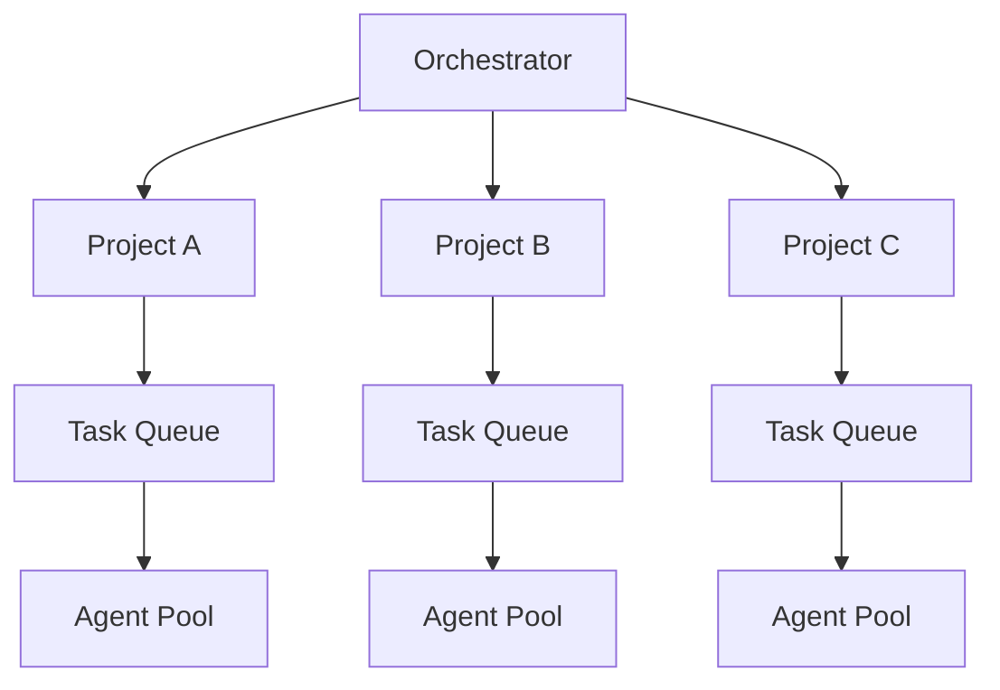
```mermaid
flowchart TB
    O[Orchestrator]
    O --> PA[Project A]
    O --> PB[Project B]
    O --> PC[Project C]
    PA --> TQA[Task Queue]
    PB --> TQB[Task Queue]
    PC --> TQC[Task Queue]
    TQA --> APA[Agent Pool]
    TQB --> APB[Agent Pool]
    TQC --> APC[Agent Pool]
```


---

### Core Objectives

The Multi-Project Execution System must achieve several objectives.


---

### Project Isolation

Ensure that tasks, workflows, and agent actions from different projects cannot interfere with each other.
Isolation boundaries include:
• task queues
• memory stores
• repositories
• deployment pipelines


---

Resource Allocation
Ensure fair distribution of system resources across projects.
Resources include:
• agent compute capacity
• LLM token usage
• infrastructure compute
• storage capacity


---

Knowledge Reuse
Allow useful knowledge to be reused across projects when safe.
Examples include:
• architectural patterns
• security fixes
• performance improvements


---

Scalability
Allow the platform to support large numbers of projects concurrently.


---

### Subsystem Components

The Multi-Project Execution System contains several internal components.


---

Project Registry

### Purpose

Maintain metadata for all projects managed by the platform.


---

### Responsibilities

The registry stores:
• project identifiers
• repository locations
• environment configurations
• workflow states
• resource quotas


---

Project Data Model

#### Project

{
    id: UUID
    name: string
    description: text
    tenant_id: UUID
    repositories: [string]
    environments: [string]
    created_at: timestamp
}
The tenant_id field enables support for multi-tenant deployments.


---

Project Namespace System
Each project operates inside an isolated namespace.
A namespace defines the boundaries for:
• task queues
• memory entries
• agent workflows
• repository access
• deployment pipelines


---

Namespace Diagram
PROJECT A
   │
   ├── Task Queue A
   ├── Memory Store A
   ├── Agent Workspace A
   └── Repository Access A

PROJECT B
   │
   ├── Task Queue B
   ├── Memory Store B
   ├── Agent Workspace B
   └── Repository Access B


---

Agent Access Boundaries
Agents must only access resources belonging to the project that created the task.
Agent access restrictions are enforced by:
• project identity tokens
• orchestrator policy validation
• RBAC policies
Example rule:
BackendAgent(ProjectA) cannot access Repository(ProjectB)
The orchestrator validates project scope before task execution.


---

Repository Access Control
Each project defines a list of authorized repositories.
The system enforces repository access through:
• repository authentication tokens
• repository access policies
• project repository allow-lists


---

Repository Data Model

#### Repository

{
    id: UUID
    project_id: UUID
    url: string
    branch: string
    access_token_ref: string
}


---

Memory Isolation
The Memory and Knowledge Layer partitions knowledge by project namespace.
Each memory entry contains a project identifier. Type uses the canonical MemoryEntry enum (see Executive Overview — Canonical Data Models).

#### MemoryEntry

{
    id: UUID
    project_id: UUID
    type: enum(decision, code_summary, research, bug, deployment)
    content: text
}
Agents may only retrieve knowledge belonging to their project unless cross-project access is explicitly allowed.


---

Cross-Project Knowledge Sharing
Certain knowledge can safely be shared globally.
Examples include:
• common bug fixes
• performance optimizations
• security mitigation strategies
The system stores such entries in a Global Knowledge Layer.


---

Knowledge Flow
Project A incident
      │
      ▼
Knowledge stored
      │
      ▼
Global Knowledge Layer
      │
      ▼
Project B retrieves insight
Only knowledge classified as safe for reuse is shared globally.


---

Resource Allocation System

### Purpose

Allocate compute resources fairly across projects.


---

Resource Types
The platform manages several resource types:
• agent workers
• compute resources
• LLM token budgets
• storage capacity


---

Allocation Strategy
Resource allocation may use:
• weighted scheduling
• project quotas
• dynamic scaling


---

Resource Quota Data Model

#### ResourceQuota

{
    project_id: UUID
    max_agents: integer
    max_tasks: integer
    max_storage: integer
    monthly_token_budget: integer
}


---

Billing and Cost Attribution
The platform must track resource consumption per project.
Billing attribution includes:
• compute usage
• LLM token usage
• storage usage


---

Usage Record Model

#### ProjectUsage

{
    project_id: UUID
    compute_hours: float
    tokens_used: integer
    storage_used_gb: float
}
This data is used by the Cost Control Architecture.


---

Project Workflow Manager

### Purpose

Track workflows for each project independently.


---

### Responsibilities

The manager tracks:
• active workflows
• workflow states
• completed workflows


---

Workflow Data Model

#### ProjectWorkflow

{
    id: UUID
    project_id: UUID
    type: feature | bug | optimization
    current_stage: string
}


---

### Runtime Behavior

The Multi-Project Execution System continuously manages workloads across projects.
while system_running:

    monitor_project_activity()

    enforce_project_isolation()

    allocate_resources()

    schedule_project_tasks()

    balance_system_load()


---

### Failure Handling

Potential failures include:
• project resource exhaustion
• workflow conflicts
• repository synchronization failures
Mitigation strategies include:
• project-level throttling
• workflow isolation
• retry mechanisms


---

### Scaling Strategy

The system must scale to support large numbers of projects.


---

Project Partitioning
Projects are distributed across orchestrator nodes.


---

Independent Task Queues
Each project maintains its own task queues.


---

Distributed Knowledge Storage
Knowledge systems partition memory by project namespace.


---

### Example Workflow

Example: Concurrent Development Across Projects
Project A: New feature development
Project B: Security patch
Project C: Performance optimization

All workflows executed simultaneously


---

### Transition to Next Section

The next section will define the Development Roadmap, which outlines the phased implementation plan for building the platform.


---

# 25. Development Roadmap

### Detailed Explanation

The Development Roadmap defines the structured, phased implementation plan for building the AI Autonomous Development Platform (AADP) from an initial prototype into a full-scale production system.
Because the platform consists of many complex subsystems—including orchestration, agent execution, knowledge systems, safety infrastructure, and deployment pipelines—it must be implemented incrementally.
Attempting to build the entire system simultaneously would introduce:
- excessive engineering complexity
- high operational risk
- long development timelines
- difficulty validating architectural decisions
Instead, the platform must evolve through multiple development phases, each introducing new capabilities while maintaining a functional system.
Each phase must deliver:
- operational functionality
- architectural validation
- incremental improvements in autonomy
The roadmap is divided into the following phases:
1.	Foundational Infrastructure
2.	Core Agent System
3.	Autonomous Development Capabilities
4.	Scalable Distributed Architecture
5.	Self-Improving System
Each phase builds upon the previous phase.


---

Roadmap Architecture Overview
PHASE 1 ─ Foundational Infrastructure
        │
        ▼
PHASE 2 ─ Core Agent System
        │
        ▼
PHASE 3 ─ Autonomous Development
        │
        ▼
PHASE 4 ─ Distributed Scaling
        │
        ▼
PHASE 5 ─ Self-Improving Platform


---

Phase 1 — Foundational Infrastructure
Objective
Establish the core platform infrastructure required to support agent execution and task orchestration.
This phase focuses on building the minimal operational platform.


---

Core Components
The following systems must be implemented first:
- Orchestration System
- Task Management System
- Basic Agent Runtime
- Repository Integration
- Deployment Infrastructure
- Observability System


---

Key Deliverables
Agent Runtime Environment
Implement containerized agent workers capable of executing tasks.


---

Task Management Infrastructure
Develop the task queue system responsible for distributing work.


---

Repository Integration
Integrate Git-based repositories for source code access.


---

Basic Deployment Pipeline
Implement a CI/CD pipeline capable of deploying software changes.


---

### Architecture Diagram

**Figure 18 — Phase 1 Architecture**


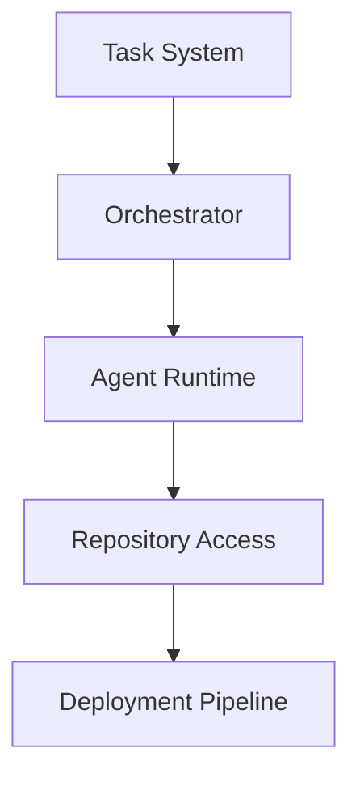
```mermaid
flowchart TB
    TS[Task System]
    TS --> O[Orchestrator]
    O --> AR[Agent Runtime]
    AR --> RA[Repository Access]
    RA --> DP[Deployment Pipeline]
```


---

Success Criteria
The system must be capable of:
- executing simple development workflows
- generating code changes
- deploying test applications


---

Phase 2 — Core Agent System
Objective
Introduce specialized agents that replicate software engineering roles.


---

New Agent Types
This phase introduces:
- Product Manager Agent
- Architect Agent
- Backend Engineer Agent
- Frontend Engineer Agent
- QA Agent
- DevOps Agent


---

Key Capabilities
Workflow Coordination
Agents must collaborate through the orchestrator.


---

Code Generation
Engineering agents generate and modify source code.


---

Automated Testing
QA agents execute testing pipelines.


---

Basic Safety Checks
Security scanning and deployment validation must be implemented.


---

Agent Collaboration Architecture
     PRODUCT AGENT
           │
           ▼
      ARCHITECT AGENT
           │
           ▼
   ENGINEERING AGENTS
           │
           ▼
        QA AGENT
           │
           ▼
       DEVOPS AGENT


---

Success Criteria
The system must autonomously complete simple development workflows such as:
- implementing small features
- fixing basic bugs
- deploying updates


---

Phase 3 — Autonomous Development Capabilities
Objective
Enable the system to perform end-to-end autonomous development.


---

New Capabilities
This phase introduces:
- Planning and Execution Cycles
- Codebase Understanding System
- Memory and Knowledge Layer
- Safety and Guardrail System


---

Key Improvements
Deep Codebase Understanding
Agents gain access to codebase indexing and architecture analysis.


---

Long-Term Knowledge Storage
The system stores historical decisions and incident data.


---

Autonomous Opportunity Detection
The system identifies improvements automatically.


---

Autonomous Workflow Architecture
System Monitoring
        │
        ▼
Opportunity Detection
        │
        ▼
Planning Agents
        │
        ▼
Engineering Agents
        │
        ▼
Testing & Validation
        │
        ▼
Deployment


---

Success Criteria
The platform must autonomously:
- detect bugs
- implement fixes
- deploy improvements


---

Phase 4 — Scalable Distributed Architecture
Objective
Scale the platform to support large workloads.


---

Key Enhancements
This phase introduces:
- distributed agent clusters
- distributed task queues
- scalable knowledge infrastructure
- multi-project execution support


---

### Architecture Diagram

**Figure 19 — Global Orchestrator Scaling**


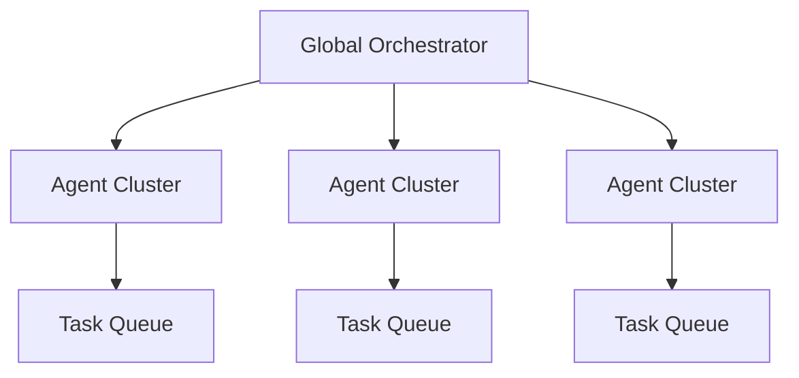
```mermaid
flowchart TB
    GO[Global Orchestrator]
    GO --> AC1[Agent Cluster]
    GO --> AC2[Agent Cluster]
    GO --> AC3[Agent Cluster]
    AC1 --> TQ1[Task Queue]
    AC2 --> TQ2[Task Queue]
    AC3 --> TQ3[Task Queue]
```


---

Success Criteria
The platform must support:
- hundreds of concurrent agents
- multiple active projects
- large-scale repositories


---

Phase 5 — Self-Improving Platform
Objective
Enable the system to improve its own architecture and workflows.


---

New Capabilities
This phase introduces:
- performance analysis systems
- improvement opportunity generation
- experimentation infrastructure
- automated platform optimization


---

Self-Improvement Architecture
System Metrics
      │
      ▼
Performance Analysis
      │
      ▼
Improvement Proposals
      │
      ▼
Controlled Experiments
      │
      ▼
System Updates


---

Success Criteria
The system must demonstrate the ability to:
- optimize its own workflows
- improve code generation quality
- enhance deployment reliability


---

Development Timeline
The implementation timeline may span multiple development cycles.
Example timeline:
Phase	Estimated Duration
Phase 1	3–4 months
Phase 2	3 months
Phase 3	4–6 months
Phase 4	4 months
Phase 5	6+ months


---

Team Structure
Developing the platform requires a multidisciplinary team.


---

Core Engineering Roles
Key roles include:
- distributed systems engineers
- AI systems engineers
- infrastructure engineers
- security engineers
- data engineers


---

Recommended Team Composition
Role	Count
Backend Engineers	4
AI Engineers	3
Infrastructure Engineers	2
Security Engineers	1
DevOps Engineers	2


---

Development Methodology
The platform should be developed using iterative methodologies.


---

Recommended Practices
- agile development cycles
- continuous integration
- automated testing


---

Risk Management
Potential development risks include:
- architectural complexity
- AI model limitations
- scaling challenges
Mitigation strategies include:
- incremental development
- early testing of components
- modular architecture


---

Example Implementation Workflow
Phase 1 infrastructure built
       │
       ▼
Phase 2 agent system added
       │
       ▼
Phase 3 autonomous workflows enabled
       │
       ▼
Phase 4 scaling implemented
       │
       ▼
Phase 5 self-improvement activated


---

### Transition to Next Section

The next section will define the Implementation Plan, which provides detailed guidance for engineers building the platform.


---

# 26. Implementation Plan

### Detailed Explanation

The Implementation Plan translates the architecture described in this specification into a concrete engineering execution strategy. While the Development Roadmap described high-level phases, the Implementation Plan defines the actual engineering tasks, technology stacks, service boundaries, deployment strategy, and integration sequence required to build the AI Autonomous Development Platform (AADP).
The primary goals of the implementation plan are:
- provide engineers with actionable build steps
- define service boundaries and system interfaces
- define core infrastructure technologies
- establish development environments
- outline deployment strategies
- ensure reproducible system builds
The system must be implemented as a distributed microservice platform composed of independently deployable services.
Major categories of implementation include:
1.	Infrastructure Setup
2.	Core Platform Services
3.	Agent Runtime Implementation
4.	Knowledge and Codebase Systems
5.	Workflow and Task Systems
6.	Deployment Infrastructure
7.	Observability and Monitoring
8.	Security and Governance Systems
Each category contains multiple implementation tasks.


---

Implementation Architecture
                    CLOUD INFRASTRUCTURE
                           │
                           ▼
                    CORE PLATFORM LAYER
        ┌──────────────────┼──────────────────┐
        ▼                  ▼                  ▼
   ORCHESTRATOR        TASK SYSTEM         AGENT RUNTIME
        │                  │                  │
        ▼                  ▼                  ▼
  CODEBASE SYSTEM     MEMORY SYSTEM       SAFETY SYSTEM
        │
        ▼
   DEPLOYMENT INFRASTRUCTURE
        │
        ▼
    OBSERVABILITY STACK


---

Implementation Stage 1 — Infrastructure Setup

### Purpose

Prepare the cloud infrastructure required to support the platform.


---

Core Infrastructure Components
The platform must run on cloud infrastructure capable of supporting distributed services.
Recommended infrastructure components include:
- Kubernetes clusters
- container registries
- distributed databases
- message queues
- object storage


---

Infrastructure Setup Workflow
Provision cloud environment
        │
        ▼
Deploy Kubernetes clusters
        │
        ▼
Configure networking
        │
        ▼
Deploy base infrastructure services


---

Core Infrastructure Services
Examples include:
Service	Purpose
Kubernetes	container orchestration
Message Broker	distributed task queues
Object Storage	artifact and document storage
Distributed Database	persistent system data


---

Implementation Stage 2 — Core Platform Services

### Purpose

Build the fundamental services that coordinate system behavior.


---

Core Services
The following services must be implemented first:
- Orchestrator Service
- Task Management Service
- Agent Registry Service
- Workflow Engine


---

Service Communication
Services communicate using:
- REST APIs
- message queues
- event streams


---

Service Interaction Diagram

**Figure 20 — Service Interaction**


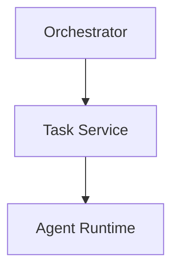
```mermaid
flowchart TB
    O[Orchestrator]
    O --> TS[Task Service]
    TS --> AR[Agent Runtime]
```


---

Implementation Stage 3 — Agent Runtime

### Purpose

Implement the execution environment for autonomous agents.


---

Agent Runtime Components
The runtime includes:
- reasoning engine
- tool invocation system
- task interface
- context retrieval system


---

Agent Execution Workflow
Task received
      │
      ▼
Retrieve context
      │
      ▼
Reasoning engine executes
      │
      ▼
Action executed
      │
      ▼
Result returned


---

Agent Runtime Data Model
AgentRuntime

#### AgentRuntime

{
    agent_id: string
    role: string
    status: idle | running
    active_tasks: integer
}


---

Implementation Stage 4 — Knowledge and Codebase Systems

### Purpose

Build systems responsible for understanding codebases and storing institutional knowledge.


---

Codebase Understanding Implementation
The system must implement:
- repository ingestion service
- code parsing workers
- dependency graph builder
- semantic search index


---

Memory System Implementation
The memory system must implement:
- vector memory store
- document knowledge repository
- knowledge graph


---

Knowledge System Architecture
Repositories
     │
     ▼
Code Parsing System
     │
     ▼
Semantic Index
     │
     ▼
Knowledge Retrieval API


---

Implementation Stage 5 — Workflow and Task Systems

### Purpose

Implement the workflow and task management infrastructure.


---

Core Components
The system must implement:
- distributed task queues
- workflow engine
- task scheduler
- dependency manager


---

Workflow Execution Architecture
Workflow created
      │
      ▼
Tasks generated
      │
      ▼
Scheduler assigns tasks
      │
      ▼
Agents execute tasks


---

Implementation Stage 6 — Deployment Infrastructure

### Purpose

Build the CI/CD pipeline and deployment system.


---

Key Components
Deployment infrastructure must include:
- build pipeline system
- artifact registry
- deployment controller


---

Deployment Pipeline Architecture
Source code
      │
      ▼
Build pipeline
      │
      ▼
Artifact registry
      │
      ▼
Deployment controller


---

Implementation Stage 7 — Observability and Monitoring

### Purpose

Deploy monitoring and observability infrastructure.


---

Observability Components
The system must implement:
- metrics collection system
- log aggregation pipeline
- distributed tracing system
- alerting system


---

Observability Pipeline
System events
      │
      ▼
Telemetry collectors
      │
      ▼
Metrics database
      │
      ▼
Monitoring dashboards


---

Implementation Stage 8 — Security and Governance Systems

### Purpose

Deploy systems that enforce security and policy compliance.


---

Security Components
The system must implement:
- identity management
- access control policies
- secret management system
- security scanning pipeline


---

Governance Architecture
Agent action request
        │
        ▼
Policy evaluation
        │
        ▼
Security validation
        │
        ▼
Action approved or rejected


---

Development Environment Setup
Developers must be able to run the platform locally.


---

Local Development Stack
Local environments should include:
- containerized services
- local message broker
- lightweight databases


---

Development Workflow
Clone repository
      │
      ▼
Start local services
      │
      ▼
Run development agents
      │
      ▼
Execute test workflows


---

Testing Strategy
The implementation must include a robust testing strategy.


---

Test Types
Required tests include:
- unit tests
- integration tests
- end-to-end workflow tests


---

Continuous Integration
Every change to the platform must trigger automated tests.


---

Deployment Strategy
Platform services must be deployed using:
- rolling deployments
- versioned artifacts
- automated rollback mechanisms


---

Example Implementation Workflow
Infrastructure deployed
      │
      ▼
Core services implemented
      │
      ▼
Agent runtime added
      │
      ▼
Knowledge systems integrated
      │
      ▼
Deployment pipeline enabled


---

### Transition to Next Section

The next section will define the Cost Model, which estimates the infrastructure and operational costs of running the platform.


---

# 27. Disaster Recovery and Backup Strategy

### Detailed Explanation

The Disaster Recovery and Backup Strategy (DRBS) defines how the AI Autonomous Development Platform (AADP) maintains system availability and protects critical data in the event of infrastructure failures, service outages, or catastrophic incidents.
The platform operates a distributed system composed of multiple critical storage and processing components including:
• relational metadata databases
• vector databases used for the knowledge layer
• graph databases used for code intelligence
• artifact registries
• task queues and workflow state stores
• observability and logging systems
Loss or corruption of these systems could disrupt autonomous development workflows and cause permanent loss of platform knowledge.
The Disaster Recovery Strategy ensures that the system can recover from failures while minimizing:
• data loss
• service downtime
• operational disruption
The strategy combines multiple mechanisms including:
• automated backups
• database replication
• multi-region deployment
• infrastructure failover
• artifact replication


---

Disaster Recovery Architecture
                PRIMARY REGION
                      │
        ┌─────────────┼─────────────┐
        ▼             ▼             ▼
   METADATA DB   VECTOR DB      GRAPH DB
        │             │             │
        └─────── REPLICATION ───────┘
                      │
                      ▼
                BACKUP REGION
                      │
          ┌───────────┼───────────┐
          ▼           ▼           ▼
      DB SNAPSHOTS  ARTIFACTS   QUEUE STATE
The backup region can assume operations if the primary region fails.


---

Recovery Objectives
The system defines two recovery targets.


---

Recovery Point Objective (RPO)
The maximum acceptable amount of data loss.
Example target:
RPO = 5 minutes
This means that no more than five minutes of data can be lost during a failure.


---

Recovery Time Objective (RTO)
The maximum acceptable system downtime.
Example target:
RTO = 30 minutes
The platform must be able to restore operations within thirty minutes after a major failure.


---

Backup Strategy
Backups are created for all critical system data.


---

Metadata Database Backups
The relational database stores:
• project metadata
• task state
• workflow information
• system configuration
Backup strategy:
• incremental backups every 5 minutes
• full snapshot every 24 hours


---

Vector Database Backups
The vector database stores:
• knowledge embeddings
• architecture knowledge
• research memory
Backup strategy:
• snapshot every 6 hours
• incremental replication to backup region


---

Graph Database Backups
Graph databases store:
• dependency graphs
• architecture graphs
• code relationships
Backup strategy:
• daily full snapshots
• streaming replication enabled


---

Artifact Registry Replication
The artifact registry stores:
• container images
• compiled binaries
• build artifacts
Artifacts are replicated across multiple storage regions.
Artifact Build
      │
      ▼
Primary Artifact Registry
      │
      ▼
Replicated Artifact Storage
Replication ensures that deployments can continue even if a region fails.


---

Task Queue Recovery
Task queues store workflow state and pending tasks.
Queue recovery mechanisms include:
• persistent message storage
• replicated queue clusters
• automatic leader election
This prevents loss of tasks during failures.


---

Knowledge Memory Backup
The Memory and Knowledge Layer stores long-term learning data.
Memory backup strategy includes:
• periodic memory snapshots
• vector index replication
• global knowledge store backups
This prevents permanent loss of learned engineering knowledge.


---

Multi-Region Deployment
Critical platform services are deployed across multiple geographic regions.
Example deployment:
Region A (Primary)
    │
    ├─ Agent Runtime
    ├─ Orchestrator
    └─ Databases

Region B (Backup)
    │
    ├─ Standby Agent Runtime
    ├─ Standby Orchestrator
    └─ Replicated Databases
If Region A fails, Region B becomes active.


---

Failover Workflow
The failover system automatically detects infrastructure failures.
Infrastructure failure detected
        │
        ▼
Failover system activated
        │
        ▼
Traffic redirected to backup region
        │
        ▼
Services restored
This minimizes downtime.


---

Backup Verification
Backups must be periodically verified to ensure integrity.
Verification mechanisms include:
• automated backup validation
• periodic restore testing
• checksum validation
These tests ensure that backups can be restored successfully.


---

### Failure Handling

Potential disaster scenarios include:
• database corruption
• infrastructure outages
• cloud provider failures
• data center failures
Mitigation strategies include:
• automated recovery procedures
• redundant infrastructure
• multi-region replication


---

### Runtime Behavior

The disaster recovery system continuously monitors platform health.
while system_running:

    monitor_infrastructure_health()

    verify_replication_status()

    validate_backup_integrity()

    trigger_failover_if_required()


---

Example Failure Scenario
Example: Database Failure
Primary database failure detected
        │
        ▼
Failover database promoted
        │
        ▼
Traffic redirected
        │
        ▼
System resumes operation


---

### Transition to Next Section

The next section defines the Cost Model and Budget Control Architecture, which describes how the platform manages operational costs and prevents uncontrolled resource consumption. 


---

# 28. Cost Model and Budget Control Architecture

### Detailed Explanation

The Cost Model and Budget Control Architecture defines how the AI Autonomous Development Platform (AADP) estimates, monitors, and controls the operational costs associated with running the system in production environments.
Because the platform operates autonomously and can generate large volumes of computational workloads, strict cost control mechanisms are required to prevent uncontrolled resource consumption.
The platform consists of multiple computationally intensive subsystems including:
• autonomous AI agents
• codebase indexing pipelines
• distributed orchestration services
• deployment infrastructure
• observability pipelines
These subsystems generate operational costs across several infrastructure layers.
Primary cost drivers include:
• AI model inference
• compute resources for agent execution
• storage infrastructure
• CI/CD pipelines
• observability systems
• networking and data transfer
The Cost Model therefore includes two major components:
1.	Cost Estimation
Understanding the infrastructure costs required to run the platform.
2.	Budget Control
Enforcing strict limits on resource usage to prevent runaway workloads.


---

Cost Architecture Overview
                PLATFORM OPERATIONS
                       │
                       ▼
            COMPUTE INFRASTRUCTURE
                       │
        ┌──────────────┼──────────────┐
        ▼              ▼              ▼
    AGENT RUNTIME   STORAGE SYSTEM   DEPLOYMENT
        │              │              │
        ▼              ▼              ▼
   AI MODEL COSTS   DATA STORAGE    CI/CD COSTS
        │
        ▼
   OBSERVABILITY COSTS


---

Cost Category 1 — AI Model Inference

### Description

Autonomous agents rely on large language models for:
• reasoning
• planning
• code generation
• documentation generation
• code analysis
Model inference is typically the largest operational cost driver.


---

Cost Factors
Inference cost depends on:
• model size
• token usage
• request frequency
• concurrent agents


---

Example Cost Model
Example assumptions:
Parameter	Value
Agents active	200
Requests per agent per hour	20
Tokens per request	2000
Estimated tokens per hour:
200 agents × 20 requests × 2000 tokens
= 8,000,000 tokens/hour
This value determines inference cost.


---

Inference Optimization Strategies
To reduce AI inference costs the platform may implement:
• prompt compression
• context window optimization
• reasoning result caching
• model routing (smaller models for simple tasks)


---

Cost Category 2 — Compute Infrastructure

### Description

Compute infrastructure supports:
• agent execution
• code indexing workers
• task scheduling services
• CI/CD pipelines


---

Example Compute Cluster
Compute Cluster
      │
      ├── Agent Workers
      ├── Task Scheduler Nodes
      ├── Code Indexing Workers
      └── Deployment Workers


---

Estimated Compute Requirements
Resource	Quantity
Agent worker nodes	20
Task scheduler nodes	5
Code indexing nodes	10
Deployment workers	10


---

Optimization Strategies
Compute costs may be reduced using:
• auto-scaling infrastructure
• spot instances
• workload batching


---

Cost Category 3 — Storage Infrastructure
Storage systems store:
• code indexes
• knowledge documents
• logs and telemetry
• artifacts


---

Storage Architecture
           STORAGE LAYER
                │
     ┌──────────┼──────────┐
     ▼          ▼          ▼
Object Storage Vector DB  Relational DB


---

Example Storage Requirements
Storage Type	Estimated Size
Code indexes	5 TB
Knowledge documents	1 TB
Observability logs	10 TB
Artifacts	3 TB


---

Cost Category 4 — Networking and Data Transfer
Networking costs arise from:
• inter-service communication
• artifact distribution
• log streaming
Optimization strategies include:
• regional deployments
• artifact caching
• efficient serialization


---

Cost Category 5 — Observability Infrastructure
Monitoring systems generate large data volumes.
Example telemetry generation:
Data Type	Daily Volume
logs	100 GB
metrics	20 GB
traces	50 GB
Optimization techniques include:
• trace sampling
• log filtering
• metric aggregation


---

Cost Category 6 — CI/CD Infrastructure
CI/CD pipelines execute:
• builds
• testing
• security scanning
• artifact packaging
Optimization techniques include:
• incremental builds
• build caching
• parallel test execution


---

Cost Category 7 — Operational Engineering Costs
Operating the platform requires a small engineering team.
Example team structure:
Role	Count
Platform Engineers	3
DevOps Engineers	2
Security Engineers	1


---

Budget Control Architecture

### Purpose

Prevent uncontrolled resource consumption caused by autonomous agent activity.


---

Budget Control Components
The platform enforces multiple layers of cost limits.


---

Token Budget System
Each task receives a maximum token allocation.
Example:

#### TaskBudget

{
    task_id: UUID
    max_tokens: integer
}
When token usage exceeds the limit, the task is automatically terminated.


---

Agent Budget Tracking
Each agent has a token and compute budget.
Example:

#### AgentBudget

{
    agent_id: UUID
    max_tokens_per_hour: integer
}


---

Project Budget Limits
Each project has a monthly cost limit.

#### ProjectBudget

{
    project_id: UUID
    monthly_token_limit: integer
    monthly_compute_limit: float
}


---

Real-Time Cost Monitoring
The platform continuously tracks:
• token usage
• compute usage
• storage usage
Usage metrics are aggregated per:
• task
• agent
• project


---

Inference Routing for Cost Optimization
The Model Management System may route requests to different models depending on:
• task complexity
• cost constraints
Example routing strategy:
Simple reasoning → small model
Complex architecture design → large model


---

Emergency Cost Circuit Breaker
If the system detects abnormal cost spikes, automatic protection mechanisms activate.
Triggers include:
• sudden token usage spikes
• infinite agent loops
• runaway task creation


---

Circuit Breaker Workflow
Cost spike detected
       │
       ▼
Agent execution paused
       │
       ▼
Alert sent to operators
       │
       ▼
System investigation


---

Cost Scaling Model
Total operational cost increases with:
• number of agents
• number of projects
• size of codebases


---

Simplified Cost Formula
Total Cost =
    AI Inference +
    Compute Infrastructure +
    Storage +
    Observability +
    CI/CD


---

Example Monthly Cost Estimate
Example medium-scale deployment:
Category	Monthly Cost
AI model inference	$25,000
Compute infrastructure	$12,000
Storage infrastructure	$3,000
Observability systems	$4,000
CI/CD pipelines	$2,500
Estimated total:
≈ $46,500 per month


---

### Transition to Next Section

The next section will define the Future Extensions, which describe additional capabilities that may be added to the platform in later versions.


---

# 29. Future Extensions

### Detailed Explanation

The Future Extensions section defines potential capabilities that can be added to the AI Autonomous Development Platform (AADP) in future versions beyond Version 1.0.
While the Version 1.0 architecture already enables a fully autonomous development workflow, the long-term vision of the platform extends far beyond basic software development automation.
Future versions of the platform may evolve into a fully autonomous engineering organization, capable of:
- building complex distributed systems
- conducting software research
- optimizing its own architecture
- collaborating with human teams at strategic levels
The Future Extensions described here are not required for the initial platform implementation but represent strategic evolution paths that may significantly increase the platform's capabilities.
These extensions fall into several categories:
1.	Advanced AI Model Integration
2.	Autonomous Research Capabilities
3.	Cross-Organization Collaboration
4.	Self-Healing Infrastructure
5.	Advanced Knowledge Systems
6.	Autonomous Product Management
7.	Autonomous Security Systems
8.	Autonomous Infrastructure Optimization
Each of these areas introduces significant additional capabilities.


---


### Future Architecture Overview

              CURRENT PLATFORM (v1.0)
                      │
                      ▼
          ADVANCED AUTONOMOUS CAPABILITIES
                      │
        ┌─────────────┼─────────────┐
        ▼             ▼             ▼
   RESEARCH AGENTS  SELF-HEALING  GLOBAL KNOWLEDGE
        │             │             │
        ▼             ▼             ▼
 AUTONOMOUS R&D   INFRASTRUCTURE  CROSS-PROJECT AI


---


### Extension 1 — Advanced AI Model Integration


### Description

Future versions of the platform may integrate a broader range of AI models optimized for specialized tasks.


---


### Model Types

Examples include:
- reasoning models
- code generation models
- planning models
- architecture design models


---


### Multi-Model Architecture

               AGENT RUNTIME
                    │
        ┌───────────┼───────────┐
        ▼           ▼           ▼
   CODE MODEL   REASONING MODEL  PLANNING MODEL


---


### Benefits

Advantages include:
- improved code generation quality
- faster reasoning performance
- specialized capabilities for different tasks


---


### Extension 2 — Autonomous Research Agents


### Description

Research agents would enable the system to conduct software research independently.


---

Research Activities
Research agents may perform tasks such as:
- exploring new frameworks
- benchmarking technologies
- analyzing performance tradeoffs


---

Research Workflow
Research question generated
        │
        ▼
Literature and code analysis
        │
        ▼
Experiment execution
        │
        ▼
Results documented


---

Output
Research agents may produce:
- architectural recommendations
- performance reports
- experimental results


---

Extension 3 — Cross-Organization Collaboration

### Description

Future versions may support collaboration across multiple organizations or teams.


---

Collaboration Capabilities
Examples include:
- shared knowledge repositories
- cross-team workflows
- shared agent infrastructure


---

Collaboration Architecture
 Organization A
      │
      ▼
Shared Knowledge Layer
      │
      ▼
 Organization B


---

Extension 4 — Self-Healing Infrastructure

### Description

Self-healing infrastructure allows the platform to automatically detect and repair infrastructure failures.


---

Self-Healing Mechanisms
Examples include:
- automatic service restarts
- automatic scaling adjustments
- infrastructure anomaly detection


---

Self-Healing Workflow
Infrastructure anomaly detected
        │
        ▼
Root cause analysis
        │
        ▼
Automated repair action


---

Extension 5 — Advanced Knowledge Systems

### Description

Future knowledge systems may include deeper semantic understanding of software systems.


---

Knowledge Capabilities
Advanced systems may support:
- architecture pattern recognition
- automated documentation generation
- cross-project knowledge inference


---

Knowledge Graph Expansion
Project Knowledge
       │
       ▼
Global Knowledge Graph
       │
       ▼
Cross-System Insights


---

Extension 6 — Autonomous Product Management

### Description

Future systems may include agents capable of managing product strategy.


---

Product Management Tasks
Product agents may perform tasks such as:
- analyzing user feedback
- prioritizing features
- defining product roadmaps


---

Product Strategy Workflow
User feedback analysis
        │
        ▼
Feature opportunity identification
        │
        ▼
Product roadmap generation


---

Extension 7 — Autonomous Security Systems

### Description

Security agents may continuously improve system security.


---

Security Capabilities
Examples include:
- vulnerability discovery
- automated patch generation
- security policy optimization


---

Security Automation Workflow
Security vulnerability detected
        │
        ▼
Patch generated
        │
        ▼
Patch validated
        │
        ▼
Deployment


---

Extension 8 — Autonomous Infrastructure Optimization

### Description

Infrastructure optimization agents may improve system efficiency.


---

Optimization Targets
Examples include:
- compute utilization
- storage efficiency
- network traffic optimization


---

Optimization Workflow
Infrastructure metrics analyzed
        │
        ▼
Optimization opportunities identified
        │
        ▼
Infrastructure configuration updated


---

Long-Term Vision
The long-term vision for the platform is the creation of a fully autonomous engineering organization capable of building and maintaining complex software systems with minimal human intervention.
This system would eventually support:
- continuous product evolution
- automated architectural innovation
- large-scale distributed system design


---

Evolution Path
The platform may evolve across multiple generations.
Version	Capabilities
v1.0	Autonomous development platform
v2.0	Self-improving engineering system
v3.0	Autonomous research and innovation platform


---

Example Future Workflow
Example: Autonomous Feature Innovation
User behavior analyzed
        │
        ▼
Feature opportunity detected
        │
        ▼
Architecture designed
        │
        ▼
Implementation executed
        │
        ▼
Deployment completed


---


---

# Appendix A — Architectural Review Notes


---

This appendix contains the comprehensive architectural review notes that were originally placed at the beginning of the document. They have been moved here so that the main body (Sections 1–29) follows the standard order: Terminology Glossary, Executive Overview, then detailed architecture. The review notes include strengths to preserve, primary weaknesses and missing items, unclear sections, top architectural risks, a high-level architecture diagram, subsystem components to add or clarify, recommended data models, example workflows, scaling strategy, and actionable recommendations for Stage 2. For the full detailed critique (governance, security, orchestration, memory lifecycle, economic agent, multi-tenant isolation, observability, etc.), refer to the document revision history or the initial draft source file.


---

End of System Design Specification
This concludes the AI Autonomous Development Platform — System Design Specification Version 1.0.
The document defines the architecture, subsystems, workflows, and implementation strategy required to build a large-scale autonomous AI development platform capable of operating in production environments.